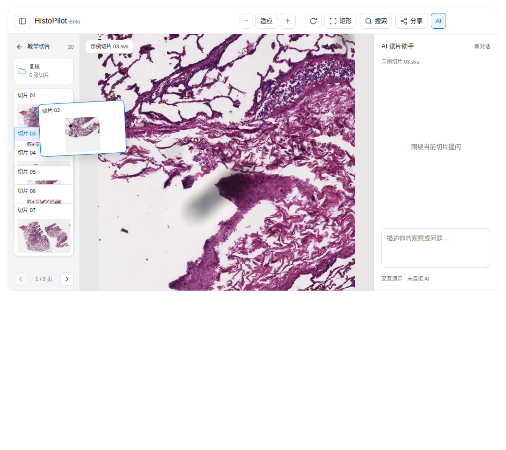

# 用户后台、注册与 Viewer 改版设计

日期：2026-10-08，Asia/Shanghai。状态：产品方向已确认，供 Opus 实现。本文及附带原型不代表正式功能已经上线。

配套材料：

- [案例与验收清单](admin-viewer-registration-acceptance-20261008.md)
- [给 Opus 的交接说明](opus-admin-viewer-handoff-20261008.md)
- [Viewer 可交互原型](design-assets/admin-viewer-20261008/viewer-folders.html)
- [后台可交互原型](design-assets/admin-viewer-20261008/admin-temporary-view.html)

## 1. 已确认的产品结论

以下是用户在多轮设计核对后的最终要求，优先于早期原型、旧文档和代码注释。

| 模块 | 最终要求 |
| --- | --- |
| 用户管理 | 区分自己的 Dogfood 测试账号和正式用户；先标记，不删除测试账号；增加加入时间和最近登录；支持按时间排序 |
| 信息密度 | 不增加最近活跃、近 7 天活跃天数或其他使用频率指标 |
| 注册 | 删除邀请码整个功能模块；邮箱验证后直接注册；保留注册开放/关闭控制 |
| Viewer 顶栏 | 参考现有风格，保持单层；品牌、常用读片工具、搜索、分享、AI 放在一行 |
| 切片选择 | 左侧缩略图栏；多张切片堆叠，鼠标划过时抽出预览，点击才正式打开 |
| 文件夹 | 左侧支持文件夹，进入后看内部切片，可返回上级；避免无限加长的滚动列表 |
| 搜索 | 原型里的“文件”按钮改为真正的搜索；可跨文件夹找切片并定位 |
| 分享 | 管理内容收进分享按钮，为读片区和 AI 留空间 |
| 后台切片管理 | 看用户上传了哪些切片，以及是否允许当前管理员临时查看；不是给用户设置“仅自己/共享”的页面 |
| 临时查看时限 | 默认 1 小时后自动结束，也可提前结束 |
| 当前交付 | 用户要求先写详细设计与案例，交给 Opus 实现；本轮不改正式业务代码、不改生产数据 |

两条权限线必须独立：用户的分享设置与管理员临时查看。后台不能把“共享范围”“是否加入我的工作区”和“是否允许管理员查看”合并成一个开关。

## 2. 设计参数与未确认事项

区分用户确认的产品行为和本文给出的实现建议。以下参数可由实现者在不改变产品方向的前提下调整，并在交付说明记录结果。

- 一叠初始上限 8 项；按实际可用高度减少。文件夹和切片混排时按真实高度计算，不能强行叠到分页按钮上。
- 左栏约 140–160px，AI 栏约 260–320px；抽出动画约 160–200ms。实际值要用现有应用验证。
- 文件夹嵌套建议上限 5 层；建议允许用户新建、重命名、移动和移除空文件夹，入口置于当前目录的“更多/＋”中。
- 管理员开启的是当前真实管理员账号自己的临时查看，延续现有后台自授权方向；用户没有要求新增上传者审批流程。
- **临时查看推荐只授予读图能力。** 用户尚未明确是否需要借此运行 AI、下载原文件或写标注；首版不自动扩大这些权限。如确有既有产品需求必须保留，先把具体能力和权限测试列出再确认，不能沿用“admin 所以都可以”的隐式推断。
- 测试账号具体名单尚未提供。实现分类能力即可；批量标记需要明确的 `user_id`/邮箱映射，不按昵称、邮箱服务商或角色猜测。
- “仅自己/共享”是用户分享面板的简化摘要，不是重建分享系统。原型中的共享范围选项是形态示意；正式能力应复用已有权限、分享有效期与认领机制，不因下拉选项而未经设计新增“全站公开”。
- 注册防刷、邮件重发和联系作者已有单独设计，见 [注册防刷与作者帮助](registration-antibot-and-author-help-design-20261008.md)。本次收敛注册入口，但不把该文尚未实现的所有功能自动纳入本次范围。

## 3. 实现前必须知道的代码现状

本次只读核查基于 `PathTogether` 的 HEAD `19b6438e` 及当前工作区。行号可能随其他工作变化，以下用文件和函数名定位。

工作区已有修改涉及注册邮件、注册模板、后台插件、测试、插件来源策略和部署文档。实现前执行 `git status` / `git diff` 建立基线；不得 reset、覆盖或把别人的改动当作本次实现。

| 接入点 | 现状与实现注意事项 |
| --- | --- |
| `user_store.py`、`user_store_pg.py` | PostgreSQL 唯一后端。已有用户 `created_at`，公共 SELECT 尚无 Dogfood 分类与最近登录字段；扩展 store 还要更新 dispatcher 导出 |
| `app.py: login()` | 成功验证凭据后建立 session；旧 `pending_activation` 分支只发受限 enrollment session。新增最近登录必须放在完成正常登录的路径 |
| `app.py: admin_v1_users()` | 已返回 `created_at`，当前按创建时间升序；已有搜索、筛选、分页及费用附属信息 |
| 后台插件 `plugins/pathtogether-admin/ui/*` | 用户、切片、邀请码等页面；通过宿主桥访问服务端，不能在 iframe 内直接新增 fetch |
| `static/admin-host.js` | 桥方法白名单、payload schema、权限映射及 HTTP dispatch。增加/退役功能时必须同步 |
| `plugins/pathtogether-admin/manifest.json`、`plugins/source-policy.json` | 后台 UI 有文件哈希与来源 pin；修改 UI 后按现有机制更新并验证，不绕过校验 |
| `templates/_app_shell.html`、`static/app.js`、`static/style.css` | 已有单层主工具栏、侧栏项目/未归类/分享管理、响应式工具折叠和侧栏 controller |
| `static/app.js: renderProjects/renderSlideRow/renderUnfiled` | 现状是项目展开列表。已有 `slide_id` 定位、同名区分、项目创建、选择器与搜索状态，改版应复用而非重新造一套独立身份 |
| `share_store_pg.py: projects/project_slides` | 已有项目与多对多切片关联；核查的项目字段没有父目录。推荐将“文件夹”映射到项目展示，新增父级关系 |
| `app.py: _slide_thumbnail_impl()` | 已能生成不超过 400×400 的真实切片缩略图；有 ID 端点、渲染参数/版本校验、鉴权后 ETag；不是从零开发缩略图能力 |
| `slide_store.py: SlideDescriptor` | 已有稳定 `slide_id`、`published_at`、revision；`slides` 表有 `created_at`，descriptor 未投影此字段 |
| `app.py: admin_v1_slides_inventory()` | 当前还以 legacy 名称组织清单，并跳过没有 `legacy_filename` 的 descriptor；**新 `id_bundle` 切片可能被遗漏**。本次必须改为 ID 驱动 |
| `app.py: admin_v1_slide_visibility()` | 旧接口按文件名与磁盘文件建立永久直授，语义是加入工作区。不能仅改按钮文案就当成临时授权 |
| `share_store_pg.py: grant_slide_view/*` | 现有直授无 TTL，并保留按名称查找的兼容路径；新表/新模型需要迁移和退役读取路径 |
| `slide_store.py: authorize_read/visible_ready_slide_ids` | 底层有 `ROLE_ADMIN` 全量读取分支。现有 app 的认证 owner 路径不传这个角色，而是按 UID + `allow_public=False/allow_share=False` 隔离；不能在新接口中误用该全量分支 |
| `app.py: _authorize_or_deny/_ai_session_subject_can_view` | 已区分认证 owner、普通用户、本地免认证和 Demo；临时权限需要贯通列表、单片、AI/插件入口，不能只改一个 route |
| `settings_store.py`、`registration_store.py` | 当前模式有 `closed/invite_only/email_verify_invite_activation/public`；public 邮箱验证注册已存在，收敛到 `closed/public` |

必须保留 ID 化与存储不变量：切片名只是展示；同名切片可以有不同 ID；没有旧名称的新资产必须可管理；不得返回服务器存储路径，不得将文件夹路径当物理存储路径。

## 4. 用户管理

### 4.1 页面与操作

主列表保留四个核心信息：用户身份、加入时间、最近登录、分类。已有启停、AI 权限、额度、密码重置等管理能力保留在详情/更多操作中，不要求全部常驻主表。

- 筛选：正式用户 / Dogfood / 全部。默认正式用户。
- 默认排序：加入时间从新到旧；可切最早优先、最近登录。
- 分类操作：标为 Dogfood / 改为正式，可撤回，不删除用户、不撤销 session、不改变额度和角色。
- 未记录登录时间显示“暂无记录”，不能写“从未登录”。
- 窄屏可转为紧凑纵向行；不加入大面积统计卡。

### 4.2 数据与时间

建议字段：`users.account_kind`（`real | dogfood`）、`users.last_login_at`（可空 TIMESTAMPTZ）。新注册默认 `real`；存量默认分入正式分类只是运营分组，不代表验证了真人身份。已知 Dogfood 用明确名单标记。

加入时间复用 `users.created_at`。最近登录只在成功建立正常登录态时更新，失败登录、仅打开登录页、自动刷新、AI 请求和受限 enrollment session 不更新。若公开注册流程完成后不自动登录，则注册完成不写最近登录；若确有自动登录，则必须调用同一登录成功记录函数。

并发更新不得回退时间；建议 DB `GREATEST`。旧用户缺少可信事件不回填虚构登录时间，不用最近 AI 调用代替。业务展示使用北京时间，机器字段遵守现有 API 时间类型；不要在同一 v1 字段中从 epoch 静默变为字符串。

排序必须在服务端分页前完成，以 `user_id` 作为稳定 tie-breaker。`last_login_at IS NULL` 始终排末尾。筛选/排序变化清空 cursor；cursor 绑定筛选与排序，避免复用错位。

建议新增分类写接口（命名可按仓库规范调整）：

```text
PATCH /api/admin/v1/users/{user_id}/classification
body: {"account_kind":"dogfood"}
```

仅 owner 管理权限，沿用 CSRF；记录真实 actor、目标 user_id、前后分类。这个接口不是删除用户的入口。

## 5. 注册与邀请码退役

### 5.1 唯一正常流程

填写邮箱与所需协议 → 发送验证邮件 → 打开验证链接 → 设置密码 → 完成注册 → 按现有成功页进入登录/工作台。

后台只保留“注册”管理，注册模式 `public/closed`。邮箱验证、密码策略、账号唯一性、限流、协议证明、邮件任务重试语义继续由现有后端保障。仅隐藏邀请码菜单不算完成。

### 5.2 删除范围

- 邀请码创建、列表、复制、撤销、兑换、激活表单及对应产品文案。
- 后台 invite 桥方法、payload schema、权限声明、路由和前端页面分支。
- 旧测试申请中“发邀请码/邀请激活”的动作；若测试申请仍有其他业务用途，保留用途本身，移除依赖邀请码的状态转移，不能无差别删整个申请模块。
- 旧 `invite_only`、`email_verify_invite_activation` 配置选项及其运行时业务路径。
- 邀请码专用邮件任务和配置；共享给 public 流程的邮件、令牌、注册帮助代码必须保留。
- 注册方式投影、审计查询、后台设置摘要等间接依赖也需要梳理。

### 5.3 存量处理决策表

| 原有状态 | 目标行为 |
| --- | --- |
| active 用户，曾通过邀请码注册 | 继续登录，保留原 user_id、切片、计费与审计历史 |
| 已验证邮箱但 pending_activation | 推荐迁移为普通已注册账号，保留身份和数据，失效受限 enrollment session；只处理有可信邮箱验证且未被禁用的记录 |
| 尚未验证邮箱 | 不直接激活；引导重新走公开邮箱验证流程 |
| 用户被禁用 | 保持禁用，不能通过迁移自动启用 |
| public 验证邮件尚有效 | 尽量保持可用；不能为退役邀请码而作废 public 的所有验证链接 |
| 历史邀请码链接 | GET 显示“注册方式已更新”并提供正常注册入口；旧兑换/激活 POST 不再生效，不回显 token |
| 模式为 public | 保持 public，仍执行既有前置检查 |
| 模式为 closed | 保持 closed，不因这次升级自动开放 |
| 模式为 invite_only 或旧激活模式 | 若部署 public 前置条件全部满足，迁到 public；否则迁到 closed 并给出明确运维提示 |

pending 用户的具体迁移脚本必须先输出按状态统计及 dry-run 结果，验证计费/AI 权限初始化不丢失、不重复创建账号。不能笼统 `UPDATE users SET activation_state='active'`。

物理数据表可分两阶段退役：先停止业务使用并冻结历史审计，再在独立可回滚迁移中移除无依赖旧表。第一阶段结束时产品和 API 已不支持邀请码；保留审计历史不等于保留可用模块。不要修改已执行的历史 migration 文件。

## 6. 后台切片：上传清单与管理员临时查看

### 6.1 界面

主列：切片/上传者、加入时间、管理员临时查看、操作。大小、资产状态等放详情；资产异常时直接显示不能查看的原因。

| 状态 | 显示 | 操作 |
| --- | --- | --- |
| 没有授权 | 未开启 | 开启 1 小时 |
| 授权有效 | 可查看 · 剩余 N 分钟 | 查看、结束查看 |
| 到期或主动结束 | 已结束 | 开启 1 小时 |
| 尚未可读/删除中/文件损坏 | 准备中或不可查看 | 禁用开启，显示原因 |
| 管理员自己的切片 | 本人切片 | 查看，不需要给自己加临时期限 |

后台清单默认显示用户上传的已登记资产，包括没有 legacy 名称的新格式资产。生产中暂未 ready 的登记资产可显示状态，不能凭元数据列表权限取图。磁盘孤儿/迁移残留放独立技术详情，不混成正常用户上传记录，不在“开启查看”时自动认领。

加入时间定义为切片首次登记入库时间，建议复用 `slides.created_at`；不是加入项目时间、授权时间、文件 mtime 或 migration 执行时间。若历史 created_at 只是迁移建行时间，不能假装是原始上传时间：显示“历史入库时间”或未知，记录时间来源。转码中资产也可有登记时间，发布时间另用 `published_at`。

### 6.2 权限边界

管理清单权限只允许读元数据。认证管理员读取他人的图像，需要当前账号对当前 `slide_id` 的有效临时授权。用户已有分享、public 标记或别人管理员的授权不会自动把资产加入当前管理员工作区。

推荐另建 `admin_slide_view_grants`，避免把普通用户分享授权和旧永久直授都加上 1 小时时限。最小数据：

```text
admin_user_id + slide_id   唯一关联
lease_id                  每次重新开启生成新的随机标识
permission                固定 view
granted_at                DB 当前时间
expires_at                granted_at + 3600 秒
revoked_at                可空
created_by                真实 actor
```

同时写审计事件，保存每次开启/提前结束的 lease_id、actor、slide_id 和时间；新租约不得覆盖历史事件。表可只保存当前租约，历史由审计保存。建议把授权写与其审计写放在同一事务。

建议 API：

```text
GET    /api/admin/v1/slides/inventory?sort=joined_desc&cursor=...
POST   /api/admin/v1/slides/{slide_id}/temporary-view
DELETE /api/admin/v1/slides/{slide_id}/temporary-view
       body: {"expected_lease_id":"..."}
```

POST 从真实登录 actor 派生 admin_user_id，客户端不能指定任意受益人或时长。有效授权重复 POST 返回原 lease，不悄悄续期；已结束后的新点击生成新 lease。网络重试用 Idempotency-Key 绑定逻辑操作，已过期租约的旧重试也不能创建新租约。

DELETE 使用 expected_lease_id，过期页面不能撤销刚重新开启的新租约。重复结束同一租约可幂等成功，版本不符返回冲突并刷新。

后台列表每项建议添加 `joined_at`/来源、`temporary_view.status`、`lease_id`、`expires_at`、`can_open`。状态由服务端推导。UI 剩余分钟可四舍五入向上显示，但是否有权限始终以服务端时间为准；返回 server_now 帮助前端避免本机时钟偏差。

### 6.3 到期必须真实生效

有效条件：主体有效、资产 ready 且可读、grant 未撤销、`expires_at > DB now()`；列表与逐片读必须同口径。以下路径必须覆盖：

- 切片列表、搜索、info、thumbnail、tile、crop、DZI/图像描述及其他图像读取别名。
- Viewer 已打开画面、缓存预览、浏览器恢复后台后重新显示。
- AI 会话/插件读取、机器端 run grant。如果其能力不由临时 view 授予，明确拒绝；如果另有获准能力，重新验证底层授权，不让长寿命 token 绕过到期。
- 管理员身份预览（actor/subject 分离）与本地免认证开发态。不得以“临时查看”切换成上传者登录身份，不能把用户的 AI 会话当成管理员的。

过期不是依赖后台清理任务删除记录。每次新的读取都查有效期；周期任务只负责取消派生任务/清理展示和记录，不能承担唯一门禁。前端到期清掉当前图像、缩略图引用和 AI 绑定，显示“临时查看已结束”，可返回后台重新开启。

撤销不承诺抹掉已经传输给浏览器的像素；设计要求是后续读取被拒、受控 UI 清屏、不再继续请求。正在执行且已授权的单次 I/O 可按现有请求边界完成；任何后续工具调用重新校验。

若存在衍生访问令牌，其最晚有效期不得超过临时授权有效期，且早撤销需实时重新检查。多个服务实例不能各自保留不校验到期的本地正缓存。ETag/304 也必须在鉴权后处理。

### 6.4 旧授权迁移

旧 `slide_view_grants` 的管理员自授权没有 TTL，不得作为新临时查看的永久旁路。推荐迁移后冻结这些旧记录作为历史，管理员普通读入口忽略旧永久自授权，需重新开启 1 小时。非管理员的其他授权不因本次迁移被误撤销。

上线前盘点现有 admin 自授权、活跃 run/session 的数量，安排收尾。上线后首次访问旧授权切片应提示重新开启，不要静默把全部旧授权转换成一批新的一小时授权。

## 7. Viewer 布局与交互

### 7.1 布局



顶栏参考当前 `_app_shell.html`：侧栏开关、HistoPilot、常用缩放/旋转/标注工具、搜索、分享、AI。始终单层；不增加第二行切片标题栏。窄屏把低频工具收进“更多”，保留可达入口；现有导入、保存图片、标注、语言和账户功能不能因为原型没画就被删掉。

左侧是当前目录的文件夹/切片选择器，中央 Viewer，右侧 AI。当前切片名可以放画面内紧凑标签或现有信息菜单，不抢一整行。管理/分享内容按需浮出，不永久挤占左右两栏。

### 7.2 切片堆叠

- 少量切片自然展示；多张按固定高度堆叠，当前页露出可命中的边缘、名称/序号和少量图像。
- 鼠标进入某张：该卡片向右抽出，展示完整缩略图。只是预览，不创建 Viewer、不发新 AI 请求、不改变当前切片、倍率、标注草稿和会话。
- 鼠标离开收回；被打开的切片保持明确选中标记。抽出的卡片也能点击，不能让动画移动导致 hover 抖动或失去命中区域。
- 点击/Enter 才打开该 ID；切片真正打开成功后才提交 selectedSlideId 与 AI 上下文。快速点击 A→B 的晚到 A 响应不得覆盖 B。
- 每叠默认约 8 项，以可用高度为准；上一叠/下一叠在固定位置，不能挤出容器。分页期间当前 Viewer 不变。
- 不靠“滚动到最下面再加载更多”作为唯一导航。大量切片用分叠 + 全局搜索；不必首屏加载全部图像。
- 触屏点击直接选择；没有 hover 仍能使用。键盘方向键移动焦点、Enter 打开。减少动态效果偏好下保留预览但关闭位移动画。

### 7.3 文件夹

推荐复用现有 projects，UI 可称文件夹，底层保留 project ID、已有关联及分享语义；不新建一套与项目重复、无法同步的数据结构。

根目录展示可访问文件夹和未归类切片。点文件夹进入；左上返回上级，标题显示当前文件夹，全路径可在需要时展开。进入、返回、翻页不打开任何切片，AI 继续绑定原片。返回记住各目录页码；刷新可恢复自己的目录状态，失效目录回根目录并提示。

建议给 projects 增加 `parent_project_id`：

- 旧项目 parent=NULL，原有 project_slides 保留，不改资产 ID 和文件路径。
- 同一切片可在多个既有项目中被引用；继续保留多对多语义。文件夹里“移出”移除关联，不删除物理切片。
- 新建子文件夹、移动目录需同属有权管理的主体，拒绝自己作父级、跨 owner 移动和循环；事务内对目录树结构修改加一致的 owner 级锁，避免并发 A→B/B→A 形成环。
- 删除非空文件夹首版拒绝并提示整理内容，不能递归删除切片。移除一个项目引用不影响其他项目引用；失去最后一个引用后进入未归类。
- 目录层级只组织内容，不隐式继承分享权限；已有分享/归档权限继续约束子资源。父级不可访问时不能泄露父路径或兄弟计数。
- 已归档项目维持只读；当前目录被删除/权限丢失时回到最近可访问父级。
- 上传到当前目录：入库成功后用 slide_id 建立关联；上传失败不出现幽灵项目成员。目录恰好删除/归档时，资产保持用户所有，可在未归类找到，并说明未能归类。

临时查看他人切片可作为管理员根目录中的虚拟“临时查看”集合，或通过后台查看深链接直接打开；不要为了可见性给管理员复制资产、伪造上传归属或永久加入用户的文件夹。

### 7.4 搜索

顶栏按钮名为“搜索”，搜索图标。打开紧凑浮层，获得输入焦点；Esc 关闭并把焦点还给按钮。

- 搜索当前账号有权访问的全部切片，不局限当前文件夹；结果显示名称、缩略图、可访问路径。
- 按显示名称和原文件名匹配，不用展示名当操作键。同名结果用路径、加入时间或 ID 后缀区分。
- 点击结果：验证仍可访问 → 进入可访问目录和所在页 → 打开 slide_id → 更新 AI；跨多个文件夹的同一资产不重复刷满结果，可显示多个可访问位置并采用确定的定位优先级。
- 搜索结果、数量、路径及缩略图均在服务端/可信已过滤数据集中经过权限过滤。管理员后台清单全量权限不能被复用于 Viewer 搜索。
- 输入可采用约 150ms 防抖；请求取消或序号丢弃迟到响应。空结果、加载、错误与重试各自明确。
- 如果已有列表量小，可以用已鉴权元数据本地筛选；大量数据应服务端分页，不能只搜索当前 8 张后声称搜遍全部。

### 7.5 分享与其他操作

分享面板复用当前分享创建、有效期、权限、链接管理；从侧栏移到按钮浮层，不丢失选中切片集合和结果复制能力。仅能分享当前主体有权分享的资产，管理员临时 view 不等于可替用户分享。

用户视角可用“仅自己/共享”作为摘要；“共享”展开具体范围和已有权限。把共享改为仅自己时，必须真实撤销相关可访问授权后才更新摘要，不能只改一列布尔值。旧 public/claimed/share 的映射必须根据现有模型逐项处理，不新增一个与权限引擎不同步的 visibility 真值源。

## 8. 缩略图生成与缓存

复用 `/api/slides/{slide_id}/thumbnail` 和现有 display/render 体系，统一各格式真实预览。缩略图由源切片渲染，不是 AI 生成，也不把聊天原型使用的示例局部图当作真实整片预览。

推荐流程：资产正式 ready/发布成功 → 幂等后台缩略图任务 → 缓存 ready → 列表按需读取。任务失败不回滚资产发布、不影响可正常读片；列表提供占位图与重试入口。后台预生成失败时可使用现有接口按需生成。

- 新上传、ZIP/转码、百度/生产者导入在统一发布边界触发，不仅在浏览器上传回调中做。
- 数据缓存 key 至少包含 slide_id、asset revision、render context/channel 组合和 display version/profile；同名文件不能共用缓存。
- 默认上下文与用户更改多通道显示后的预览要区分，避免一张缓存图代表所有渲染模式。
- 状态 loading/ready/failed；前端只加载当前叠及少量邻近资源，并限制并发，避免每次 hover 重新打开巨大切片。
- 旧资产渐进生成，不用启动时扫描渲染所有文件。记录失败、重试与耗时，以可恢复后台任务处理。
- 即使缓存已经存在，返回图片之前仍鉴权；不能公开暴露 COS/磁盘缓存路径。私有缓存也要在主体切换、授权结束时失效 UI 引用。
- 任务需有持久幂等键与重试上限；发布已提交而任务入队失败时要可由补偿扫描恢复，不在 Flask 请求进程里 fire-and-forget 后即声称完成。

## 9. 实现分批与迁移顺序

建议按以下顺序推进，每批都有可运行代码和相关验证；最终需整体验收，不能把仅改 UI 当成完工。

1. 基线：记录工作区改动，阅读 ID、权限和插件发布约定；确认数据库表及旧模式/授权规模。
2. 用户：additive migration、分类与最近登录 store/API/桥/UI，验证分页、登录时机和权限。
3. 临时查看：新 ID 清单、租约与事务、所有读取门禁、旧永久直授退役、到期和早撤销。
4. 注册：盘点共享依赖，收敛 public/closed；处理旧账号/链接/邮件；退役 invite UI/桥/服务端。
5. Viewer 数据：文件夹父子关系、原项目兼容、搜索定位及列表字段；确保归档/所有权不变。
6. Viewer 交互：单层栏、堆叠、分享浮层、响应式、缩略图缓存。
7. 联调：后台开启查看→Viewer 搜索/打开→权限到期；注册新用户→登录→上传→生成预览→归类与搜索。
8. 发布准备：迁移 dry-run、插件哈希/pin、缓存版本、失败处理和回滚说明；是否实际部署由用户另行安排。

新增 migration 使用实现时未占用的顺序号；当前已看到 0081，不把文稿里的示例编号当成锁定版本。新表加入测试清理 fixture，避免跨测试残留。

代码回滚不能复活永久 admin 授权、旧邀请码兑换或撤销过的权限。权限模型切换通常需要代码和迁移协同回滚；若旧二进制会重新放行，应暂时关闭受影响入口直到前向修复，而不是只回滚前端。

## 10. 检查与交付标准

可使用当前仓库测试基建：Python 测试会启动独立 pgserver，不能连接生产库；E2E server 也有隔离环境。是否需要扩大测试集合，按实际改动决定。

基础命令示例（在 `PathTogether`，使用已配置的 Python 环境）：

```bash
python3 -m pytest tests/test_user_store.py tests/test_admin_api_v1.py tests/test_public_registration.py tests/test_slide_store_pg.py -q
npm run test:js
npm run test:e2e:admin
```

新功能需补充有业务意义的测试，详见配套验收文档。旧邀请码测试应按新的退役契约改写，不能为了通过测试恢复邀请码。验证真实 backend、AdminBridge 和 iframe UI，不只测模拟页面。

最终交付应说明：变更文件、迁移/回填命令、已确认的默认参数、未处理的数据名单、相关测试结果、桌面/窄屏截图、仍存在的限制。明确区分“已实现”“仅设计”“未部署”。

附带 HTML 是本地交互原型，数据都是示例；其中时钟、假分享和静态图不构成后端实现。不要将原型内 `Tweak`、`window.openai`、示例数组或 base64 示例图直接搬进生产应用。
