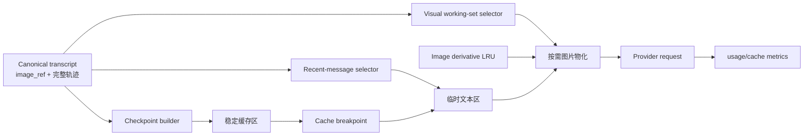

# AI 上下文缓存与视觉工作区升级设计

> 状态：Phase 1–3 已实现（Phase 0 基线已固化；Phase 4 A/B 准备中——Wave 1 数据面与 Wave 2 执行 runner（scripted 模式可用）已落地于 `sidecar/experiments/`，正式采数仍 NO-GO，见 §14）
> 版本：v1.2
> 日期：2026-08-10
> 范围：AI 读片 sidecar 的请求上下文、图片物化、Prompt Cache、Compaction 与可观测性
> 设计基线：base commit `ae46808`（fix(ai): Phase 1 基线——图片预淘汰、3路并发、LRU、指纹校验与唯一概览保护）
> 实现提交：`ae46808`（基线）→ `18d173c`（Phase 1）→ `d1c7649`（Phase 2a）→ `f7d744b`（Phase 2b）→ `ac9ae0b`（Phase 3）

## 1. 背景

当前会话采用 `AgentMessage[]` 保存完整轨迹，图片落盘时脱水为 `image_ref`，模型请求前再物化为 base64。该设计避免了会话文件长期保存大块图片，但随着会话变长，仍有以下问题：

1. 图片如果先全部物化、再按数量淘汰，会重复读取和编码最终不会发送给模型的历史区域。
2. 滚动淘汰会把历史位置上的图片替换为占位文本，改变请求前缀，降低 Prompt Cache 命中稳定性。
3. 单纯扩大 Context 窗口只能延后文本压缩，不能消除视觉 token、JPEG 编码、base64 传输和冷启动成本。
4. 大部分历史图片只承担导航和记忆作用；模型已经具备 `goto + snapshot` 能力，不需要在每轮请求中持续携带高清版本。
5. 文本上下文、视觉工作记忆和持久化审计轨迹目前共用一套消息序列，三者生命周期不同，调优边界不清晰。

本升级将模型请求重构为：

```text
【稳定缓存区】 + cache breakpoint + 【临时工作区】
```

其中稳定缓存区承载长期语义记忆，临时工作区承载近期完整对话和少量当前图片。

### 1.1 当前工作区实现基线

本文档不是对干净 `HEAD` 的现状描述。撰写文档前，工作区已经存在一组未提交的 Phase 1/正确性修复，已固化为 base commit `ae46808`。随后 Phase 1–3 已在 `18d173c`/`d1c7649`/`f7d744b`/`ac9ae0b` 落地，下表"后续工作"列为 Phase 4 及遗留项。

| 能力 | 基线状态（ae46808） | 当前状态（ac9ae0b） |
|---|---|---|
| 淘汰前选择图片 | 已实现：只物化保留项 | 已接入 assembler 的 visual working set 选择器（Phase 2b） |
| region 并发上限 | 已实现：固定 3 路 | 已接入 AbortSignal 和配置项 `region_materialize_concurrency`（Phase 1） |
| region LRU | 基线：32 项、30 秒 TTL、按指纹和 bbox 索引 | 已实现：64MB 总字节上限、1800s TTL、完整派生规格 cache key（质量/overlay版本/resize/encoder）；跨进程 hash 已验证进程内与 Flask 重启两层（本机 Pillow 12.3.0），跨部署环境未验证（§6.3 要求在验证前不得宣称跨部署可复现） |
| 服务端指纹校验 | 已实现：传 `expected_fingerprint`，不符返回 409 | 与 checkpoint、slide info、派生图统一失效（Phase 2a/2b：fingerprint 变化 → checkpoint stale + LRU invalidate） |
| 唯一概览保护 | 基线过渡逻辑：每次 transform 仅首个 >90% 图可声明 | Phase 2b 已持久化 `overview_derivative.ref_id`（identity → 覆盖率兜底只选一次）；旧会话惰性迁移 |
| `image_ref` 异常清理 | 已实现：顶层异常也不会把 ref 发给 Provider | 保持回归测试；Provider 边界同时剥离 `_context_meta` |
| 连续 compaction retained tail 去重 | 已实现 | 保持回归测试 |
| compaction 落盘图片脱水 | 已实现 | 保持回归测试 |
| AbortSignal 取消 region | 基线未实现 | 已实现（Phase 1）：hook→mapPool→flask.region 全链路；按 cache key in-flight 合并，最后订阅者离开才中止底层 fetch（§12.1/§13） |
| 保持宽高比和自适应尺寸 | 基线未实现：固定 1568×1568 | 已实现（Phase 1）：region 新增 `max_long_edge`/`jpeg_quality`，服务端按 bbox 比例计算输出尺寸；sidecar 按概览(1024)/详情(1280)/工作图(768) 分档 |
| 富文本历史图片摘要 | 基线未实现：固定占位文本 | 已实现（Phase 2b）：assembler 建立 ref_id→observations 索引，输出 §7.2 格式（bbox/倍率/摘要/回访提示），无 observation 不伪造 |
| 持久化 context checkpoint | 基线未实现 | 已实现（Phase 2a/2b）：`context_checkpoint` + `session_message_seq` + per-session lock + generation/fingerprint CAS 原子提交；compaction 后重建换代 |
| PreparedRequest | 基线为隐式 currentContext 复用 | 已实现（Phase 2b）：显式对象（logicalCallId/generation/stablePrefixHash/canonicalPayloadHash/imageContentHashes），transient retry 复用，force-compaction 释放重建一次 |
| 显式 cache key / breakpoint | 基线未实现 | 部分实现（Phase 3）：能力分级 off/auto/explicit；explicit 经 pi `samplingParams` 注入 `prompt_cache_key`，provider 拒绝时剥离重试一次（不耗 transient 预算）并 run 级降级；openai-completions 无显式 breakpoint（`supportsBreakpoints=false`）；**CPA 透传未经真实网关验证**（代码内以 `CPA-UNVERIFIED` 标注） |
| 结构化指标（§12） | 基线仅有 last_usage | 已实现（Phase 2b/3）：每请求 JSON 行指标，含 generation/hash 前缀/LRU 命中/两类字节/transform_ms/region_fetch_ms；provider 缓存 usage 不可观测时为 `unknown` |
| 视觉预算（§9.1） | 基线未实现 | 已实现（Phase 2b）：compaction 触发纳入视觉估算（无公式时全额预留 8000）；`tokens_after` 逐消息重估 + 视觉估算；`visual_working_set_max` 限制张数 |

遗留与偏离（详见各 commit message 与代码注释）：
- `safety_margin` 弃用仅到 API 层（接受不写回）；前端表单字段未剔除。
- `_ai_slide_ctx` 的 legacy Python 进程内取图路径仍固定 1568×1568（sidecar 迁移后不走该路径）。
- 确定性 hash 跨部署环境（不同 Pillow 版本）未验证；encoder_version 已随响应返回并记录。
- LRU 命中/未命中计数器为进程级共享，多 session 并发时指标存在竞态（仅影响指标精度）。
- assembler 侧指标与 runner 侧指标分两路记录，未完全合并。
- 概览 `overviewSrcResolver` 依赖 run 内缓存的 canonical 快照；极端情况下（compaction 恰好移除概览 ref）会走 StableContextUnavailable → 无概览换代路径。

## 2. 目标与非目标

### 2.1 目标

- 同一个 checkpoint 生命周期内，模型请求的稳定前缀保持完全一致。
- 图片淘汰只影响 cache breakpoint 之后的临时工作区。
- 图片读取数量由视觉工作集大小决定，不再随会话历史图片总数增长。
- 保留一张稳定的全片概览图；需要细节时由 Agent 主动抓取局部高倍图。
- 旧图片转换为坐标、倍率、观察摘要等文本记忆，不丢失可回访能力。
- Context 窗口与视觉预算独立配置、独立观测。
- 不改变现有会话 transcript、SSE 轨迹和 `image_ref` 的对外语义。
- 在 CPA 不支持显式 Prompt Cache 时安全降级为自动前缀缓存。

### 2.2 非目标

- 本阶段不训练新的病理视觉编码器或视觉 token 压缩模型。
- 不在第一阶段引入 FOCUS、SlideChat、TCP-LLaVA 等自托管模型。
- 不删除历史图片引用；canonical transcript 仍保留 `image_ref` 供 UI 回放和重新取图。
- 不把模型输出视为诊断结论；现有“待复核线索”语义保持不变。

## 3. 核心概念

### 3.1 Canonical transcript

持久化、可审计的完整会话轨迹，继续使用 `SessionData.messages`：

- 文本和工具调用保持原始顺序；
- 图片以 `image_ref` 落盘，不保存 base64；
- UI transcript 从 canonical transcript 构建；
- Prompt Cache 优化不得破坏 canonical transcript。

### 3.2 Context checkpoint

从历史轨迹生成的稳定长期记忆。一个 checkpoint 在多轮模型请求间保持不变，包含：

- 历史任务目标和约束；
- 已确认的观察摘要；
- 重要 bbox、倍率、标注和复核状态；
- 当前 spot 索引快照；
- 一张已预生成、已校验内容哈希的稳定全片概览图；
- checkpoint 覆盖到的 canonical 消息边界。

Checkpoint 更新时 `generation` 加一。新 generation 首次请求是冷缓存，后续请求复用新的稳定前缀。

Checkpoint 只有在稳定概览派生图成功生成并写入缓存后才能提交。临时读取失败不得把稳定区内的概览图静默替换成文本：

- 短暂读取/存储失败：本次请求返回可重试的 `stable_context_unavailable`，checkpoint 不变。它与普通瞬时错误共用同一个逻辑调用的最多 3 次重试预算和 2/4/8 秒退避，不得启动独立递归重试循环；耗尽后结束本次调用并报告错误。
- 指纹不匹配或图片确认永久不可用：使旧 checkpoint 失效，显式生成一个新的、无概览图的 generation；不能在同一 generation 内改变块类型。

### 3.3 Visual working set

只在近期推理中需要的图片集合：

- 当前待消化快照；
- 最近若干张导航或高倍观察图；
- 与图片配对的 tool call / tool result；
- 当前问题和近期完整对话。

Visual working set 位于 cache breakpoint 之后，可滚动变化，不要求 Prompt Cache 命中。

### 3.4 Request context

模型实际收到的请求形态，由 canonical transcript 派生，不直接落盘：

```text
system prompt
tools
checkpoint summary
stable overview image
stable annotation index
cache breakpoint
recent messages
visual working set
current user/tool message
```

## 4. 目标架构



关键约束：

- `Checkpoint builder` 只生成文本和稳定概览引用，不复制近期高清图。
- `Visual working-set selector` 必须在图片物化之前运行。
- 被淘汰的 `image_ref` 直接转换为稳定文本描述，不调用 region 接口。
- `Image derivative LRU` 缓存确定性缩放后的 JPEG 字节，不缓存未校验指纹的数据。

## 5. 请求组装规则

### 5.1 稳定缓存区

稳定区按以下顺序组装：

1. System Prompt。
2. 完整且顺序稳定的工具定义。
3. `context_checkpoint.summary`。
4. 全片概览说明和稳定概览图。
5. checkpoint 时刻的标注/观察索引。
6. 显式 cache breakpoint（provider 支持时）。

同一 generation 内不得加入时间戳、随机 ID、动态计数或重新编码的图片。

稳定概览并非零成本：客户端仍需发送图片载荷，Provider 也可能按缓存视觉 token 计费。预算和“字节数下降”指标必须把这张固定概览计入，不能只统计临时工作区。

建议缓存键：

```text
svs-viewer:{session_id}:{slide_fingerprint}:g{generation}
```

### 5.2 临时工作区

临时区包含：

- checkpoint 边界之后的近期消息；
- 最近图片及其完整工具配对；
- 当前 `pending_snapshot_review`；
- 当前用户问题或 follow-up；
- checkpoint 之后发生的 spot 增量。

不能把孤立的 `toolResult` 放进临时区。选择图片时必须同时保留产生它的 assistant tool call，或将整组历史转换为普通文本观察。

### 5.3 Checkpoint 更新

满足任一条件时允许更新 checkpoint：

- 文本 token 接近 `context_window_tokens - reserve_tokens`；
- recent messages 超过配置上限；
- force-compaction 被触发；
- 用户显式开始新的分析阶段；
- 切片指纹发生变化，旧 checkpoint 必须失效。

更新步骤：

1. 汇总 checkpoint 之后的历史文本、工具结果和 observation。
2. 图片只以 `bbox + magnification + summary + ref_id` 形式参与摘要，不发送 base64 给 summarizer。
3. 生成新 summary 和 annotation index。
4. 更新 `through_message_seq`，`generation += 1`；该字段使用 §10 定义的 session-local message sequence，不是数组下标或 SSE event sequence。
5. 清理不再需要的视觉工作集，仅保留 pending 快照和最近必要图。
6. 下一次请求写入新 cache generation。

Checkpoint 提交必须是原子的：摘要、概览派生规格、概览内容哈希和 `stable_prefix_hash` 要么一起更新，要么全部保持旧 generation。候选摘要和派生图可在 session lock 外计算；提交时必须进入现有 `SessionStore.withLock(sessionId)`，校验预期 generation 与 slide fingerprint 未变化，再通过现有临时文件 + rename 机制一次写入完整 `SessionData`。校验或写盘失败时丢弃候选结果，旧 generation 保持可用；不能先递增 generation 再补写其他字段。

## 6. 图片分辨率与生命周期

### 6.1 默认分层

| 类型 | 建议尺寸 | 生命周期 | 用途 |
|---|---:|---|---|
| 全片概览 | 最长边 1024px | checkpoint 全生命周期 | 导航、组织结构和候选区定位 |
| 低倍导航图 | 最长边 768px | 最近 1–2 张 | 区域间移动和低倍复核 |
| 中倍观察图 | 最长边 768–1024px | 最近若干张 | 结构观察 |
| 当前高倍证据图 | 最长边 1280–1568px | 当前复核周期 | 细胞级细节确认 |
| 已完成观察的旧图 | 不传图片 | 长期文本化 | bbox、倍率、观察摘要、回访入口 |

所有缩放必须保持宽高比，禁止固定拉伸为正方形。Phase 1 需要替换当前固定 `out_w=1568, out_h=1568` 的调用方式：sidecar 根据原始 bbox 比例计算输出宽高，或 region API 新增 `max_long_edge` 并由服务端统一计算。

### 6.2 自适应选择

首版可按 bbox 覆盖率和当前 pyramid level 选择尺寸：

```text
覆盖全片 > 90%       -> 1024px，仅稳定概览
覆盖全片 40%–90%     -> 768px，低倍导航
覆盖全片 15%–40%     -> 768px
覆盖全片 5%–15%      -> 1024px
覆盖全片 < 5%        -> 默认 1280px，仅当前图；经 Provider 能力验证可提高至 1568px
```

最终参数应通过真实读片任务 A/B 测试校准，不能只根据通用视觉 benchmark 决定。

### 6.3 确定性派生图

同一个图片引用和目标规格必须产生相同字节：

```text
cache_key = sha256(
  slide_fingerprint,
  x, y, w, h,
  target_long_edge,
  jpeg_quality,
  overlay_version,
  resize_algorithm,
  encoder_id,
  encoder_version
)
```

建议统一：

- JPEG quality：82 或 85，配置固定；
- 色彩空间：RGB；
- resize：保持比例、固定算法；
- 坐标刻度 overlay 带显式版本号；
- 不写入时间戳和不稳定 EXIF；
- 缓存最终 JPEG bytes，而不是每轮重新编码。

“确定性”必须通过同一固定 fixture 在进程内重复编码、sidecar/Flask 重启后重新编码，以及受支持部署环境间重建三层测试验证。编码器名称/版本与 resize 算法必须纳入派生规格和 cache key，并把编码集中到单一受控实现；在验证完成前不能宣称 `content_sha256` 可跨部署复现。

### 6.4 图片 LRU

LRU 建议按总字节数限制，而不是只按图片张数：

```text
image_derivative_cache_max_mb    = 64
image_derivative_cache_ttl       = 30 min
region_materialize_concurrency   = 3
```

实现内部将 `image_derivative_cache_max_mb` 换算为字节后执行淘汰。缓存项必须包含切片指纹；同名切片被替换后不能命中旧派生图。

## 7. 图片选择与物化算法

### 7.1 先选后取

每次请求按以下顺序执行：

1. 扫描消息中的 `image_ref` 和尚未脱水的 `image`。
2. 确定唯一稳定概览图。
3. 强制保留 pending 快照。
4. 从剩余图片中选择最近 N 张，必要时按观察状态和倍率加权。
5. 未选中的图片直接转换为文本引用。
6. 只物化已选中的 `image_ref`。
7. 先查 derivative LRU，未命中才调用 Flask region。
8. 以 2–4 路并发读取，响应取消时立即中止。

由此保证：

```text
region_calls_per_request
  <= selected_valid_image_refs - image_lru_hits
```

指纹预检失败的 ref 不进入 `selected_valid_image_refs`；并发请求合并时 region 调用数还可以更低。该指标的意义是证明读取量与历史图片总数解耦。

### 7.2 文本化格式

被移出视觉工作集的图片统一转换为：

```text
历史快照 ref={ref_id}：
- level-0 bbox=({x},{y},{w},{h})
- 放大倍率={magnification}
- 观察摘要={summary 或“尚无结构化观察”}
- 如需复核，可 goto bbox 中心后重新 snapshot
```

已经产生 observation 的图片必须携带 observation 文本；未产生 observation 的图片不得伪造结论。

这不是当前 `transformContext(messages)` 单靠消息数组可以完成的工作。Phase 2 的 request-context assembler 必须接收 checkpoint、`SessionData.observations`、pending review 和 canonical message metadata，并建立 `snapshot_id/ref_id -> observations[]` 索引；旧 transform hook 只保留为兼容入口，不能在内部逐次读取 session 文件。

### 7.3 概览图规则

- 每个 session 只保护一张概览图。
- Phase 1 过渡期尚无 `overview_derivative.ref_id`：使用 snapshot identity；恢复旧会话时允许每次 transform 的“首个 >90% 覆盖图”兜底，但同一请求最多声明一个。
- Phase 2 创建 checkpoint 时，按“已记录 identity → canonical 中首个 >90% 覆盖图”的顺序只选择一次并持久化 `overview_derivative.ref_id`。
- checkpoint 已有 `overview_derivative.ref_id` 后不再运行覆盖率猜测；旧会话首次生成 checkpoint 后完成迁移。
- bbox 覆盖率只用于这次惰性迁移，不应让所有大范围图片都成为永久 protected。
- 概览图一旦选定，在 slide fingerprint 不变时不重新编码。

## 8. Prompt Cache 策略

### 8.1 Provider 能力分级

新增 provider capability：

```ts
type PromptCacheMode = "off" | "auto" | "explicit";

interface PromptCacheCapabilities {
  mode: PromptCacheMode;
  supportsCacheKey: boolean;
  supportsBreakpoints: boolean;
  supportsUsageMetrics: boolean;
}
```

- `explicit`：发送 session cache key 和稳定区末尾 breakpoint。
- `auto`：不发送 provider 专有字段，但仍保持稳定前缀和可变后缀结构。
- `off`：仅执行图片和上下文预算，不宣称缓存命中收益。

CPA 是否透传相关字段必须通过实际请求验证，不能只根据上游模型名称推断。

### 8.2 命中规则

- 同一 generation 的 stable-prefix hash 必须一致。
- 图片像素相同但 JPEG 字节、URL 或内容块结构不同，均按可能不命中处理。
- 临时区变化不得修改 breakpoint 之前的块。
- Compaction/checkpoint 更新允许产生一次预期的冷写入。
- transient retry 必须复用同一个已经组装好的 `PreparedRequest`，不能依赖 region LRU 恰好热命中。

建议在 agent-runner/request assembler 边界定义：

```ts
interface PreparedRequest {
  logicalCallId: string;
  checkpointGeneration: number;
  stablePrefixHash: string;
  context: LlmContext;
  imageContentHashes: string[];
  canonicalPayloadHash: string;
}
```

同一个逻辑模型调用的 2/4/8 秒 transient retry 直接复用该对象。当前 `agent-runner` 确实定义了 `currentContext`：普通 transient retry 会继续使用同一份已经转换的上下文；只有 force-compaction 成功后才重新执行 transform 并替换它。升级的目的不是修复一个不存在的“每次重试都重新 transform”问题，而是把现有隐式行为提升为可验证的 `PreparedRequest` 契约，避免未来 wrapper/provider adapter 改动时退化，也不把 30 秒 LRU TTL 当作正确性保证。force-compaction 会创建新的 checkpoint generation，因此允许释放旧对象，组装一次新对象后重试。

`PreparedRequest` 只存活于一次逻辑模型调用：成功、不可重试错误、取消或 force-compaction 换代时立即释放；每个 active session 最多持有一个，不写入 `SessionData`，也不进入全局历史。图片内容复用 derivative cache 已有的 immutable bytes/string，不额外复制；实现应记录对象估算字节数，并纳入单 session 请求内存上限。Provider adapter 应在首次发送前生成一次规范化请求体和 `canonicalPayloadHash`，后续 retry 复用同一对象/字节表示，而不是重新读取图片或重新拼装 JSON。

### 8.3 预期请求序列

```text
R1: [stable g1][BP][image A][question 1]       -> g1 cold write
R2: [stable g1][BP][image A][image B][q2]     -> g1 hit
R3: [stable g1][BP][image B][image C][q3]     -> g1 hit
R4: [stable g2][BP][image C][q4]              -> g2 cold write
R5: [stable g2][BP][image C][image D][q5]     -> g2 hit
```

## 9. Context 窗口与 Compaction

### 9.1 独立预算

文本 Context 和视觉工作集分开限制：

```text
selected_visual_tokens <= visual_context_budget_tokens

estimated_input_tokens
  = estimated_text_tokens
  + estimated_selected_visual_tokens

should_compact
  = estimated_input_tokens + reserve_tokens
    >= context_window_tokens
```

`visual_context_budget_tokens` 是每次请求允许的视觉 token 硬上限，建议初始值 8000；图片张数和分辨率策略还要同时满足该上限。`estimated_selected_visual_tokens` 的计算顺序为：

1. Provider/model adapter 有明确图片 token 公式时使用精确估算。
2. Provider 返回可靠、可拆分的图片 usage 时，用实际值校准该 adapter 的估算安全系数。
3. 无图片公式或 usage 只有聚合输入总量时，即使存在历史 usage，也不能拿它预测不同图片集合；预算预检保守按完整 `visual_context_budget_tokens` 预留，并继续用张数和分辨率双重限制。

不能把像素数直接当 token，也不能因为提高 `context_window_tokens` 就同步提高历史图片数量。固定概览图包含在视觉预算内。

该判断不是与现有 pi compaction 并行运行的第二套触发器，而是替换/扩展传给 compaction 判断的输入估算：pi 的 `tokens + reserve_tokens >= context_window_tokens` 仍是权威触发语义，只是 `tokens` 必须纳入本节估算的已选视觉工作集。`keep_recent_tokens` 只决定压缩切点和保留尾部大小，不参与触发公式；保存配置时仍要求 `reserve_tokens + keep_recent_tokens < context_window_tokens`。现有 `safety_margin` 仅作为兼容配置被接受、运行时未使用，本设计不重新赋予其语义，应单独弃用并在后续版本移除。

### 9.2 窗口升级建议

- 保留当前 272k 作为兼容默认值。
- 增加 400k、512k 灰度档，仅对已验证上游窗口和计费行为的模型启用。
- 先上线视觉压缩和缓存指标，再判断是否提高默认 Context。
- Flask 配置 API 与 sidecar run 边界都必须验证 `reserve_tokens + keep_recent_tokens < context_window_tokens`；不能只依赖某一个入口的校验。

### 9.2.1 窗口档位预设（产品决策，2026-08-13）

产品拍板（取代 9.2 的"任意值"思路）：上下文窗口对用户呈现为**档位选择 + 可选自定义**，视觉预算不再让用户直接调绝对 token 数，而是按"窗口档位 → 预算百分比 + 图片压缩档"的预设推导：

| 窗口档位 | 用户语义 | 视觉预算（窗口 %） | 图片档（overview / detail / working） |
|---|---:|---|---|
| **200k** | 极致节约上下文 | ~10% | 768 / 1024 / 640 |
| **400k** | 宽松 | ~15% | 1024 / 1280 / 768（≈当前默认） |
| **500k**（1M 模型默认） | 高性能 | ~20% | 1024 / 1536 / 1024 |
| 自定义 | 用户填窗口值 | 按最接近档位插值 | 按最接近档位 |

依据与约束：

- 400k 以上模型注意力涣散严重——**1M 模型默认取 500k**，不鼓励直接用满 1M。
- 图片预算是窗口的百分比，随档位自动伸缩；用户不再单独调 `visual_context_budget_tokens` 绝对值（保留自定义覆盖入口给高级用户）。
- 各档位图片压缩比例的具体数值为草案，等 EXP-VISCTX-v1 Step 1/2 数据回来后按 token 成本与质量回归修正。
- 实现时在 `resolveTransformSettings` 增加 `window_tier`（`saving | balanced | performance | custom`）推导逻辑；`context_window_tokens` 与 `visual_context_budget_tokens` 仍可显式覆盖（覆盖时以显式值为准）。

### 9.3 Compaction 正确性

- 下一次增量压缩不得重复注入上一次 retained tail。
- `compaction_entries[].retained_tail` 和 `messages` 落盘前必须真正脱水。
- `tokens_after` 不得复用 retained assistant message 中属于旧请求的 usage。统一口径为：逐消息重新估算压缩后文本块，再加按本节规则估算的已选视觉工作集；事件中的数值标记为 estimate。
- force-compaction 成功后重建 stable checkpoint，并只重试一次模型调用。

## 10. 建议数据结构

在 `SessionData` 中新增可选字段，保证旧会话无需一次性迁移：

```ts
interface PersistedMessageMeta {
  // 从 1 开始、仅在当前 session 内单调递增且永不复用。
  session_message_seq: number;
}

type PersistedAgentMessage = AgentMessage & {
  _context_meta?: PersistedMessageMeta;
};

interface ContextCheckpoint {
  version: 1;
  generation: number;
  created_at: number;
  slide_fingerprint: string;
  through_message_seq: number;
  summary: string;
  annotation_index: string;
  overview_derivative: {
    ref_id: string;
    target_long_edge: number;
    jpeg_quality: number;
    overlay_version: string;
    resize_algorithm: string;
    encoder_id: string;
    encoder_version: string;
    mime_type: string;
    content_sha256: string;
  } | null;
  system_prompt_version: string;
  tool_schema_hash: string;
  request_schema_version: number;
  stable_prefix_hash: string;
}

interface VisualWorkingSetEntry {
  ref_id: string;
  tool_call_id: string | null;
  reason: "overview" | "pending" | "recent" | "detail";
  target_long_edge: number;
  last_used_at: number;
}

interface SessionData {
  messages: PersistedAgentMessage[];
  next_message_seq?: number;
  context_checkpoint?: ContextCheckpoint;
  visual_working_set?: VisualWorkingSetEntry[];
}
```

`through_message_seq` 明确定义为 checkpoint 已覆盖的最大 `session_message_seq`。它不是 `messages[]` 的数组下标，也不是 SSE/event 的 `seq`：compaction 可以重写数组，事件流也可能独立重连，但该消息序号不能改变或复用。新消息由 `SessionStore` 在 append 时分配序号；旧会话首次迁移时按当时 canonical 数组顺序一次性分配 `1..N`。创建分支时，复制到子 session 的 canonical 历史在子 session 内重新连续编号，checkpoint 不直接照搬；如需复用父 checkpoint，必须在子 session 中重建并写入映射后的边界和新 generation。该 metadata 只用于 sidecar 持久化和组装；request assembler 在 Provider/UI payload 边界必须显式剥离 `_context_meta`，不改变消息内容语义。

读取旧会话时：

- 缺少 checkpoint：从现有 compaction summary、observations、spots 和第一张有效 overview ref 惰性生成 generation 1。
- 缺少 working set：从 pending 快照和最近 `image_ref` 推导。
- 只有新 checkpoint 成功落盘后才使用新请求组装器。

`stable_prefix_hash` 必须对 Provider 将要发送的稳定前缀计算，而不是只 hash `summary`。规范序列化固定为 UTF-8、对象键递归字典序、数组顺序不变、忽略 `undefined`、禁止非有限数字，并在 provider capability 转换完成后执行；同一份规范化对象用于计算 hash 和创建 `PreparedRequest`，不能一份用于 hash、另一份交给 Provider SDK 自由重建。

恢复时先按 checkpoint 内快照的编码参数取得概览 bytes，并验证 `content_sha256`。若不匹配，删除可疑派生缓存，使用 checkpoint 保存的完整编码参数和编码器环境重新生成一次：

1. 重建后匹配：继续使用当前 generation，并记录一次 derivative repair。
2. 重建后仍不匹配：判定为编码器环境/确定性契约漂移，当前 generation 失效；以当前受控编码器原子生成新的 checkpoint generation、内容 hash 和稳定前缀，单个逻辑调用最多自动换代一次。
3. 新 generation 仍无法生成稳定概览：按 §13 的稳定上下文失败策略结束调用，不能循环换代，也不能在旧 generation 内把图片静默替换为文本。

用户修改图片配置只影响下一代 checkpoint，不能悄悄改变当前 generation。`system_prompt_version`、`tool_schema_hash`、`request_schema_version`、slide fingerprint 或概览编码规格任一变化，都必须使旧 checkpoint/cache key 失效并创建新 generation；启动恢复时必须先比较这些版本字段，不能只依赖 `stable_prefix_hash` 碰撞后才发现变化。

## 11. 配置建议

建议增加以下配置，旧字段继续兼容：

| 参数 | 建议默认值 | 说明 |
|---|---:|---|
| `visual_working_set_max` | 4 | 不含稳定概览的临时图片上限 |
| `visual_context_budget_tokens` | 8000 | 包含稳定概览的每请求视觉 token 硬预算 |
| `overview_long_edge` | 1024 | 概览图最长边 |
| `working_image_long_edge` | 768 | 普通近期图片最长边 |
| `detail_image_long_edge` | 1280 | 当前高倍证据图最长边 |
| `image_jpeg_quality` | 85 | 确定性派生图 JPEG 质量；checkpoint 内保存快照 |
| `image_overlay_version` | `v1` | 坐标刻度渲染版本；checkpoint 内保存快照 |
| `region_materialize_concurrency` | 3 | region 并发上限 |
| `image_derivative_cache_max_mb` | 64 | JPEG 派生图缓存总量 |
| `image_derivative_cache_ttl` | 1800 | 派生图缓存 TTL，秒 |
| `prompt_cache_mode` | `auto` | `off/auto/explicit` |
| `context_window_tokens` | 272000 | 兼容默认，验证后可灰度提高 |

`keep_recent_images` 在迁移期映射为 `visual_working_set_max`；两者同时存在时使用新字段并记录一次弃用告警。

历史字段 `safety_margin` 继续只为读取旧配置而接受，并记录弃用告警；它不进入 §9.1 公式，新配置 UI/API 不再展示或写回该字段。

图片编码配置更新只对新 checkpoint 生效。保存配置时继续执行跨字段校验；sidecar 收到配置后还要重复验证，防止绕过 Flask 配置 API 的启动方式带入矛盾参数。

## 12. 可观测性

每次模型请求记录以下结构化指标，不记录图片内容和 API Key：

```text
session_id
checkpoint_generation
stable_prefix_hash_prefix
prompt_cache_mode
input_tokens
cached_tokens / cacheRead
cache_write_tokens / cacheWrite
selected_images
materialized_images
evicted_image_refs
image_lru_hits
image_lru_misses
overview_image_bytes_sent
working_set_image_bytes_sent
prepared_request_bytes
transform_ms
region_fetch_ms
compaction_reason
derivative_hash_mismatch
checkpoint_rebuild_reason
```

建议派生指标：

```text
prompt_cache_hit_ratio = cached_tokens / input_tokens
image_lru_hit_ratio     = image_lru_hits / selected_images
visual_bytes_per_turn   = overview_image_bytes_sent + working_set_image_bytes_sent
region_calls_per_turn   = image_lru_misses
checkpoint_turn_lifetime
```

本地可测项（选择/物化/淘汰数、LRU 命中、两类图片字节、请求对象字节、耗时、generation/hash）是强制指标；Provider 依赖项（cached/cache-write tokens）按 capability 可选。如果 CPA 不返回缓存 usage，指标必须标记 `unknown`，不能用请求成功推断命中。

### 12.1 并发与所有权

- 同一 session 延续现有单 active run 约束；request assembler 在 session lock 内只读取一致快照，耗时的 region/编码工作在锁外完成。
- 提交 checkpoint 时使用 §5.3 的 generation + fingerprint compare-and-swap；等待期间若另一个操作换代，当前候选结果直接丢弃。
- 不同 session 可以并发共享进程内 derivative LRU。Node 单线程仍需使用按 cache key 的 in-flight promise map 合并相同派生请求，完成、失败或取消后都必须清理该 entry。
- 一个调用取消只取消自己的订阅；只有同一 in-flight 派生请求已无订阅者时才中止底层 region fetch，避免误伤其他 session。

## 13. 失败与降级

| 场景 | 行为 |
|---|---|
| Provider 不支持 breakpoint | 降级 `auto`，保持稳定前缀结构 |
| Provider 拒绝缓存字段 | 本次移除字段重试一次，并记 capability downgrade |
| 稳定概览暂时读取失败 | 本次请求返回 `stable_context_unavailable`，不改变当前 generation 的稳定区；与瞬时错误共用最多 3 次总重试预算 |
| 概览 `content_sha256` 不匹配 | 清理缓存并按 checkpoint 参数重建一次；仍不匹配则记录编码器漂移并原子换代一次，禁止循环重建 |
| 稳定概览永久失效 | 失效旧 checkpoint，原子生成无概览的新 generation |
| 图片指纹不匹配 | 转为“切片变更，历史图片不可用”，不读取新文件同坐标 |
| LRU 未命中 | 正常调用 region，成功后写 LRU |
| 临时工作区单张图片读取失败 | 仅该图片文本降级，不让整个 transform 失败 |
| Transform 顶层异常 | 清除所有未识别 `image_ref` 后继续，禁止 ref 进入 provider |
| 用户取消 | Phase 1 接通 AbortSignal 后，中止排队和进行中的 region 请求；当前基线尚未实现 |
| Context 超窗 | force checkpoint/compaction 后重试一次 |
| 同名切片被替换 | 失效 checkpoint、working set、slide info 和图片 LRU |

## 14. 实施阶段

### Phase 0：基线指标

- 接入图片物化次数、字节数、耗时和模型 cache usage。
- 建立 10–20 个代表性 WSI 任务的回归集。
- 固化当前未提交修复的 base commit，并在本文档头记录。
- 将 §1.1 的现状矩阵纳入发布检查，避免把目标态误认为已实现。
- 用固定小图 fixture 验证 Flask/sidecar 当前 JPEG 在进程内、重启后和目标部署环境间的 hash；记录编码库及版本，先确认确定性边界。
- 不改变请求结构，收集当前基线。

### Phase 1：图片管线降本

- 改为先选择、后物化。
- 加入并发限制、AbortSignal 和 derivative LRU。
- 修复宽高比和服务端 fingerprint 校验。
- 过渡期保证每次 transform 最多保护一个 overview，并让 snapshot identity 可恢复；持久化 `overview_derivative.ref_id` 留给 Phase 2。
- LRU 从当前条目数上限升级为 `image_derivative_cache_max_mb` 字节上限。
- 将编码器环境纳入派生规格，补齐确定性 JPEG 和 hash mismatch repair 流程。

其中预淘汰、3 路并发、短 TTL LRU、指纹校验和单次唯一概览已在当前未提交工作区实现；AbortSignal、宽高比和字节上限仍待补。这一阶段不依赖 Provider Prompt Cache 能力，可独立上线。

### Phase 2：稳定区与视觉工作区分离

- 增加 `context_checkpoint` 和 `visual_working_set`。
- 新建 request-context assembler。
- 保留 canonical transcript，不再在历史中滚动改图。
- 补齐 tool call/result 成组选择。
- 关联 observations，生成 §7.2 的富文本历史图片摘要。
- 持久化 overview derivative 编码快照和内容哈希。
- 为 canonical message 分配 session-local sequence，并实现旧会话/分支迁移。
- 使用 session lock + generation/fingerprint compare-and-swap 原子提交 checkpoint。
- 组装显式 `PreparedRequest`，普通 transient retry 复用同一对象。

### Phase 3：显式 Prompt Cache

- 增加 provider capability 配置。
- CPA 验证 `prompt_cache_key`、breakpoint 和 usage 字段透传。
- 对支持的模型启用 `explicit`，其余保持 `auto`。
- 验证 `PreparedRequest` 在 Provider 重试层不会被二次序列化为不同图片载荷。
- 对规范序列化、cache key 版本失效和 payload hash 做适配器契约测试。

### Phase 4：分辨率与窗口 A/B

> 准备工作 GO，正式采数 NO-GO。数据面（fixture / 任务集 / arm / rubric / 报表 / 门禁）与**执行 runner（scripted 模式可用）**均已落地于 `sidecar/experiments/`（见 `sidecar/experiments/README.md`）：
> - `fixtures/generate.py` + `manifest.schema.json`/`manifest.example.json`：合成去标识化切片 + 版本化 manifest（pin 需运行中的 Flask，Wave 2 smoke run 才提交 `manifest.json`）。
> - `tasksets/reading-v1.json` + `src/taskset.ts`：覆盖 §15.3 全部 7 类的质量回归任务集 + 手写校验器。
> - `arms/step1-*` / `arms/step2-*` + `src/arms.ts`：两步 A/B arm 定义 + 矩阵生成 + Step-2 `image_strategy: "${step1_winner}"` 占位符解析（`overview_enabled` 已在 Wave 2 接到稳定区概览抑制）。
> - `src/rubric.ts`：rubric 检查器（纯函数）。
> - `src/report.ts`：metrics 聚合 + 确定性 markdown 报表（含概览固定成本/临时工作区成本拆分与 NO-GO 横幅）。
> - `src/gate.ts`：NO-GO 门禁，real-model 模式须 `PHASE4_CPA_VERIFIED=1` 才放行。
> - **Wave 2 执行 runner**（`src/run.ts` 库 + `run-ab.ts` CLI + `src/fake-stream.ts`/`src/manifest.ts`/`src/flask-process.ts`）：scripted 模式经真实 AgentRunner 跑通整套管线（fixture→spawn Flask→pin manifest→每 cell 跑→输出 metrics.jsonl/rubric.json/report.md）；real-model 模式 gate 放行后仍抛“Wave 2 未实现”，provider 接线随 CPA 验证落地。
>
> 在 §14 Phase 3 的 `prompt_cache_key` 真实 CPA 网关验证前，缓存命中率数字不作正式结论。
>
> **EXP-VISCTX-v1 Step 1 初步结果（2026-08-13，gpt-5.6-luna + explicit cache，21 cells 全跑通、0 cell 错误）**：
>
> | arm | reqs | input μ/req | 概览字节∑ | 工作区字节/req | 机器 rubric |
> | --- | ---: | ---: | ---: | ---: | --- |
> | step1-overview-1024 | 89 | 2,549 | 1,625,712 | 786k | 3 FAIL / 4 PENDING |
> | step1-overview-768 | 115 | 2,339 | 1,567,241 | 660k | 2 FAIL / 5 PENDING |
> | step1-overview-none | 120 | 2,756 | 0 | 843k | 2 FAIL / 5 PENDING |
>
> 初步结论：**768 概览胜出**——input 均值最低、工作区字节/请求最低、机器 FAIL 最少；无概览对照组成本反而最高（失去概览后模型反复 snapshot 探索，input 与工作区字节双升），印证概览的语义价值。样本为单轮 21 cells（真实模型非确定性），列为初步结论；Step 2 以 `step1-overview-768` 为固定图像策略继续。
>
> **CPA gemini 兼容路径验证实录（2026-08-12，`sidecar/experiments/smoke-gemini.ts`）**：
> - CPA 网关 gemini 兼容端点（`/v1beta`，模型 `gemini-3.6-flash-high`）文本与图片请求均正常，`usageMetadata` 完整透传（含 `thoughtsTokenCount`）。
> - sidecar 新增 `api_protocol: "gemini"`（pi `google-generative-ai` provider）并端到端跑通真实 AgentRunner run：goto/snapshot/mark_observation/complete_snapshot_review/finish 工具链、快照图片经 assembler 物化进入请求（`working_set_image_bytes_sent` > 0）、usage 落指标。
> - **缓存观测**：连续 3 次相同 1024px 图请求 `cachedContentTokenCount` 恒为 0——CPA 转发的 gemini 路径缓存命中**不可观测**（可能网关未透传缓存统计、或上游未命中隐式缓存）。gemini 协议无 `prompt_cache_key` 字段，explicit 模式在 gemini 下跳过 cache key 注入；`cachedContentTokenCount`（pi 映射为 `usage.cacheRead`）指标保留观测。openai 协议的 `prompt_cache_key` 透传仍为独立的未验证项。
> - 因此 `PHASE4_CPA_VERIFIED` 门禁**维持 NO-GO**：gemini 路径已可正常使用，但缓存命中率结论仍待可观测性验证。

- 对“稳定区无概览”、768px 概览、1024px 概览三组做同任务质量、token、缓存和 TTFT 对比；临时高倍图策略保持一致。
- 在胜出概览组内再对 768/1024/1280px working/detail 策略做质量、token、延迟对比。
- 灰度测试 272k、400k、512k Context。
- 根据真实 cache read、TTFT 和读片回归结果选择默认值。

## 15. 测试计划

### 15.1 单元测试

| 测试 | 基线状态（ae46808） | 当前状态（ac9ae0b + Wave 1/2 实验，sidecar 448 + python 43 全绿） |
|---|---|---|
| 历史图片很多时 region 调用有界 | 已有 | 保持；working set 默认 4 + 概览 1 张上限由 assembler 层覆盖 |
| LRU 热请求不再次调用 region | 已有 | 字节上限 LRU 下保持；补 recency 刷新/TTL/按 slide 失效 |
| 图片选择顺序稳定 | 已有基础覆盖 | 补 assembler recent-slice 选择与稳定区字节一致性覆盖 |
| pending 快照不被淘汰 | 待补 | 已有（ref 与 live image 两路，优先级高于普通 recent） |
| 只保护唯一概览 | 已有过渡逻辑覆盖 | 已有持久化 `overview_derivative.ref_id` + selectOverviewRef 覆盖 |
| 缩放保持宽高比 | 待补 | 已有（横向/纵向/边界裁剪，python `test_region_max_long_edge.py`） |
| 同样输入产生相同 JPEG hash | 待补 | 已有进程内+Flask 重启两层（烟雾测试实录 hash 一致）；跨部署未验证 |
| JPEG hash 跨部署环境稳定 | 待补 | 未覆盖：encoder_version 已入响应与 checkpoint，跨部署验证留 Phase 4 前置 |
| 概览 hash 不匹配恢复 | 待补 | 已有（首次清缓存重建、二次不匹配 StableContextUnavailable 且旧 generation 不被原地修改） |
| 指纹不匹配时不读取 region | 已有 | 保持 sidecar 预检和 Flask 409 两层覆盖 |
| AbortSignal 终止排队/进行中请求 | 待补 | 已有（排队不启动、fetch abort、两订阅者单方取消、最后订阅者才中止） |
| 顶层异常后没有 `image_ref` 泄漏 | 已有 | 保持；补 Provider 边界 `_context_meta` 剥离 |
| 连续两次 compaction 不重复 tail | 已有 | 保持 |
| compaction 落盘不包含图片 base64 | 已有 | 保持 |
| LRU 按总字节淘汰 | 待补 | 已有（超限淘汰最久未用派生图） |
| message sequence 迁移与边界 | 待补 | 已有（旧会话 1..N 迁移幂等、append 单调不复用、compaction retained 不重编号、UI 边界剥离） |
| 配置与版本失效 | 待补 | 已有（prompt/tool/request/slide/encoding 任一变化 checkpointStale 判定并换代；cache key 随 generation/fingerprint 失效） |
| checkpoint 原子提交 | 待补 | 已有（过期 generation/指纹变化/写盘失败时旧 generation 完整保留） |

“已有”指对应 commit 的工作区中已有测试并通过（sidecar `npx vitest run` 448、python `pytest tests/` 43；含 Wave 2 实验 runner 的 `experiments-runner.test.ts` 与 `overview_enabled` 覆盖）。

### 15.2 集成测试

- 同一 generation 连续请求的 `stable_prefix_hash` 一致。
- 图片滚动淘汰不改变 breakpoint 之前的 payload。
- checkpoint generation 更新后仅首次请求冷写。
- CPA 不支持显式缓存字段时自动降级并成功完成请求。
- transient retry 复用同一个 `PreparedRequest`，对象内图片 hash 和 payload bytes 不变。
- `stable_context_unavailable` 与普通瞬时错误共用重试计数，最多 3 次后终止且 generation 不变。
- 替换同名切片后旧 checkpoint 和图片缓存全部失效。
- 两个 session 同时请求同一派生图时只发起一次 region；单方取消不会中止另一方。
- force-compaction 释放旧 `PreparedRequest`，只创建一个新 generation 和一个新请求对象。
- Wave 2 实验 runner（`experiments-runner.test.ts`，注入内存 FlaskClient mock 不 spawn 真 Flask）：scripted 1-task/1-arm 矩阵产出 metrics.jsonl/rubric.json/report.md/run.json；transcript 扁平从 `toolResult.details.src` 还原 snapshot bbox；real-model 缺 `PHASE4_CPA_VERIFIED` 在任何工作前抛 gate 错；step 2 缺 `--image-arm` 抛错；arm 覆盖经 `buildRunConfig` 到达 transform 设置（`overview_enabled=false` → 全行 `overview_image_bytes_sent=0`）。

### 15.3 质量回归

覆盖以下任务：

- 全片低倍候选区域定位；
- 从概览逐级 goto 至高倍；
- 细胞级形态需要重新抓取高倍图；
- 多区域比较；
- 长会话继续和 compaction 后继续；
- 历史 observation 坐标回访；
- 无值得标注区域的完整扫读。

低分辨率策略必须通过人工复核，确认不会让 Agent 在细节不足时直接下结论，而是会主动重新 snapshot。

### 15.4 回归数据与设计同步

- 仓库只保存去标识化的小型裁剪 fixture 和版本化 manifest（fixture ID、slide fingerprint、期望 bbox/hash/任务标签），不提交原始大 WSI。✅ 已具备：`sidecar/experiments/fixtures/generate.py`（合成 pyramidal TIFF + `--pin` 版本化 manifest）、`manifest.schema.json`、`manifest.example.json`（占位指纹，Wave 2 smoke run 才 pin 真实指纹）；生成切片 `slides/` 已 gitignore 不提交。
- 完整 WSI 回归集放在权限受控的评测存储中；本地和 CI 通过 manifest 固定版本，缺失数据时明确 skip，不能悄悄换样本。
- 每个 Phase 合并时必须更新 §1.1 的“已实现/后续工作”、测试状态和文档头 base commit；CI 增加配置 schema 与本文档配置名的一致性检查，并运行 `git diff --check`/Markdown 链接与代码块检查。
- 实现 PR 在 checklist 中逐项链接对应设计条目和测试；改变请求 schema、checkpoint 字段或预算公式时，文档与迁移测试必须同 PR 更新。

## 16. 验收标准

### 16.1 正确性

- Provider payload 中 `image_ref` 数量始终为 0（当前未提交工作区已有回归测试，升级后保持）。
- 同名切片替换后旧图片不会被错误物化。
- canonical transcript 与 UI 历史不因请求优化而丢失。
- tool call/result 配对验证全部通过。
- 连续 compaction 不重复历史、不写入 base64。

### 16.2 性能

- 图片物化调用数与历史图片总数解耦。
- 典型长会话的每轮发送图片字节数较 Phase 0 基线下降至少 50%；新旧口径都必须包含固定概览图，分别报告“概览固定成本”和“临时工作区成本”。
- LRU 热命中时相同 bbox 不重复 JPEG 编码。
- 用户取消后不再等待无关历史图片请求完成。

### 16.3 缓存

- 同一 checkpoint generation 的稳定前缀 hash 为 100% 一致。
- Provider 支持显式缓存时，预热后的请求能观察到非零 cached tokens。
- checkpoint generation 不变化时，不因视觉工作集滚动而重写稳定缓存区。
- 缓存命中不可观测的 Provider 必须明确显示 `unknown`。

### 16.4 质量

- 代表性读片回归集不出现明显退化。
- 需要细节的任务能触发高倍 snapshot，而不是依赖低分图猜测。
- 坐标回访和标注位置与升级前保持一致。

## 17. 风险与取舍

1. **低分图遗漏细节**：通过保留当前高倍证据图和主动 zoom 机制缓解，不能把所有图片统一压到 512px。
2. **稳定概览固定成本**：概览位于稳定区有利于语义和缓存，但仍占请求字节及视觉 token；A/B 必须包含“文本稳定区无概览”的对照组。
3. **缓存字段兼容性**：CPA 可能不透传最新 Provider 字段，因此必须能力分级和安全降级。
4. **Checkpoint 摘要损失**：重要坐标、倍率、观察状态必须采用结构化模板，不完全依赖自由文本摘要。
5. **缓存写成本**：新 generation 会产生冷写，应避免过于频繁地更新 checkpoint。
6. **工作区重组影响工具语义**：必须成组保留工具调用和结果；更早历史先转换为 checkpoint 文字。
7. **模型差异**：不同模型视觉 token 计算方式不同，分辨率参数不能只按单一供应商公式硬编码。

## 18. 相关工作

- [OpenAI Prompt Caching](https://platform.openai.com/docs/guides/prompt-caching)：精确前缀匹配、cache key 与显式 breakpoint。
- [OpenAI Images and Vision](https://platform.openai.com/docs/guides/images-vision)：视觉 detail、分辨率与 token 预算。
- [Anthropic Prompt Caching](https://docs.anthropic.com/en/docs/build-with-claude/prompt-caching)：图片也要求缓存前缀完全一致。
- [Anthropic Vision](https://docs.anthropic.com/en/docs/build-with-claude/vision)：按 patch 计费及保持比例缩放。
- [V*: Guided Visual Search](https://arxiv.org/abs/2312.14135)：从全局图搜索局部证据。
- [ZoomEye](https://arxiv.org/abs/2411.16044)：training-free、model-agnostic 的树形视觉探索。
- [LLaVA-NeXT / AnyRes](https://llava-vl.github.io/blog/2024-01-30-llava-next)：动态高分辨率与网格化视觉输入。
- [Matryoshka Multimodal Models](https://matryoshka-mm.github.io)：推理时可调的粗到细视觉 token。
- [FOCUS](https://arxiv.org/abs/2411.14743)：病理 WSI 的自适应视觉压缩和区域优先级。
- [SlideChat](https://arxiv.org/abs/2410.11761)：面向 whole-slide pathology 的视觉语言助手。
- [Efficient Whole Slide Pathology VQA via Token Compression](https://arxiv.org/abs/2507.14497)：病理 WSI 视觉 token 压缩。

## 19. 最终决策摘要

本升级不采用“无限提高 Context 并持续携带高清图片”的方案，而采用：

```text
稳定缓存区
  = 系统提示 + 工具 + checkpoint 摘要 + 唯一低分概览 + 标注索引

临时工作区
  = 近期完整对话 + 最近少量图片 + 当前高倍证据 + 当前问题

长期视觉记忆
  = image_ref + bbox + 倍率 + observation 文本，可按需重新 snapshot
```

Context 窗口负责保留文本推理连续性；视觉工作集负责当前感知；canonical transcript 负责审计和回放；Prompt Cache 只覆盖稳定前缀。四者生命周期分离后，才能同时获得可控成本、稳定命中和读片细节能力。
