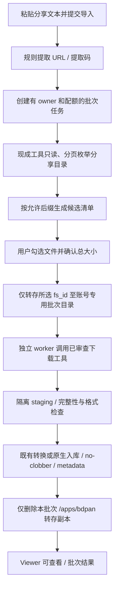

# 百度分享链接候选选择、转存与下载：开源方案可行性

> 2026-09-12；只更新方案文档，未改业务代码、未转存、未下载、未入库。本机 `bdpan` 3.8.7 已完成 OAuth；官方 `transfer list --json` 已对用户实样分享做只读递归枚举。
> 用户最终流程：贴百度分享文本/提取码，平台先只读递归枚举并列出可导入的 SVS、OME-TIFF/TIF 或 KFB 候选；用户选择后才转存、下载、校验入库，并删除平台账号里本批次转存副本。无需整理 agent。
> 已对用户提供的实样分享做只读枚举（提取码会话，未登录官方 CLI）。未把提取码、完整路径或姓名写入外部搜索；下文只保留结构、后缀和量级。
> 关联：[远程摄取架构](remote-file-ingestion-feasibility.md)、[COS 方案](cos-direct-upload-audit-plan.md)。不改变 COS 首期优先级及暂缓实施决定。

## 1. 结论与旧判断修正

**条件式可行，而且“先列候选、用户选择、再转存下载”比自动整理更简单、更可审计。** 技术流程已有现成工具覆盖，无需自写分享页抓取、签名算法、网盘下载协议或整理 agent；尚不能承诺无人值守生产或会员满速。

本次发现 `baidu-netdisk/bdpan-storage` 官方组织仓库已明确提供分享列表、按选择转存、分享链接先转存再下载的文档能力。[1][2] 因此旧文档中“百度分享链接只可非官方抓取”的概括不再完整：官方工具路径可以探索；非官方 Cookie 抓取仍不作为正式公共入口的默认方案。

但官方工具存在不等于通用开放 API 对任意自建应用已开放：应用身份、权限范围、后台集成条件、商业/多用户使用范围仍未验证。也不能把官方 Skill 的公开许可证自动延伸为另行分发的 CLI 核心许可证。

## 2. 现成工具优先级

| 候选 | 查到的能力 | 缺口 | 结论 |
|---|---|---|---|
| 官方 `bdpan-storage` / `bdpan` | OAuth、应用目录、分享列表/选择转存、目录下载、JSON 输出 | README 标注 Beta；CLI 核心源码未在已查仓库找到；长任务恢复、后台授权和实际速度待测 | **功能匹配度最高，第一 PoC 候选**，但不能称为已证实完整开源成熟下载器 [1][2][3] |
| `qjfoidnh/BaiduPCS-Go` | 可编译 Go 源码，分享转存、目录下载、线程/重试配置 | Cookie/BDUSS/STOKEN 路径，存在非官方接口依赖；需审查固定版本和实际账号行为 | **源码可审查的备选**；适合隔离自用验证，不默认公开托管总账号 [4] |
| 官方 `baidu-drive-sdk-go` | OAuth、文件列表、fs_id→dlink→下载 API | 未在本次 API/scene 目录发现分享转存实现；高级下载函数不足以承担断流恢复 | 适合作为未来官方 API 适配层，不是完整开箱即用分享导入服务 [5] |
| OpenList 百度分享插件 | 有官方团队仓库 | README 明确标“测试版”；还需运行/适配 OpenList | 当前没有证据说明比直接 CLI 更成熟，不为这个入口单独引入整套平台 [6] |

只读 GitHub tree 核验（未执行仓库代码）：

- `bdpan-storage`：`069dc7ee9f51e5a4595abd221d6263f000eaa340`，40 个文件；未找到 `.go/.rs/.py/.ts/.js` 下载核心源文件。公开安装脚本从百度 CDN 获取安装器。结论仅限本次审查仓库，并非断言其他地方不存在源码。
- `BaiduPCS-Go`：`1b9131817aaf8ca7dee24bc00e33ebc4c7a5cc73`，227 个文件。
- `baidu-drive-sdk-go`：`e975a2c2b0bd123b5a7c9aca4f59fe7a6e02de4e`，87 个文件。

官方 Go SDK `scene/download.go` 中使用 `os.Create` 写文件，`io.Copy` 失败会删除 partial；接口调用重试不能证明传输中断后可续传。[5] 不直接把这个 helper 放到最终目录，也不把厂商 MD5 字段当作本地已计算校验结果。

若“下载核心必须完整开源”是后续硬要求，需优先核验 BaiduPCS-Go 的实际稳定性或获得官方核心源码；不能以“官方仓库可看”替代开源审计。现阶段不自行补一整套下载器作为默认解决办法。

## 3. 会员与速度边界

用户表示自己有会员，这是可测试的有利条件；分享文本中的“超级会员 V10”是分享者描述，不能证明接收账号权限或下载程序能获得同等加速。

百度开放平台的 NAS 方案提及下载等会员权益与商业合作能力，但不能据此确认任意 CLI、自建应用、多人共用账号均享有同一套餐权益。[7] 本次未拿到用户账号授权，也未验证 API 场景和下载吞吐，不给出“必定 10/50/100 MB/s”承诺。

需测：同一非敏感测试文件、同一目标服务器，用官方支持路径比较 CLI 与可用的官方客户端；记录会员类别、应用身份、单连接/合理并发、持续吞吐、token/dlink 过期及断点恢复。按账号串行转存、小并发下载起步，避免把一个账号当作无限并发后端。

百度到最终服务器可以直接下载，不需要经过 frp，也不必再传 COS；因此没有这一条路径的 COS 公网下行费，但仍有网盘权益/容量、目标网络、服务器磁盘与维护成本。若服务器自身入网也只有 30 Mbps，会员不会突破该物理瓶颈。

## 4. 建议的产品流程

1. URL 与提取码使用确定性解析器，从用户贴的整段文本提取；只接受批准的百度分享域名和格式。query 提取码与文本提取码冲突时需澄清，不猜测。服务端 API 不请求分享页，只持久化控制任务。
2. 受限连接器使用 `bdpan transfer list --json` 一类现成能力，只读、分页、递归枚举这一个分享的目录；设置最大条目数、深度和总候选字节。不要使用账号全局文件搜索来代替分享目录枚举，否则可能漏文件、混入同名文件或跨出本次分享。[2]
3. 平台对返回名称做不区分大小写的最长后缀匹配，首期候选为 `.svs`、`.ome.tif`、`.ome.tiff`、普通 `.tif/.tiff` 和 `.kfb`。只按最后一个点取扩展名会丢失 OME 语义，因此必须先匹配 `.ome.tiff/.ome.tif`。`.kfbf` 不支持；其他格式可在后续按项目格式注册表扩大。
4. UI 展示分享内相对路径、文件名、格式类别、大小和可选择状态；默认可不勾选。用户确认具体文件及总大小后，服务端提交这些候选对应的字符串 `fs_id`，并再次验证它们属于原分享快照、名称/大小未变、未超配额。分享标题声称的文件数不代替真实目录枚举，用户提交任意 fs_id 也不能绕过候选清单。
5. 仅把用户选中的文件转存到本批次独立目录，不转存整个分享目录。选中的文件随后逐项下载；单个文件失败不冒充整个批次成功，只重试失败项。同名使用内部唯一标识，跨用户禁止仅凭文件名复用或泄露去重结果。
6. 为每个批次使用独立网盘目录、staging 和 source manifest，记录选择时、转存后和下载前的 fs_id、相对路径、大小、可用校验值及来源关联。fs_id 用字符串跨 JSON 传输，避免整数精度损失。[2]
7. 采用 CLI 时使用固定可执行文件和参数数组，禁 shell 拼接用户文本；限命令集合、超时、CPU/磁盘及网络范围，凭证仅连接器可读。不让 Web 请求或 HistoPilot 启动长下载。
8. 保存异步转存 task_id。`submitted` 只表示提交，不是成功；查询暂不可用时保持待核验，不重复转存。[2] 任务租约、进度、重试、取消、源身份变化均纳入同一平台摄取架构。

下载工具可以作为受监督的子进程复用，但原始工具的自动重定向、下载目标路径和恢复行为也须实测；容器网络仍拒绝内网/metadata，工具不得拥有最终 UPLOAD_DIR 写权限。若工具达不到安全恢复合同，先用于管理员隔离导入，不直接扩到公共入口。

## 5. 确定性筛选与入库

不需要整理 agent。分享文本只用于取得链接和提取码；其中的人名、日期、标记物、项目编号及“几张”等内容不自动写入病例或切片元数据。平台把百度返回的路径和文件名作为来源信息保留，最终可见名称继续走现有安全命名与 no-clobber 规则。

后缀筛选只产生“可能可导入”的候选，不能证明内容真实有效。下载后仍执行实际字节限制、SHA-256、magic/容器检查及 `slide_io.open_slide` 验证：

| 候选 | 下载后的处理 |
|---|---|
| `.svs` | 原生单文件校验并入库 |
| `.ome.tif` / `.ome.tiff` | 保留完整逻辑后缀，走 OME-TIFF 优先读取与多通道校验 |
| `.tif` / `.tiff` | 作为通用 TIFF 候选，实际解析失败则拒绝 |
| `.kfb` | `convert-required`；仅已支持的明场 KFB 进入现有后台转换，成功后以 canonical `.tif` 入库并保留来源关联 |

当前 `slide_format_registry.py` 明确把 KFB 标为需转换，把 KFBF 标为不支持；不能因为分享里出现 `.kfbf` 就推导为可转换。若以后加入 MRXS，必须选择主文件及其完整伴随目录，不能沿用当前单文件选择合同。

用户选择后即可自动执行转存、下载和规则化入库，无需第二次人工整理。只有候选在选择后被分享者撤回/替换、大小未知、格式验证失败、KFB 变体不支持或配额冲突时，任务进入明确的待处理/失败状态。无候选时不得转存整个分享。

## 6. 多用户与清理

用管理员会员账号接收其他用户提交的分享，本质上是统一代收：平台 owner 必须始终是提交者/已授权项目，不能变成网盘账号持有者。网盘应用目录不是多租户隔离机制；每任务权限、列表过滤、配额及审计需要平台保证。

建议先对管理员/明确邀请用户开放连接器试点；对外规模化前核实该工具及账号套餐是否允许这种后台代收使用。这里尚未完成条款核验，不能断言禁止或已经允许。验证码/撤权/会员能力不足应进入待处理，不做绕过和无限重试。

网盘清理对象是**平台连接器账号**在 `/apps/bdpan/<job-id>/` 下的转存副本，不是分享者网盘、也不是提交用户的个人文件。在这个边界内，入库成功后删除转存副本是合理的，作用等同于 COS 暂存对象的成功即删：把会员容量留给下一批，而不是再留一份已入库的 GB 级副本。

建议合同：

1. 只转存用户勾选的 `fs_id` 到本任务独立目录，禁止 `bdpan download <分享链接>` 那种“先整份转存再下载”的默认路径。
2. 本地 SHA-256、格式校验、原子提升和 metadata 提交成功后，才对该文件执行 `bdpan rm`；整批完成后可删空的任务目录。CLI 文档将 `rm` 描述为不可撤销，且 PathGuard 限制在 `/apps/bdpan/`。
3. 单文件失败则保留对应转存副本供重试，不删整个任务目录；超过保留窗（建议 7 天）再过期清理。删除失败记审计告警，不把已成功的入库打成失败。
4. 删除前校验路径前缀等于本任务目录；禁止把 COS 的“成功即删”套用到连接器账号以外的任何网盘路径。
5. 回收站是否真正释放容量、以及 `rm` 是否进入回收站，登录后仍需实测。空候选清单（如下文 KFBF 实样）不应产生转存，也就没有可删副本。

## 7. PoC 退出条件

| 项目 | 必须取得的证据 |
|---|---|
| 工具资格 | 固定版本、源码/二进制来源、许可证边界、供应商授权方式；官方 Beta 不能标成熟稳定 |
| 分享解析 | 带 query/单独提取码、无密码、错误密码、失效/撤销链接、多级目录和分页；先查清单而非盲目全盘转存 |
| 账号能力 | 实际会员/应用授权支持列表、转存、下载和后台运行；不借用无关公开 client_id |
| 长任务 | 5/20/50 GB 非敏感测试文件，断流/进程重启/token 过期/源变化后正确恢复；唯一完整本地 SHA-256 |
| 批次与配额 | 清单超量、转存排队、submitted、账号空间不足、并发提交、取消、部分成功都不重复下载或错归属 |
| 候选与选择 | 递归分页、大小写后缀、`.ome.tif/.ome.tiff` 最长匹配、KFB/KFBF、同名不同路径；只转存服务端清单中由用户选定的 fs_id |
| 隔离与入库 | 工具无最终目录/内网权限；后缀命中但内容伪造时校验失败，校验前不可见，配额一次结算，失败可恢复 |
| 转存清理 | 仅删除 `/apps/bdpan/<job-id>/` 前缀；成功项删除、失败项保留；删除失败不回滚入库；回收站容量是否释放需实测 |

建议顺序：官方 bdpan 功能 PoC → 核实核心可审计性和后台集成条件 → 不满足时评估 BaiduPCS-Go 隔离备选 → 确定工具后才写薄适配层。若所有现成方案均无法达到要求，则保留“用户用官方客户端下载，再走现有上传”的退路，不立即自研分享抓取。

## 7.1 实样枚举（2026-09-12）

官方只读列举需要 OAuth：未登录时 `bdpan transfer list` 返回“请先执行 bdpan login”。授权码登录后 `whoami` 为已认证，token 约 30 天。随后用 `bdpan transfer list --json` 按返回的目录 `path` 填 `--source-dir` 递归走完这棵树；`has_more` 均为 false。`fs_id` 在 JSON 中为字符串，与先前网页分享会话中的 `fs_id`、大小完全一致。路径合同不同：CLI 使用 `/<分享内相对路径>`，网页会话使用 `/sharelink<uk>-<root_fs_id>/...`；递归必须用 CLI 当前页返回的 `path`，不能混用网页前缀，也不能做账号级 `search`。

| 层级 | 结果 |
|---|---|
| 根 | 1 个文件夹，`has_more=false` |
| 第二层 | 8 个条目：4 个 `.kfbf` 文件 + 4 个同名 `*_kfbf` 目录 |
| `*_kfbf` 目录 | `Annotations/` → `channel.json`（1229 字节），无 `.kfb` / `.tif` / `.svs` |
| `.kfbf` 大小 | 481661346、530063959、806456145、946972112 字节，合计约 2.57 GiB |

结论：

- “枚举本次分享目录再筛选”已被官方 CLI 证实可运行：一层一页、目录再查、`fs_id` 可稳定引用。
- 当前白名单下**候选为空**。`.kfbf` 必须不可选；不要把 `*_kfbf` 目录或 `channel.json` 当成切片。无候选则停止，不转存。
- 本分享若误用 `bdpan download <分享链接>`，会把约 2.57 GiB KFBF 及伴随目录全部转进 `/apps/bdpan/`。这从反面支持“先筛选、只转存所选、成功后删批次目录”。
- 仍未做：转存、下载、`rm` 是否进回收站、会员实际下载速度。`bdpan vip` 只返回开通入口，不能据此判断当前账号套餐。

## 8. 证据来源

1. [官方 bdpan-storage README：分享下载、OAuth、Beta](https://github.com/baidu-netdisk/bdpan-storage)
2. [bdpan 命令手册：列表、选择转存、异步状态、分享下载](https://github.com/baidu-netdisk/bdpan-storage/blob/main/skills/baidu-drive/reference/bdpan-commands.md)
3. [安装脚本：另行获取百度 CDN 安装器](https://github.com/baidu-netdisk/bdpan-storage/blob/main/skills/baidu-drive/scripts/install.sh)
4. [BaiduPCS-Go 源码与说明](https://github.com/qjfoidnh/BaiduPCS-Go)
5. [官方 Go SDK 下载 helper 源码](https://github.com/baidu-netdisk/baidu-drive-sdk-go/blob/e975a2c2b0bd123b5a7c9aca4f59fe7a6e02de4e/baidudriver/scene/download.go)
6. [OpenList 百度分享插件：测试版](https://github.com/OpenListTeam/openlist-baidushare-plugin)
7. [百度开放平台 NAS 方案](https://yun.baidu.com/union/industrySolutions?type=storage)（搜索索引可读，页面正文动态加载；未获得适用个人账号的完整套餐合同。）

补充：开放平台下载文档 `pan.baidu.com/union/doc/pkuo3snyp` 本次读取失败；没有以第三方“满速”描述替代官方合同。
