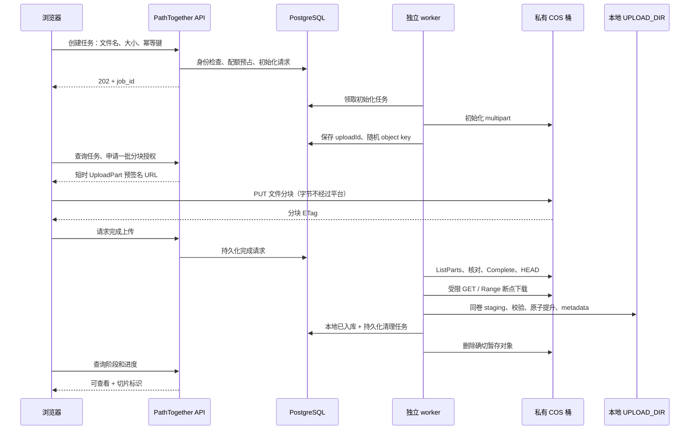

# COS 前端直传与本地摄取：更新方案及审计合同

> 日期：2026-09-12（Asia/Shanghai）
> 状态：合同已冻结待开工授权。未实现、未采购、未配置云资源、未部署。2026-09-11 暂缓实施继续有效。
> 产品决定与执行顺序以本文 + [分流调研](upload-routing-open-source-review.md) §0/§8 为准。worker/SSRF/邮件 NO-GO 仍以 [远程摄取架构](remote-file-ingestion-feasibility.md) 为不可降级门槛。
> 未获明确开工授权前，不得改业务代码、创建桶/密钥或开启 capability。

**授权决议栏（PoC 后填写，填写前禁止开发产品控制面）：**

- 日期：
- 决议：`未决` / `B-SDK-STS` / `A-presign-parts` / `NO-GO`
- 证据：三段吞吐记录、STS/CAM 策略、费用边界、CORS/CSP、失败原因
- 选定后删除另一候选的 API 实现计划，不得双栈

## 1. 决策与边界

可行。上传按钮留在 PathTogether：浏览器向平台要任务和授权，分块字节直传 COS。平台 Web API 只处理小型 JSON；COS→本地由独立 worker 下载。Viewer 仍读本地 `UPLOAD_DIR`。

冻结边界：

- 平台自有、管理员配置的私有标准存储桶。禁止用户任意 URL/bucket/endpoint/Header。
- 普通地域域名；不默认 CDN、全球加速、跨地域复制。地域由实际上传网和服务器下载网测量后选择。
- 10 GB 容量包不是桶上限，也不是应用配额。现有默认 10 GiB 单文件、20 GiB 用户配额不能借 COS 绕过。
- 首期 COS 格式 = 原生单文件：`svs/tif/tiff/ndpi/vms/vmu/scn/bif/svslide`。ZIP/MRXS 保留 V1。KFB 等转换格式单独验收前禁止 COS。
- V1/V2 保留为备用。任务开始后冻结运输方式。
- 路由政策 v1 与校准规则见分流文档 §0。本文不单独发明另一套大小表。
- COS capability 四项门禁（授权决议已填、worker/清理可运行、长租约与费用硬停、首期格式验收）全部通过前，不得把 COS 标为 available。

## 2. 当前代码证据与未来改动位置

2026-09-12 只读检查，当时 HEAD `4d52c25`；工作区可能另有未提交修改，锚点不代表生产版本。

| 位置 | 当前行为 | 未来审计范围 |
|---|---|---|
| `static/app.js`：`uploadFile()` | V2 或 Legacy | capability 关闭时行为不变；开启后增加 COS 分支 |
| `static/app.js`：`shouldChunkUpload()` | `>=16 MiB` 走 V2；ZIP/MRXS 排除 | COS 白名单、开关、冻结 transport |
| `static/app.js`：`uploadV2Chunks()` | PUT `/api/uploads/{id}/chunk` | 不改 V2 offset 合同；COS 用独立适配器 |
| `app.py` bootstrap | 仅 V2 阈值 | 门禁后才下发 COS 可用性、格式、阈值字节；不含秘密 |
| `upload_guard.py` | 用户配额、1800s reservation、磁盘水位 | 长租约、COS 在途/费用硬停（含 owner/免登录） |
| `upload_task_store.py` | 浏览器串行 offset | **禁止**复用作 COS 任务表 |

不能只把 XHR URL 改成 COS 域名。

## 3. 授权选型：先 B 后 A，只留一套

候选 B：官方 `cos-js-sdk-v5` + 单 key STS，浏览器执行高级分块（含 Initiate/Complete）。
候选 A：平台/worker 控制 multipart，浏览器只有绑定长度的 UploadPart 预签名。

互斥。未写入文首决议栏前，只允许测试账号上的 PoC 脚本，不允许合入产品 API。

### 3.0 自动判定（PoC 后执行，不再询问）

**先做 B。** 下列全部为真 → 决议 `B-SDK-STS`：

1. CAM 能把临时权限限制到平台分配的单个随机 key（或该 key 前缀下的该对象），且 PoC 证明跨 key 写入失败。
2. 不授予 GetObject、删除最终对象、ListBucket 全桶、下载最终切片。ListParts/Abort 若 SDK 必需，范围不得大于该 key。
3. 费用硬边界成立：取消或过期后，在凭证最长 TTL 内停止新写入，并能 Abort 未完成分块、清理该 key 的对象及历史版本；应用层另有全局/每身份 COS 在途字节与月预算硬停。不能只靠本地 20 GiB 配额。
4. worker 能 HEAD 后钉死 `versionId+size`（若未开版本则须证明同 key 在下载窗口不可被替换；不能证明则必须开版本控制）。
5. CORS/CSP 在真实生产 origin（含端口）下 PUT 成功，ETag 等实际读取头可暴露；凭证不进日志、localStorage、console。

任一条失败 → **改做 A**。A 全部为真 → 决议 `A-presign-parts`：

1. 预签名绑定 HTTPS、Host、方法、key、uploadId、partNumber 和 Content-Length（或等价硬限制）。
2. 超长/截短/越界 part 被 COS 拒绝，或 PoC 证明无法突破已签名计划的总字节。
3. 浏览器无 Initiate/Complete/GetObject/Delete/ListBucket。
4. 取消后停发签名 + worker Abort；旧 URL 过期后不能继续写入。

A 也不通过 → 决议 `NO-GO`，不公开 COS，保持 V1/V2。

切换必须发生在产品开发前。禁止先按 B 写完 capability/状态/CORS/恢复再改 A。

### 3.1 候选 A：平台控制 multipart 与逐块预签名

仅当决议为 A 时实现本节与 §4.A。不是默认首选。

要点：

- key 由服务端生成：`incoming/<opaque-owner-id>/<job-id>/<random-id>`，不用患者信息或原文件名。
- 分块长度按 declared size 和分块计划计算，不信任浏览器自报长度。
- Content-Length 与 Blob 上传兼容性必须实测。无法证明 COS 拒绝超长/截短时，不能声称云端容量已硬限制，也不能公开上线。
- PoC 起点（非已验证生产值）：32 MiB 分块、每文件 3 并发、每用户 1 个活动 COS 文件。
- 按少量待传分块批量签发、短 TTL，可续签同一 uploadId。暂停/取消/超时/超配额后停发。停发 ≠ 撤销已发出的 URL。
- 签名器在独立授权单元；控制 API 请求内不做 COS 网络调用。Init/Complete/Abort 进 worker。
- 浏览器上报的 ETag 只是提示。worker 分页 ListParts，核对连续编号、每块长度、总长度和计划后再 Complete。必须读完 Complete 响应再 HEAD。
- 钉死 key、size、ETag，及存在时的 versionId。禁止把 multipart ETag 当整文件 MD5/SHA-256。
- 候选 A 若能证明浏览器只有已关闭会话的 UploadPart、worker 不复用 key、合并/下载一致，则不必为短暂存开版本。否则开版本并删确切版本，删除标记不算释放容量。

### 3.2 候选 B：官方 SDK + 单 key STS

仅当决议为 B 时实现本节与 §4.B。

浏览器用锁版本、本地托管的 `cos-js-sdk-v5` 高级上传。平台创建任务后分配随机 key；`getAuthorization`（或等价临时授权接口）发该 key 的短期 STS。回调续取时重验 owner、任务状态、额度。

- 服务端固定 bucket/region/key。
- 同 key 在凭证有效期内可能再次写入。必须开版本控制：worker 钉死 versionId+size，GET 该版本，不读 latest。
- 取消：停发、Abort、追踪凭证最长 TTL，TTL 后再清延迟出现的分块和历史版本。删一次 key 不是清理完成。
- 完成通知的 key/version/size 不可信。worker 核验任务固定 key、冻结一次源版本、核对大小，再字节计数、SHA-256、解析、原子入库。重复回调不重复摄取。
- 凭证只留内存。禁止示例中的 `console.log(credentials)`。

### 3.3 两条路径共用的完成与校验

冻结源后：Range 续传只接受匹配 checkpoint 的 206/Content-Range；源身份变化、错误 Range 或 200 整对象按失败计入重传预算。最终 SHA-256 在本地计算；格式、解析隔离、磁盘水位、no-clobber 提升、metadata、配额一次结算。

## 4. 拟议 API 与状态（均未存在）

统一新表 `ingestion_jobs`，`source_kind=cos_staging`。不向 `upload_tasks` 写入 COS 状态。字段至少：owner、幂等摘要、size、reservation、bucket/key、源身份、下载 checkpoint、lease generation、重试/流量预算、清理状态、`transport_auth`（`sts` 或 `presign_parts`）。秘密仅为 secret ref。

共用接口：

| 接口 | 责任 |
|---|---|
| `POST /api/ingestions` | 登录 + CSRF + `can_upload()`；格式/大小/路由政策；预占配额；幂等创建；202 |
| `GET /api/ingestions/{id}` | 仅 owner/授权管理员；阶段进度与过期；不触发远程读取 |
| `POST /api/ingestions/{id}/upload-complete` | 幂等记录“浏览器侧完成”；202；worker 核验远端对象 |
| `POST /api/ingestions/{id}/cancel` | 幂等取消；worker 停下载、Abort/清理、释放 reservation；已入库走既有切片删除合同 |

**仅 A：**

| 接口 | 责任 |
|---|---|
| `POST /api/ingestions/{id}/parts/sign` | owner、状态、编号、并发/费用预算；签固定计划内分块；续签同一 uploadId |
| `POST /api/ingestions/{id}/resume` | 请 worker 刷新可信 ListParts；前端再 GET |

**仅 B：**

| 接口 | 责任 |
|---|---|
| `POST /api/ingestions/{id}/credentials` | 重验 owner/状态/额度后发该任务 key 的 STS；过期续取走同一接口 |

状态：`preparing → uploading → completing → queued → downloading → validating → ready → completed`。

- B 的 `completing` 是 worker 钉版本 + HEAD，不是浏览器 Complete 的替代缺失。
- UI 仅在 metadata/配额收口且 Viewer readiness 成功后显示“可查看”。
- `cleanup_pending/cleaned/cleanup_failed` 独立；COS 删除失败不得回滚或删除本地成功切片。

竞态均需持久 intent、CAS/fencing、reconciler：完成重放、合并/HEAD 成功但 DB 丢失、cancel 与 Complete 并发、旧签名/旧 STS 仍在写、worker 失租。COS 操作不是 DB 事务，按精确 key/uploadId/versionId 恢复。Init 成功未记 uploadId 的孤儿由清理器回收。

## 5. 前端体验与跨域

- capability 默认关。未下发不得因“文件很大”走 COS。
- 阶段文案固定为：正在上传 / 等待服务器接收 / 服务器接收中 / 正在校验 / 可查看。上传 100% ≠ 可查看，不合成虚假总百分比。
- 浏览器 PUT COS 用独立适配器，不使用自动带 CSRF 的 `apiFetch`/`xhrSend`。不向 COS 发送平台 Cookie、会话、CSRF。控制 API 仍要登录会话 + CSRF。
- 字节进度按已确认唯一分块计，重试不得累计超过文件大小。下载进度来自持久 checkpoint。
- 刷新只存非秘密 job id 与文件提示。禁止存签名 URL、STS、checkpoint 密钥。
- 已完成 COS 合并/对象钉死的任务，关页后由服务器继续。未完成上传：A 可在重选同一文件且分块摘要匹配后续传；B 若不能在无密钥下证明同一文件，则重选文件并清理旧任务。文件名/大小/mtime 只是候选。
- CORS：精确生产 origin（含端口），允许所需 PUT/头，暴露实际读取的响应头。控制台规则和真实 OPTIONS 都要测。CORS 不是鉴权。
- CSP `connect-src` 放行指定 COS endpoint。授权响应 `Cache-Control: no-store`。日志只留脱敏 job id、request id、错误码。
- 首期禁止 busy 文案。手动 COS 说明还需服务器接收与校验。

## 6. 成本、配额和清理

采购时重核价。先前估算基准：大陆标准存储 0.118 元/GB/月、外网下行 0.5 元/GB。月成本 ≈ 平均驻留 GB×0.118 + 实际下载 GB×0.5 + 请求及其他。容量包不抵扣下载。[7][8]

每个成功文件正常只拉一次。记录逻辑下载字节和实际传输字节（含失败/重传），与账单交叉核对。上行免费 ≠ 请求/存储免费。

必须实现，不论 A/B：

- 创建前预占用户配额和本地最终空间；长任务由 worker 心跳续租，不复用 1800s 惰性 TTL 作为唯一机制。
- 每身份（含 owner、免登录共享身份）和全局：COS 在途字节、任务数、授权/签名速率、月下载预算、每任务重试字节上限。超限硬停签发与调度。账户预算告警不是硬停。
- STS 刷新、GET 状态、complete、cancel 不计 `UPLOAD_HOURLY_REQUEST_LIMIT` 的新上传尝试。
- 下载按实际字节硬截断，不信 Content-Length。超预算暂停并写明恢复条件。
- 创建时和 worker 落盘前都查磁盘水位。
- 本地文件、metadata、配额、恢复记录提交成功后，才持久化删除任务并异步清 COS。禁止在浏览器 100%、GET 结束或校验前删源。
- 删除失败只重试删除，不重拉。删除权限仅 `incoming/` 下任务 key/version。清理器不接受客户端任意 key。
- 建议任务最长 72 小时（含上传/重试）；成功主动删；过期先取消再清理；孤儿 7 天生命周期兜底。生命周期阈值必须大于任务期限+恢复余量。生命周期异步，不等于满 24 小时立即释放。
- 配置未完成分块清理。碎片收费。[9]
- 回滚：关新任务和新授权；保留查询/取消/清理。不得关清理器。

## 7. 验收与证据

本次无真实账号/网络验证。不以 mock 替代发布证据。真实失败要记录退出条件。HAR 脱敏。

**阶段 0**

| 项 | 通过标准 |
|---|---|
| 三段吞吐 | 同一测试文件记录浏览器→平台、浏览器→COS、COS→服务器；含失败率与费用。COS 更快不是预设 |
| 授权 B 或 A | 按 §3.0 逐条；双失败则 NO-GO |
| 云端超量 | 超长/截短/越界/重放；无法限制则不公开自助 |

**阶段 1–2（只验收选定合同 + 共享项）**

| 项 | 通过标准 |
|---|---|
| 字节路径 | 文件 PUT 指向 COS；平台只有小 JSON，该任务不再进 `/chunk` |
| 授权隔离 | 跨用户拒绝；固定 key；无长期密钥。A：改 uploadId/partNumber/长度拒绝且无合并权限。B：STS 最小动作、TTL 内重写窗口、全版本清理 |
| 浏览器 | 生产 origin/端口 CORS、CSP、ETag；Chromium + 至少一种目标浏览器 |
| 完成一致性 | 伪造 ETag/size、漏分页、重复完成、200 未完成、超时恢复 → 不错误入库 |
| 大文件恢复 | 5/20/50 GB：断网、签名/STS 过期、刷新重选、Range 中断、worker kill；最终 SHA-256 一致 |
| 竞态 | cancel/complete、旧凭证重放、失租双 worker、同名文件；一次提升一次结算 |
| 清理费用 | 入库前不删源；清理失败不重拉；重启可恢复；碎片/版本/预算暂停/超期可追踪 |
| 配额 | owner/免登录触发 COS 硬停；落盘前水位；hourly 不因续签耗尽 |
| 回归 | V1/V2、ZIP/MRXS、KFB 现有转换、CSRF、Viewer 瓦片 |
| 部署 | 同卷 staging、出网 allowlist + IP/redirect、凭证轮换、清理器、告警、回滚开关 |
| 路由（capability 开启后） | 阈值边界、格式拒绝、手动选路、刷新 transport 不变、COS 不可用退路。不验 busy |

首期仅固定平台 COS endpoint；保留 SSRF 双层防护；禁止任意源和回源扩大访问面。

## 8. Agent 执行顺序及回滚

未获开工授权：停止。获准后：

1. 测浏览器→平台、浏览器→COS、服务器→COS（直连）。确认 30M 是 Mbps 还是 MB/s，以及 COS 下载是否共享 frp 瓶颈。测试文件，禁止真实医疗数据。套用分流文档校准规则。
2. PoC B；失败则 PoC A。填写文首决议栏。未填写不得开发控制面。
3. 实现 `ingestion_jobs`、长租约配额、owner/免登录硬停、worker、清理器。开关默认关。只实现决议合同的那一组接口。
4. 前端独立 COS 适配 + 首期格式验收。
5. 四项门禁通过后，按分流文档校准规则下发 capability 和政策 v1。中间档手动选路。禁止实现 busy。
6. 内部小范围验证费用与矩阵后再扩大。
7. 回滚：关新任务和新授权；drain/取消在途任务；清理器继续跑。不能把已上传 COS 的文件自动改走 V2。

不把原调研 16–24 人周当承诺。PoC 和 worker 基座完成后再拆估时。

## 9. 官方参考

访问日期：2026-09-12。官方说明 ≠ 本账号已验证。

1. [COS 预签名授权上传](https://cloud.tencent.cn/document/product/436/14114)
2. [COS Upload Part](https://cloud.tencent.com/document/product/436/7750)
3. [COS 上传对象：分块完成后 uploadId 失效](https://cloud.tencent.com/document/product/436/65935)
4. [JavaScript 上传对象实践教程：服务端随机 key 与临时权限](https://cloud.tencent.com/document/product/436/109014)
5. [COS Complete Multipart Upload](https://cloud.tencent.com/document/product/436/7742)
6. [JavaScript SDK 快速入门与 CORS](https://cloud.tencent.com/document/product/436/11459)
7. [COS 官方定价](https://buy.cloud.tencent.com/price/cos)
8. [COS 资源包规则](https://intl.cloud.tencent.com/zh/document/product/436/54353)
9. [COS 生命周期与碎片清理](https://cloud.tencent.com/document/product/436/56548)
