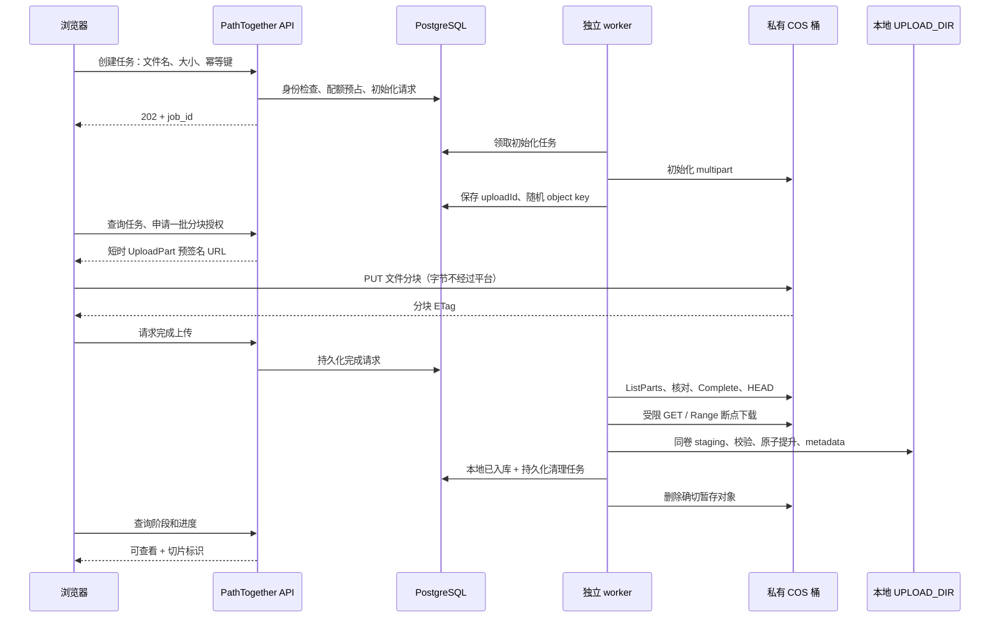

# COS 前端直传与本地摄取：Agent 执行合同

> 日期：2026-09-12（Asia/Shanghai）
> 执行版更新：2026-09-24（Asia/Shanghai）
> 状态：**实现前执行稿**。当前仓库仍未实现、未配置云资源、未部署；本文已把 10 GB 暂存池、等待与清理规则收敛为可直接拆任务的合同。
> 产品决定与执行顺序以本文 + [分流调研](upload-routing-open-source-review.md) §0/§8 为准。worker/SSRF/邮件 NO-GO 仍以 [远程摄取架构](remote-file-ingestion-feasibility.md) 为不可降级门槛。
> Agent 必须从 §10 开始逐阶段执行；前一阶段证据未写回本文时，不得开始后一阶段。任何时候都不得用真实医疗数据做 PoC。

**运行记录（Agent 必填；空项表示对应门禁未通过）：**

- 执行日期：
- 执行人/Agent：
- 基线 commit：
- 测试 COS bucket/region：
- 三段吞吐证据：
- 授权决议：`未决` / `B-SDK-STS` / `A-presign-parts` / `NO-GO`
- 授权证据：STS/CAM 策略、容量越界、CORS/CSP、失败原因
- 10 GB 容量对账证据：
- capability 状态：`off` / `internal` / `on`
- 选定后删除另一候选的 API 实现计划，不得双栈

## 1. 决策与边界

可行。上传按钮留在 PathTogether：浏览器向平台要任务和授权，分块字节直传 COS。平台 Web API 只处理小型 JSON；COS→本地由独立 worker 下载。Viewer 仍读本地 `UPLOAD_DIR`。

冻结边界：

- 平台自有、管理员配置的私有标准存储桶。禁止用户任意 URL/bucket/endpoint/Header。
- 普通地域域名；不默认 CDN、全球加速、跨地域复制。地域由实际上传网和服务器下载网测量后选择。
- 远端只有 **10 GB 十进制暂存池**，即 `10_000_000_000` 字节；它不是长期文件库。容量包本身不会替应用拒绝超量，应用必须实现 §6 的预约、等待、清理和对账。
- 默认保留 `500_000_000` 字节安全余量，首发可准入容量为 `9_500_000_000` 字节。单个 COS 文件不得超过可准入容量；超过时明确回退现有 V2，不得先上传再碰运气清理。
- COS 对象只负责“浏览器上传完成 → 服务器下载并本地入库”之间的中转。正常成功路径在本地提交后立即异步删除确切远端版本；不提供用户长期保留 COS 文件的产品语义。
- 现有默认 10 GiB 单文件、20 GiB 用户本地配额不能借 COS 绕过；COS 还要单独受 10 GB 全局池约束。
- 首期 COS 格式 = 原生单文件：`svs/tif/tiff/ndpi/vms/vmu/scn/bif/svslide`。ZIP/MRXS 保留 V1。KFB 等转换格式单独验收前禁止 COS。
- V1/V2 保留为备用。任务开始后冻结运输方式。
- 路由政策 v1 与校准规则见分流文档 §0。本文不单独发明另一套大小表。
- COS capability 四项门禁（授权决议已填、worker/清理可运行、长租约与费用硬停、首期格式验收）全部通过前，不得把 COS 标为 available。

## 2. 当前代码证据与未来改动位置

2026-09-12 只读检查，当时 HEAD `4d52c25`；工作区可能另有未提交修改，锚点不代表生产版本。

| 位置 | 当前行为 | 未来审计范围 |
|---|---|---|
| `static/app.js`：`uploadFile()` | V2 或 Legacy | capability 关闭时行为不变；开启后增加 COS 分支 |
| `static/app.js`：`shouldChunkUpload()` | `>=16 MiB` 走 V2；ZIP/MRXS 排除 | COS 白名单、开关、冻结 transport |
| `static/app.js`：`uploadV2Chunks()` | PUT `/api/uploads/{id}/chunk` | 不改 V2 offset 合同；COS 用独立适配器 |
| `app.py` bootstrap | 仅 V2 阈值 | 门禁后才下发 COS 可用性、格式、阈值字节；不含秘密 |
| `upload_guard.py` | 用户配额、1800s reservation、磁盘水位 | 长租约、COS 在途/费用硬停（含 owner/免登录） |
| `upload_task_store.py` | 浏览器串行 offset | **禁止**复用作 COS 任务表 |

不能只把 XHR URL 改成 COS 域名。

## 3. 授权选型：先 B 后 A，只留一套

候选 B：官方 `cos-js-sdk-v5` + 单 key STS，浏览器执行高级分块（含 Initiate/Complete）。
候选 A：平台/worker 控制 multipart，浏览器只有绑定长度的 UploadPart 预签名。

互斥。未写入文首决议栏前，只允许测试账号上的 PoC 脚本，不允许合入产品 API。

### 3.0 自动判定（PoC 后执行，不再询问）

**先做 B。** 下列全部为真 → 决议 `B-SDK-STS`：

1. CAM 能把临时权限限制到平台分配的单个随机 key（或该 key 前缀下的该对象），且 PoC 证明跨 key 写入失败。
2. 不授予 GetObject、删除最终对象、ListBucket 全桶、下载最终切片。ListParts/Abort 若 SDK 必需，范围不得大于该 key。
3. 费用与容量硬边界成立：取消或过期后，在凭证最长 TTL 内停止新写入，并能 Abort 未完成分块、清理该 key 的对象及历史版本；重复写同 key 产生的版本和 multipart 碎片也必须计入 10 GB 池。若 B 无法证明凭证期内不会突破已预约字节，则 B 失败，转做 A。事后对账、暂停准入和清理只是异常兜底，不能替代此通过条件；重复写入造成超预约即判 B 失败，不以“随后能清理”判通过。
4. worker 能 HEAD 后钉死 `versionId+size`（若未开版本则须证明同 key 在下载窗口不可被替换；不能证明则必须开版本控制）。
5. CORS/CSP 在真实生产 origin（含端口）下 PUT 成功，ETag 等实际读取头可暴露；凭证不进日志、localStorage、console。

任一条失败 → **改做 A**。A 全部为真 → 决议 `A-presign-parts`：

1. 预签名绑定 HTTPS、Host、方法、key、uploadId、partNumber 和 Content-Length（或等价硬限制）。
2. 超长/截短/越界 part 被 COS 拒绝，或 PoC 证明无法突破已签名计划的总字节。
3. 浏览器无 Initiate/Complete/GetObject/Delete/ListBucket。
4. 取消后停发签名 + worker Abort；旧 URL 过期后不能继续写入。

A 也不通过 → 决议 `NO-GO`，不公开 COS，保持 V1/V2。

切换必须发生在产品开发前。禁止先按 B 写完 capability/状态/CORS/恢复再改 A。

### 3.1 候选 A：平台控制 multipart 与逐块预签名

仅当决议为 A 时实现本节与 §4.A。不是默认首选。



要点：

- key 由服务端生成：`incoming/<opaque-owner-id>/<job-id>/<random-id>`，不用患者信息或原文件名。
- 分块长度按 declared size 和分块计划计算，不信任浏览器自报长度。
- Content-Length 与 Blob 上传兼容性必须实测。无法证明 COS 拒绝超长/截短时，不能声称云端容量已硬限制，也不能公开上线。
- PoC 起点（非已验证生产值）：32 MiB 分块、每文件 3 并发、每用户 1 个活动 COS 文件。
- 按少量待传分块批量签发、短 TTL，可续签同一 uploadId。暂停/取消/超时/超配额后停发。停发 ≠ 撤销已发出的 URL。
- 签名器在独立授权单元；控制 API 请求内不做 COS 网络调用。Init/Complete/Abort 进 worker。
- 浏览器上报的 ETag 只是提示。worker 分页 ListParts，核对连续编号、每块长度、总长度和计划后再 Complete。必须读完 Complete 响应再 HEAD。
- 钉死 key、size、ETag，及存在时的 versionId。禁止把 multipart ETag 当整文件 MD5/SHA-256。
- 候选 A 若能证明浏览器只有已关闭会话的 UploadPart、worker 不复用 key、合并/下载一致，则不必为短暂存开版本。否则开版本并删确切版本，删除标记不算释放容量。

### 3.2 候选 B：官方 SDK + 单 key STS

仅当决议为 B 时实现本节与 §4.B。

浏览器用锁版本、本地托管的 `cos-js-sdk-v5` 高级上传。平台创建任务后分配随机 key；`getAuthorization`（或等价临时授权接口）发该 key 的短期 STS。回调续取时重验 owner、任务状态、额度。

- 服务端固定 bucket/region/key。
- 同 key 在凭证有效期内可能再次写入。必须开版本控制：worker 钉死 versionId+size，GET 该版本，不读 latest。
- 取消：停发、Abort、追踪凭证最长 TTL，TTL 后再清延迟出现的分块和历史版本。删一次 key 不是清理完成。
- 完成通知的 key/version/size 不可信。worker 核验任务固定 key、冻结一次源版本、核对大小，再字节计数、SHA-256、解析、原子入库。重复回调不重复摄取。
- 凭证只留内存。禁止示例中的 `console.log(credentials)`。

### 3.3 两条路径共用的完成与校验

冻结源后：Range 续传只接受匹配 checkpoint 的 206/Content-Range；源身份变化、错误 Range 或 200 整对象按失败计入重传预算。最终 SHA-256 在本地计算；格式、解析隔离、磁盘水位、no-clobber 提升、metadata、配额一次结算。

## 4. 拟议 API 与状态（均未存在）

统一新表 `ingestion_jobs`，`source_kind=cos_staging`。不向 `upload_tasks` 写入 COS 状态。字段至少：owner、幂等摘要、declared size、`pool_reserved_bytes`、`capacity_admitted_at`、bucket/key、源身份、下载 checkpoint、lease generation、重试/流量预算、清理状态、`transport_auth`（`sts` 或 `presign_parts`）。秘密仅为 secret ref。

另建 `cos_pool_state`（全局单行或等价的 PG 锁行）保存 `capacity_bytes`、`safety_bytes`、`reserved_bytes`、`observed_remote_bytes`、`reconciled_at`。容量准入必须在一个 PG 事务内锁该行并预约，不能靠进程内变量或先查后写。

共用接口：

| 接口 | 责任 |
|---|---|
| `POST /api/ingestions` | 登录 + CSRF + `can_upload()`；格式/大小/路由政策；非法大小或超过单文件准入上限按 §6.1 返回 422 且不建任务；检查当前本地配额但不为等待任务建长租约。容量足够时同时预约本地配额与 COS 池并进入 `preparing`；不足则进入 `waiting_capacity`，不发凭证；202 |
| `GET /api/ingestions/{id}` | 仅 owner/授权管理员；阶段进度与过期；不触发远程读取 |
| `POST /api/ingestions/{id}/upload-complete` | 幂等记录“浏览器侧完成”；202；worker 核验远端对象 |
| `POST /api/ingestions/{id}/cancel` | 幂等取消；worker 停下载、Abort/清理、释放 reservation；已入库走既有切片删除合同 |

**仅 A：**

| 接口 | 责任 |
|---|---|
| `POST /api/ingestions/{id}/parts/sign` | owner、状态、编号、并发/费用预算；签固定计划内分块；续签同一 uploadId |
| `POST /api/ingestions/{id}/resume` | 请 worker 刷新可信 ListParts；前端再 GET |

**仅 B：**

| 接口 | 责任 |
|---|---|
| `POST /api/ingestions/{id}/credentials` | 重验 owner/状态/额度后发该任务 key 的 STS；过期续取走同一接口 |

主状态：`waiting_capacity → preparing → uploading → completing → queued → downloading → validating → ready → completed`。

- `waiting_capacity` 可以取消；没有 COS key/uploadId/STS/签名，不占远端容量，也不持有 1800 秒本地 reservation，只保留任务和排队位置。准入时重新检查并原子取得本地配额与 COS 池预约；失败则以稳定原因结束或继续等待。
- 容量调度器按 `created_at, id` FIFO 尝试准入；跳过当前不再满足权限、配额、格式或本地磁盘水位的任务。首发不允许后来的小文件插队。
- `pool_reserved_bytes` 从准入开始持有，直到确切对象、历史版本和 multipart 碎片已确认清理；仅“下载完成”不能提前释放远端池预约。

- B 的 `completing` 是 worker 钉版本 + HEAD，不是浏览器 Complete 的替代缺失。
- COS 状态语义以本节为准：`ready` 表示本地原子提升、metadata、配额一次结算和恢复记录均已成功，尚未通过 Viewer readiness；`completed` 表示独立 worker 已完成 DZI/代表性 tile readiness probe，并以有效 lease/fencing + CAS 持久化 `viewer_ready=true` 和完成审计。此迁移不依赖浏览器查询或 COS 清理结果，UI 仅在 `completed` 显示“可查看”。
- 与远程摄取架构 §7.1 的区别：COS 不单列 `tiling`，其 `ready` 是本地提交之后的状态。原架构的提交恢复栅栏仍须保留：在 `validating` 内、原子提升之前先持久化 `commit_intent`（目标路径、源版本、SHA-256 和提交步骤）；重启由 worker/reconciler 幂等补齐提升、metadata 和配额结算，不能把 `ready` 当作提交 intent 的替代品。
- readiness 暂时失败时保持 `ready`，持久化错误、attempt 和 `next_retry_at`，由 worker/reconciler 重试；不可自动恢复时告警并标记需人工处理，不显示“可查看”。不得重新下载、重复结算或删除已入库副本；本地已提交的 `ready/completed` 不走上传超期取消，后续删除遵循既有切片删除合同。
- `cleanup_pending/cleaned/cleanup_failed` 独立；COS 删除失败不得回滚或删除本地成功切片。

竞态均需持久 intent、CAS/fencing、reconciler：完成重放、合并/HEAD 成功但 DB 丢失、cancel 与 Complete 并发、旧签名/旧 STS 仍在写、worker 失租。COS 操作不是 DB 事务，按精确 key/uploadId/versionId 恢复。Init 成功未记 uploadId 的孤儿由清理器回收。

## 5. 前端体验与跨域

- capability 默认关。未下发不得因“文件很大”走 COS。
- 阶段文案固定为：等待暂存空间 / 正在上传 / 等待服务器接收 / 服务器接收中 / 正在校验 / 可查看。上传 100% ≠ 可查看，不合成虚假总百分比。
- 浏览器 PUT COS 用独立适配器，不使用自动带 CSRF 的 `apiFetch`/`xhrSend`。不向 COS 发送平台 Cookie、会话、CSRF。控制 API 仍要登录会话 + CSRF。
- 字节进度按已确认唯一分块计，重试不得累计超过文件大小。下载进度来自持久 checkpoint。
- 刷新只存非秘密 job id 与文件提示。禁止存签名 URL、STS、checkpoint 密钥。
- 已完成 COS 合并/对象钉死的任务，关页后由服务器继续。未完成上传：A 可在重选同一文件且分块摘要匹配后续传；B 若不能在无密钥下证明同一文件，则重选文件并清理旧任务。文件名/大小/mtime 只是候选。
- CORS：精确生产 origin（含端口），允许所需 PUT/头，暴露实际读取的响应头。控制台规则和真实 OPTIONS 都要测。CORS 不是鉴权。
- CSP `connect-src` 放行指定 COS endpoint。授权响应 `Cache-Control: no-store`。日志只留脱敏 job id、request id、错误码。
- 首期禁止 busy 文案。手动 COS 说明还需服务器接收与校验。

## 6. 成本、配额和清理

### 6.1 10 GB 暂存池硬合同

首发配置（全部是整数十进制字节）：

| 配置 | 默认值 | 含义 |
|---|---:|---|
| `COS_POOL_CAPACITY_BYTES` | `10_000_000_000` | 远端池总预算 |
| `COS_POOL_SAFETY_BYTES` | `500_000_000` | 版本、碎片、清理延迟和计量误差余量 |
| `COS_POOL_ADMISSION_BYTES` | 派生值 `9_500_000_000` | 可被任务预约的上限，不单独配置 |
| `COS_MAX_ACTIVE_UPLOADS_PER_IDENTITY` | `1` | 每身份同时取得上传授权的任务数 |
| `COS_MAX_ACTIVE_UPLOADS_GLOBAL` | `2` | 首发全局并发；容量预约仍是最终权威 |
| `COS_MAX_WAITING_PER_IDENTITY` | `1` | 防止单身份铺满等待队列 |
| `COS_WAITING_MAX_AGE_SECONDS` | `86400` | 等待容量最长 24 小时，超时后终止但可重新创建 |
| `COS_JOB_MAX_AGE_SECONDS` | `259200` | 自准入起 72 小时尚未本地提交则取消并清理 |

`GB` 在本文一律表示十进制；不要写成 `10 * 1024**3`。所有配置由服务端读取并原样通过只读状态接口展示，前端不得自行计算另一份容量上限。

容量准入事务必须满足：

```text
declared_size > 0
declared_size <= capacity_bytes - safety_bytes
reserved_bytes + declared_size <= capacity_bytes - safety_bytes
```

大小校验先于容量排队：`declared_size` 必须为正整数，否则返回 HTTP 422 + `code=invalid_declared_size`。若单文件超过 `capacity_bytes - safety_bytes`，返回 HTTP 422 + `code=cos_exceeds_admission`，响应包含服务端整数 `max_size_bytes` 和 `fallback_transport=v2`；不创建 `ingestion_jobs` 行、不占本地/COS reservation、不创建远端会话、不发凭证，也绝不能进入 `waiting_capacity`。前端说明超出 COS 上限，并提供用户明确选择的平台 V2 重试；V2 仍独立检查单文件、本地配额和权限，不能静默切路或承诺 V2 必然接收。

只有前两条大小条件及其它创建门禁已通过、仅不满足最后一条时，创建任务仍返回 202，但状态为 `waiting_capacity`；响应包含稳定码 `cos_waiting_capacity`、当前排队位置和不作承诺的状态查询地址，**不返回预计秒数**。调度器先触发一次安全清理，再按 FIFO 重试准入。等待期间若用户取消、超过 24 小时或准入时已不满足本地配额，任务终止且不接触 COS。

等待任务只做创建时的配额可行性检查，不长期占住现有 1800 秒 reservation。正式准入时固定锁顺序为“用户配额行 → `cos_pool_state`”，同一事务内重新校验两者并同时预约；任何一步失败则全部不生效，禁止出现只占本地或只占 COS 的半成功。

容量有两个口径：

- `reserved_bytes`：DB 中已准入且尚未完成远端清理的任务预约总和，用于同步准入。
- `observed_remote_bytes`：reconciler 通过受限账号分页列举 `incoming/` 下对象版本和 multipart 碎片得到的实际占用，用于发现漂移。

任一条件成立时立即暂停新准入和新凭证，状态码 `cos_capacity_reconcile_required`，但继续下载、取消和清理：`observed_remote_bytes > capacity_bytes`、实际值比预约值高出安全余量、对账超时、列表分页失败或容量状态无法加锁。不得在观测不可信时 fail-open。以上是运行时异常保护，不是 §3.0 授权容量硬边界的替代证明。

### 6.2 清理与淘汰规则

正常路径不是“存满再删”，而是本地成功提交后立刻把任务置为 `cleanup_pending` 并删除确切 `key + versionId`、历史版本和未完成 multipart；确认远端不存在后置 `cleaned` 并释放 `pool_reserved_bytes`。确认清理完成还须证明旧授权不能再产生写入：A 的 multipart 已关闭且不再接受旧 UploadPart；B 已停发凭证、所有已发 STS 均超过最长有效期，并在此后完成全版本/碎片复查。不能因一次列表为空就提前释放预约。

容量不足时，清理器只处理以下**可回收集合**，并按优先级、再按最早 `terminal_at/local_ready_at` 排序：

1. 已取消、失败或过期任务的对象版本与 multipart 碎片；
2. 已在本地完成原子入库、metadata 和配额结算的 `cleanup_pending` 对象；
3. reconciler 识别出的、能由数据库终态或过期 uploadId 证明归属的孤儿。

以下对象永远不可为了腾空间而淘汰：

- `uploading/completing` 中仍可能被浏览器写入的对象；
- `queued/downloading/validating` 且尚无本地成功副本的唯一远端对象；
- 无法映射到任务、无法钉死版本或归属证据不足的对象；此时暂停准入并告警，不能猜测删除；
- legal hold 或管理员显式保留的对象（首发默认没有此功能）。

若清完所有安全候选仍不足，新任务继续 `waiting_capacity`。不得取消更早的有效任务给后来任务让路，不得跨用户按文件大小挑选牺牲对象。清理失败只重试清理，不得重新下载已成功入库的文件。

清理操作必须持久化 intent、attempt、last_error、next_retry_at，并使用单独 lease/fencing；进程重启后可恢复。生命周期规则只作 7 天孤儿兜底，不能作为 10 GB 实时容量控制器。

### 6.3 费用与本地配额

采购时重核价。先前估算基准：大陆标准存储 0.118 元/GB/月、外网下行 0.5 元/GB。月成本 ≈ 平均驻留 GB×0.118 + 实际下载 GB×0.5 + 请求及其他。容量包不抵扣下载。[7][8]

每个成功文件正常只拉一次。记录逻辑下载字节和实际传输字节（含失败/重传），与账单交叉核对。上行免费 ≠ 请求/存储免费。

必须实现，不论 A/B：

- 正式准入 COS 前预占用户配额和本地最终空间；`waiting_capacity` 只做可行性检查。准入后由常驻容量调度器统一维护本地 reservation 续租，覆盖 `preparing/uploading/completing/queued/downloading/validating`，不依赖浏览器轮询、STS 续取或下载 worker 是否已开始；worker 的执行 lease/fencing 独立维护。调度器默认每 60 秒扫描一次，为仍有效且未超期的预约续至当前时间 + 1800 秒，配置须保证扫描间隔小于 TTL 的三分之一。续租事务重验状态和 reservation；已过期预约不得直接复活，暂停该任务新授权及落盘提交，由恢复流程按固定锁顺序重新取得所需预约，失败则终止并清理远端。若已有 commit intent 或提升痕迹，必须先由提交 reconciler 核实并收口，禁止按过期预约直接删除已提交副本或重复结算。`ready/completed` 已结算不再续本地 reservation；取消/失败释放本地预约，COS 预约仍须等确切清理完成。不复用惰性 TTL 作为唯一机制。
- 每身份（含 owner、免登录共享身份）和全局：COS 在途字节、任务数、授权/签名速率、月下载预算、每任务重试字节上限。超限硬停签发与调度。账户预算告警不是硬停。
- STS 刷新、GET 状态、complete、cancel 不计 `UPLOAD_HOURLY_REQUEST_LIMIT` 的新上传尝试。
- 下载按实际字节硬截断，不信 Content-Length。超预算暂停并写明恢复条件。
- 创建时和 worker 落盘前都查磁盘水位。
- 本地文件、metadata、配额、恢复记录提交成功后，才持久化删除任务并异步清 COS。禁止在浏览器 100%、GET 结束或校验前删源。
- 删除失败只重试删除，不重拉。删除权限仅 `incoming/` 下任务 key/version。清理器不接受客户端任意 key。
- `waiting_capacity` 最长 24 小时；准入后尚未本地提交的任务自 `capacity_admitted_at` 起最长 72 小时（含上传/重试）；等待期限自 `created_at` 起算，续租不延长这两个绝对期限。成功主动删；过期先取消再清理；孤儿 7 天生命周期兜底。生命周期阈值必须大于任务期限+恢复余量。生命周期异步，不等于满 24 小时立即释放。
- 配置未完成分块清理。碎片收费。[9]
- 回滚：关新任务和新授权；保留查询/取消/清理。不得关清理器。

## 7. 验收与证据

本次无真实账号/网络验证。不以 mock 替代发布证据。真实失败要记录退出条件。HAR 脱敏。

**阶段 0**

| 项 | 通过标准 |
|---|---|
| 三段吞吐 | 同一测试文件记录浏览器→平台、浏览器→COS、COS→服务器；含失败率与费用。COS 更快不是预设 |
| 授权 B 或 A | 按 §3.0 逐条；双失败则 NO-GO |
| 云端超量 | 超长/截短/越界/重放；无法限制则不公开自助 |

**阶段 1–2（只验收选定合同 + 共享项）**

| 项 | 通过标准 |
|---|---|
| 字节路径 | 文件 PUT 指向 COS；平台只有小 JSON，该任务不再进 `/chunk` |
| 授权隔离 | 跨用户拒绝；固定 key；无长期密钥。A：改 uploadId/partNumber/长度拒绝且无合并权限。B：STS 最小动作、TTL 内重写窗口、全版本清理 |
| 浏览器 | 生产 origin/端口 CORS、CSP、ETag；Chromium + 至少一种目标浏览器 |
| 完成一致性 | 伪造 ETag/size、漏分页、重复完成、200 未完成、超时恢复 → 不错误入库 |
| 大文件恢复 | 300 MB、500 MB、2 GB 与接近 9.5 GB 边界：断网、签名/STS 过期、刷新重选、Range 中断、worker kill；最终 SHA-256 一致。大于 9.5 GB 必须返回 422 + `cos_exceeds_admission`，无任务行/预约/远端写入，并提供明确的 V2 重试入口 |
| 竞态 | cancel/complete、旧凭证重放、失租双 worker、同名文件；一次提升一次结算 |
| 清理费用 | 入库前不删源；清理失败不重拉；重启可恢复；碎片/版本/预算暂停/超期可追踪 |
| 10 GB 池 | 9.5 GB 准入边界；并发原子预约；满池等待；只淘汰安全集合；对账漂移 fail-closed；清理后 FIFO 唤醒 |
| 配额 | owner/免登录触发 COS 硬停；落盘前水位；hourly 不因续签耗尽 |
| 回归 | V1/V2、ZIP/MRXS、KFB 现有转换、CSRF、Viewer 瓦片 |
| 部署 | 同卷 staging、出网 allowlist + IP/redirect、凭证轮换、清理器、告警、回滚开关 |
| 路由（capability 开启后） | 阈值边界、格式拒绝、手动选路、刷新 transport 不变、COS 不可用退路。不验 busy |

首期仅固定平台 COS endpoint；保留 SSRF 双层防护；禁止任意源和回源扩大访问面。

## 8. 发布与回滚

发布时先 `off`，再仅内部身份 `internal`，最后才允许 `on`。回滚只关新任务、新准入和新授权；查询、下载已钉死对象、取消、对账和清理器保持运行。不能把已上传 COS 的文件自动改走 V2。

不把原调研 16–24 人周当承诺。Phase 0 和 worker 基座完成后再拆估时。

## 9. 官方参考

访问日期：2026-09-12。官方说明 ≠ 本账号已验证。

1. [COS 预签名授权上传](https://cloud.tencent.cn/document/product/436/14114)
2. [COS Upload Part](https://cloud.tencent.com/document/product/436/7750)
3. [COS 上传对象：分块完成后 uploadId 失效](https://cloud.tencent.com/document/product/436/65935)
4. [JavaScript 上传对象实践教程：服务端随机 key 与临时权限](https://cloud.tencent.com/document/product/436/109014)
5. [COS Complete Multipart Upload](https://cloud.tencent.com/document/product/436/7742)
6. [JavaScript SDK 快速入门与 CORS](https://cloud.tencent.com/document/product/436/11459)
7. [COS 官方定价](https://buy.cloud.tencent.com/price/cos)
8. [COS 资源包规则](https://intl.cloud.tencent.com/zh/document/product/436/54353)
9. [COS 生命周期与碎片清理](https://cloud.tencent.com/document/product/436/56548)

## 10. Agent 执行卡（唯一实施顺序）

Agent 每完成一个 Phase，必须先运行该 Phase 的测试，把命令、结果、commit 和未决风险写入 `docs/evidence/cos-YYYYMMDD.md`，并在文首运行记录链接该文件。失败时停在当前 Phase；不得绕过门禁先做 UI。证据文件、命令行、HAR 和截图都必须脱敏，禁止写入 SecretId、SecretKey、STS token、签名 URL、Cookie 或患者信息。

开始 Phase 0 前核实以下五类输入。先检查获准访问的部署配置和 secret ref 元数据，只向操作者补问仍缺失或无法确认的项目；文首未填不等于部署环境不存在。秘密值不得输出或提交到仓库：

- 现有私有 COS bucket 与 region，以及可隔离的 `poc/` 测试前缀；若现有桶不能安全隔离测试，才另建专用测试桶；
- 生产浏览器 origin（协议、域名、端口完整）和服务器访问 COS 的出口环境；
- PoC 对象操作仅限测试前缀的凭证引用，以及后续 worker/清理器最小权限凭证引用；桶级配置权限单独由操作者或管理身份持有，不能声称这些权限也受对象前缀隔离；
- COS 控制台中版本控制、CORS、生命周期、未完成 multipart 清理和用量/账单查询权限；
- 明确的无医疗数据测试文件或可复现随机文件生成方法；Agent 可准备生成脚本，记录尺寸、生成参数和 SHA-256，无需操作者上传现成文件。

缺少任一项时，Agent 记录 `blocked_external_input` 并停在 Phase 0；不得用硬编码密钥、公开桶、跳过真实 PoC 或 mock 结果代替。

PoC 环境边界与执行记录：

- `poc/` 只隔离对象路径。版本控制是桶级设置，开启后只能暂停，不能恢复从未启用状态；CORS 须评估对现有桶调用方的影响，生命周期与 multipart 清理规则须核实前缀过滤。先记录现有配置及变更范围；不能安全隔离配置影响时采用专用私有测试桶，不直接改变生产桶。[版本控制官方说明](https://intl.cloud.tencent.com/zh/document/product/436/19883)
- 真实生产 origin 下的 CORS/CSP 验证和平台/frp 吞吐测试须纳入已授权的部署/压测范围，在记录中写明 Asia/Shanghai 的具体低峰日期、起止时间、测试入口和停止条件；不得臆定日期。测试入口沿用获准的发布方式，不因 origin 验证自行增加生产页面。
- 2 GB 在 30 Mbps 下单次纯传输理论约 533 秒（8.9 分钟），20–25 Mbps 下约 640–800 秒，实际须留重试、校验和恢复余量。2 GB 在 Phase 0 是有条件追加项，不为赶窗口删减必测的 300/500 MB 证据。
- 在运行记录填写包含本轮合同的基线 commit；建议实施前单独提交两份文档，保留其它工作区改动。`docs/evidence/`、`experiments/cos-poc/` 可在 Phase 0 创建；空记录或生成脚本不能充当真实 PoC 通过证据。

### Phase 0：真实 PoC 与授权裁决

**允许改动：** `experiments/cos-poc/`、本文件和脱敏证据；不得改产品路由。

1. 按上述环境边界选择可安全复用的现有桶或专用私有测试桶，在 `poc/` 前缀执行。核实桶级配置影响和操作范围后配置版本控制、限定前缀的 multipart 生命周期和精确 CORS；只用无医疗数据的随机测试文件。
2. 测浏览器→平台/frp、浏览器→COS、COS→服务器（服务器直连 COS endpoint 下载，不绕 frp），至少 300 MB、500 MB，有条件再测 2 GB；记录 Mbps、失败率和账单口径。
3. 先验证 B：单随机 key、跨 key 拒绝、无 Get/Delete/List 全桶、凭证过期、重复写版本、Abort、全版本清理以及凭证有效期内任一时点的对象版本与 multipart 碎片总占用不能突破该任务已预约字节；事后清理不算通过。
4. B 任一硬条件失败则记录证据并验证 A：签名绑定 method/host/key/uploadId/partNumber/length，超长、截短、越界和重放均失败。
5. 将唯一决议写回文首；双失败写 `NO-GO` 并停止全部后续 Phase。

**完成定义：** 有真实 COS 证据；授权只剩一种；容量失控测试通过；没有长期密钥进入浏览器、日志或仓库。

### Phase 1：数据库、容量账本与纯状态机

**建议文件：** 新 migration、`ingestion_store.py`、`cos_pool_store.py` 及对应测试；不得修改 `upload_task_store.py` 语义。

1. 新建 `ingestion_jobs`、事件/cleanup intent、lease/fencing 索引和 `cos_pool_state`。
2. 实现固定锁顺序下的本地配额 + COS 池原子预约、释放、FIFO `waiting_capacity` 准入和幂等创建/取消。
3. 用纯状态机测试非法跳转、重复请求、并发预约、9.5 GB 边界、每身份最多一个等待任务、24 小时等待超时、等待取消、调度器在浏览器无请求时续租、续租不延长绝对期限、过期预约禁止复活、清理后唤醒和旧 lease 拒绝。

**完成定义：** 两个并发事务不可能让 `reserved_bytes` 超过 `9_500_000_000`；状态机和 migration 在 JSON 非权威模式 fail-closed。

### Phase 2：worker、下载、本地提交与安全清理

**建议文件：** `cos_ingest_worker.py`、`cos_client.py`、worker 入口和 systemd/container 配置。

1. worker 只消费 DB 中服务端固定的 bucket/key/version；客户端回报只作提示。
2. HEAD 钉死源；Range 断点必须校验 206/Content-Range/版本，逐字节执行单任务和全局下载预算。
3. 按 §4 在原子提升前持久化 commit intent；同卷 staging、最终 SHA-256、格式解析、磁盘水位、no-clobber、metadata 和配额一次结算后才标 `ready`。worker 执行 Viewer readiness probe，成功后 CAS 转 `completed`；验证提交各崩溃窗口恢复及 readiness 失败重试不会重复摄取或删除成功副本。
4. 实现 §6.2 清理器、orphan reconciler、远端分页对账及 fail-closed 暂停准入；实现 §6.3 常驻容量调度器续租，验证浏览器关页、下载 worker 未启动、调度器重启和旧凭证仍有效时预约不会被错误释放。

**完成定义：** kill/restart、错误 Range、对象替换、重复完成、cancel/complete 竞争、清理失败重启均不会错误入库、重复计费或删除唯一副本。

### Phase 3：控制 API 与唯一授权合同

1. 实现 §4 共用 API，以及文首裁决对应的 B `credentials` 或 A `parts/sign + resume`；另一套接口必须不存在。
2. 所有写接口走登录、CSRF、owner、幂等和速率限制；授权响应 `Cache-Control: no-store`。
3. `waiting_capacity` 不创建远端会话、不发凭证；只有容量调度器准入后才能进入 `preparing`。
4. capability 继续为 `off`，但内部 API 集成测试必须完整，覆盖大小为零/非法值及超上限 1 字节的 422 与无任务/预约副作用、恰好准入上限且资源充足时的 202 准入，以及池余量不足时的 202 等待响应。

**完成定义：** 越权统一拒绝；任意客户端 bucket/key/version 无法影响 worker；续签不能绕过任务状态、容量或预算。

### Phase 4：前端独立 COS 适配器

1. 锁版本并本地托管官方 SDK（若裁决 B），或实现最小预签名 part 客户端（若裁决 A）。
2. 不复用 `apiFetch`/`xhrSend` 向 COS 发请求；COS 请求不带 Cookie/CSRF，凭证只在内存。
3. 路由开始后冻结 transport；刷新只保存 job id 和非秘密文件提示。
4. 展示“等待暂存空间 / 正在上传 / 等待服务器接收 / 服务器接收中 / 正在校验 / 可查看”；上传 100% 不显示完成。

**完成定义：** 首期格式逐项真实验收；V1/V2、ZIP/MRXS、KFB、CSRF 和 Viewer 测试无回归。

### Phase 5：容量故障演练与内部发布

1. 用测试容量参数缩小为几十 MiB，稳定复现：恰好边界、超 1 字节、两任务竞争、清理释放、清理失败、未知孤儿、对账超时。
2. 证明旧的安全对象会被清理并唤醒最早等待任务；活跃/唯一副本绝不删除。
3. 用真实 10 GB 配置核对 DB `reserved_bytes`、COS 实际版本/碎片占用和账单。
4. capability 切到 `internal`，完成小范围真实网络 smoke 后才允许 `on`。

**完成定义：** 四项门禁、§7 验收矩阵、告警和回滚演练全部有证据。

### Phase 6：最终交付检查

- 更新部署变量示例、secret ref、CORS/CSP、worker 健康检查、容量/费用告警和运维手册。
- 确认仓库、构建产物、浏览器存储、日志和 HAR 均无长期密钥或临时凭证。
- 运行全量相关测试并记录命令；检查工作树，不覆盖用户无关改动。
- 最终报告必须列出：授权类型、10 GB 对账结果、已知限制、回滚开关和仍在等待/清理的任务数。
