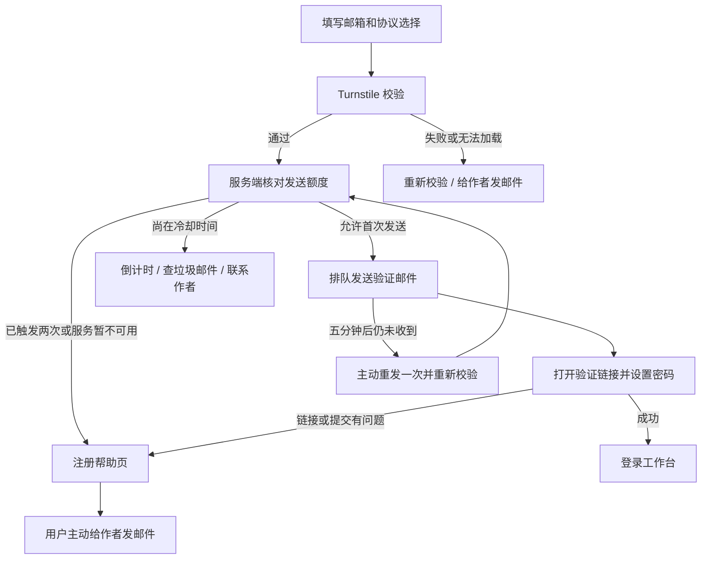

# 注册防刷、联系作者与入口一致性设计

日期：2026-10-08（Asia/Shanghai）

状态：可实施设计稿；本文没有启用线上校验或修改现有注册配置。

## 1. 用户流程

发送注册验证邮件前接入 Cloudflare Turnstile Managed 校验。同一邮箱在滚动 24 小时内最多触发两次验证邮件投递：首次一次，用户主动重发一次，两次之间至少间隔五分钟。多次尝试仍有困难时，把“给作者发邮件”作为主要操作。

Turnstile 通过只说明通过了本次挑战；未完成注册也不能证明是机器人。邮件是否进入收件箱不能由当前 SMTP 接受结果推断。因此页面不把用户分成“真实用户”和“机器人”，分别处理挑战结果、发送频率和用户主动求助。

“给作者发邮件”复用主页现有公开地址 `solarise94@gmail.com`。用户点击后进入注册帮助页，再主动打开邮件客户端；应用不自动替用户发邮件，不自动跳出注册页。

用户来源入口和验证邮件入口保持一致：从 `histopilot.cn` 提交的申请使用 `.cn` 验证链接，从 `histopilot.com` 提交的申请使用 `.com` 验证链接；验证页、登录跳转、帮助页及邮件语言跟随本次入口。具体规则见第 6 节。



## 2. 现状与设计依据

本次只读排查发现，同一批邮箱在一秒内集中申请验证邮件，并在当天反复申请。样例分别有 5、4、2 个独立任务，每个任务仅发送一次，没有完成建号。该模式增加了自动化批量提交的嫌疑，但不能据此认定全部申请是机器人。

现有代码：

- `registration_store.py`：同邮箱 60 秒冷却、每小时 3 次、滚动 24 小时 5 次，全站滚动 24 小时验证邮件预算 40 次。
- `enqueue_public_verification()`：每次合规申请创建新 token，并把该邮箱旧任务设为 `superseded`，旧链接随即不可用。
- `app.py`：公开注册入口为 `POST /register`；现有 `POST /api/registration/resend` 只支持旧的邮箱验证加邀请码激活模式，不能直接作为 public 模式的重发接口。
- 现有发送后页面对多种结果统一显示“验证邮件已发送”，其中包含限流情况；这会让用户以为重发成功，从而继续尝试。
- `templates/entry.html` 已有作者邮箱；注册弹窗和验证页没有完整的求助流程。

首次上线聚焦 public 和 email_verify 两种发送验证邮件的流程，继续使用现有数据库限流与邮件 worker。

## 3. 发送规则

| 场景 | 服务端行为 | 页面操作 |
|---|---|---|
| 首次申请 | 必须通过本次 Turnstile；满足额度后入队一次 | 查看邮箱、垃圾邮件提示、联系作者 |
| 五分钟内重复申请 | 不新增邮件、不作废已有有效 token | 显示等待提示；已有链接仍可用 |
| 五分钟后主动重发，额度尚有余量 | 必须重新通过 Turnstile；新增一次投递 | “已提交重发请求”；突出求助入口 |
| 滚动 24 小时内已触发两次 | 不再新增验证邮件 | 主按钮“给作者发邮件”；显示恢复自助发送的时间 |
| 请求已入队、worker 仍在处理 | 不并行新增重发任务 | “邮件正在处理，请稍候”；可联系作者 |
| Turnstile 无 token、过期、重复使用或校验失败 | 不入队、不占用邮箱发送额度 | “安全验证未完成，请重新验证”；可联系作者 |
| 校验服务超时或加载失败 | 暂停本次发送，不静默绕过校验 | “验证服务暂时不可用”；重试和联系作者 |
| 全站发送预算耗尽或数据库不可用 | 不入队 | “暂时无法发送验证邮件”；联系作者 |
| 已有链接有效，但发送额度已用完 | 仍允许用已有链接完成注册 | 联系作者入口不阻断已有验证流程 |

两次上限统计服务端实际接纳的投递任务，覆盖 `/register`、重发、所有域名、所有进程；失败、排队及结果不确定的任务也占用额度。后台对“确定未发出”的有界重试属于同一个投递任务，不重复占用两次额度；结果不确定的任务不自动重试。

两次上限是本次设计的初始产品参数，后续根据完成率、求助量和退信数据调整。没有在真实流量上验证其最优性。上限过后自动恢复自助发送，不永久封禁邮箱。机器校验失败不计为“用户注册失败”，不消耗发送额度。

现有每 IP 前缀滚动 24 小时 30 次尝试及全站 40 次邮件预算先保留。IP 只作为辅助限制，不按国家、邮箱服务商或昵称判断身份；必须先确认反向代理可信链，防止整个入口被当成一个 IP，或客户端伪造转发头绕过限制。

## 4. 保留有效验证链接

用户重复打开表单或遇到网络重试，不应导致原邮件失效。有效 token 存在时：

1. 冷却期内重复申请只返回等待/求助页面，原 intent、协议选择、token 和过期时间均不改变。
2. 允许的主动重发沿用同一个有效 token、协议证明和原过期时间。同入口重发沿用原链接；用户从另一个受信任入口主动申请时，邮件链接使用本次入口，但不作废旧邮件中的有效 token。每次投递的入口和正文分别冻结，规则见第 6 节。
3. 重发前若原链接剩余有效期不足五分钟，则生成新 token 和 intent，明确提示“请使用最新邮件中的链接”；已过期链接也按新申请处理。两次发送额度仍合并计算。
4. 已完成的 intent 不再重发原链接。统一提示检查邮箱、尝试登录或联系作者，不对陌生访问者披露该邮箱是否已有账号。
5. 未完成且仍有效的 intent 保持原协议证明；协议有实质更新时，继续由最终验证页重新确认，不通过重发偷偷覆盖用户选择。

现有 `registration_mail_jobs.token_hash` 有唯一约束，不能通过复制原作业并复用 token_hash 实现重发。建议添加 `registration_mail_redeliveries` 表引用原 `job_id`，保存独立投递状态、尝试次数、排队时间、失败类别、`entry_origin`、`form_locale` 和冻结的 `payload_enc`。同入口且同语言时复用原加密正文；跨入口或语言变化时从受保护的原载荷取得有效 token 并构造新投递正文，不修改原任务。验证查询仍只查原作业，重发投递记录不能充当新验证 token。

重发入队和 worker 领取时均核对原请求未消费、未作废、未过期、当前模式仍允许发送；注册完成、token 被替换或模式关闭后停止尚未发出的重发任务。沿用 worker 的“明确失败可有界重试，uncertain 不自动重发”规则。

## 5. 页面与“给作者发邮件”

### 注册弹窗

Turnstile 放在协议选择之后、“发送验证邮件”按钮之前。采用 Managed 模式，按需展示交互；仅打开注册视图时加载/渲染，打开登录视图不额外要求挑战。

按钮下始终提供低强调链接：

> 注册遇到问题？给作者发邮件

首次提交后的文案：

> 验证邮件请求已提交。请检查收件箱和垃圾邮件，邮件可能需要几分钟送达。

五分钟内显示倒计时；五分钟后可主动重发一次。再次提交后显示：

> 仍未收到邮件或无法完成注册？可以给作者发邮件，我会协助你排查。

达到发送上限时以求助为主操作，并用中性措辞说明暂缓重复发送；不能继续声称“邮件已发送”。对已存在、未知邮箱采用同一响应结构与页面，不展示账号存在性、全站申请历史或“此邮箱注册失败 N 次”。

### 帮助页 `/registration-help`

无需登录、无需通过 Turnstile 即可访问，注册弹窗、验证码失败、限流、链接过期/失效、最终提交错误均可进入。服务端只接受固定原因词表，不回显任意错误文本或外部跳转地址。

主按钮：**给作者发邮件**；另提供“复制作者邮箱”和“返回注册”，帮助没有默认邮件客户端的用户。点击主按钮使用 `mailto:`，用户自行审阅并发送。

预填邮件内容：

```text
主题：HistoPilot 注册遇到问题 / Registration help

你好，我在注册 HistoPilot 时遇到了问题。

注册邮箱：（请自行填写）
大致尝试时间：（请自行填写）
注册入口：（由页面填入当前受信任域名）
问题：没有收到邮件 / 链接打不开 / 验证无法完成 / 其他
页面显示的提示：（请自行填写）

请协助排查，谢谢。
```

正文不自动带入注册邮箱、密码、验证 token、完整验证链接、IP 或 Cookie。主题和正文使用标准 URL 编码；按当前语言提供中英文版本。请求编号如用于排查，应随机生成，只用于日志关联，不具有账号访问权限。

用户主动选择联系作者；应用不向作者自动转发每次失败，不因收到求助邮件直接开通账号。人工处理仍需核实邮箱控制权。

## 6. 用户来源入口与邮件入口一致

### 入口映射与展示

“来源入口”指用户实际提交注册表单的受信任网站 origin，不按邮箱后缀、用户 IP、地理位置、搜索来源或 HTTP Referer 选择域名。HTTPS 地址和品牌由服务端配置的固定映射产生。

| 实际提交入口 | 本次邮件验证链接 | 邮件中的站点名 | 完成验证后的登录与帮助页 |
|---|---|---|---|
| `https://histopilot.cn` | `https://histopilot.cn/verify-email?token=…` | `HistoPilot.cn` | `.cn/login`、`.cn/registration-help` |
| `https://histopilot.com` | `https://histopilot.com/verify-email?token=…` | `HistoPilot.com` | `.com/login`、`.com/registration-help` |
| 旧 `https://pt.solarise94.fun` 入口 | 表单提交前按已配置的固定重定向进入 `.cn`，新邮件使用 `.cn` | `HistoPilot.cn` | `.cn`；旧邮件链接继续兼容 |

邮件主题、正文站点名、可点击验证链接和页脚帮助链接采用同一映射。邮件语言跟随注册页实际选择的语言，并保存在任务中；不因 `.com` 强制改为英文，也不因 `.cn` 强制改为中文。所有站点均能用统一的发信邮箱投递，入口一致性不要求为每个域名另建个人邮箱账号。

### 首次申请、重发与异步 worker

1. 首次申请时，应用从受信任请求 origin 解析 `entry_origin`，同时固定 `form_locale`。在 intent/验证请求以及首个投递任务中保存，不能等 worker 发送时再取全局 `PUBLIC_BASE_URL`。
2. 同一入口重发继续使用原入口；换入口主动申请或重发时，本次投递改用本次受信任入口，原请求的 `source_origin` 保留作归因，新投递单独记录 `entry_origin`。初次来源和本次发信入口分开记录，不能把来源归因覆盖成重发入口。
3. 复用未过期 token 时，可在这两个受信任网站上构造同 token 的链接；后台共用身份和验证状态。两封旧、新邮件在各自入口仍有效，任何入口成功消费后全部失效；不因跨入口重发多建账号，也不延长过期时间。
4. worker 使用每条任务冻结的 origin、语言和加密正文。进程环境切换、默认入口变更、同邮箱的其他请求都不能使已排队邮件改域名。
5. token 将过期而重新签发时，新 intent 和新投递记录以本次入口为来源；仍遵守同邮箱两次上限。两域名共用配额，不允许通过切换入口取得额外邮件额度。

### 验证、登录与帮助

- 验证页提交仍用相对路径 `/api/registration/verify`，成功响应继续返回相对 `/login?registered=1`，使浏览器留在当前邮件入口；不得把 `.com` 用户统一送回全局默认 `.cn` 或旧 `.fun`。
- 注册页、邮件正文和验证错误页上的帮助入口均位于对应域名。帮助页返回注册也留在该入口；给作者的预填邮件可带入公开的受信任注册域名，不能带入 token 或完整请求 URL。
- 同一个 token 若从另一个允许的入口打开，显示并完成当前入口流程；不得为了匹配最初来源而把有效 token 暴露给任意外站跳转。
- 已发送的旧 `.fun` 邮件保留兼容跳转到 `.cn`，完整保留验证路径与 token 参数，不能只跳首页、丢参数或生成重定向循环。新申请在旧入口的提交前先归一到 `.cn`，避免产生与新邮件不一致的表单入口。

### 信任边界与迁移

生产允许发信的 origin 必须显式配置为固定 HTTPS 白名单，至少包含 `.cn`、`.com`。不能把任意 `Host`、`X-Forwarded-Host`、`Origin`、`Referer`、`next` 或前端隐藏字段直接拼入验证邮件。反向代理须保持真实站点 Host，并仅信任已配置代理；Turnstile `hostname` 与本次实际提交入口匹配。

已知生产入口匹配不到映射应显示配置错误及联系作者入口，不静默回退到别的域名。内部开发/测试默认地址单独配置，仅在非生产环境使用。

本地当前 `_REGISTRATION_EMAIL_ENTRY_ORIGINS` 只列 `.com` 与旧 `.fun`，`.cn` 会走默认值；实施时把它收敛为统一站点映射，邮件展示名也复用此映射。不能只增加 `.cn` 链接却让邮件标题继续显示另一个产品名。

现有 intent 没有显式入口字段，迁移时按原加密邮件中的链接匹配受信任白名单恢复历史 origin；无法识别的历史任务保留原载荷并列入人工核查，不能统一改域名重发。原邮件正文中的 token 只在服务器内解密使用，不进入迁移报告或日志。

## 7. Turnstile 接入要求

- 使用 Free 计划的 Managed widget；允许的生产 hostname 至少包含 `histopilot.com`、`histopilot.cn`，旧域名仅在仍承载表单时加入。校验服务可独立使用，无需把国内网站整体接到 Cloudflare CDN。
- 前端 sitekey 可以公开；secret 仅通过服务器配置读取，不进入模板、前端资源、仓库或日志。生产配置禁止接受 Cloudflare 测试密钥。
- 前端 token 提交给应用服务器，服务器调用 `https://challenges.cloudflare.com/turnstile/v0/siteverify`；发送前检查 `success`、`hostname` 和预期 `action`，不能只检查前端勾选。
- 使用 `registration_start` / `registration_resend` 两个 action。token 最长 2,048 字符、有效五分钟且只能校验一次；失败、过期、提交结束后更新挑战。
- 每一次可触发新投递的请求都要校验，覆盖 form 和 JSON。不能仅靠 Cloudflare 入口规则保护，直连国内入口或重发 API 也须满足相同规则。
- 保持 CSRF 校验。校验超时总等待控制在约五秒；如重试 Siteverify，使用同一 `idempotency_key`，避免把结果不确定的验证变成重复消费。
- 在注册所在页面的 CSP 中只增加官方要求的 `script-src` 和 `frame-src https://challenges.cloudflare.com`，不放开任意第三方域名或 `unsafe-inline`。保留当前 `connect-src` 等限制。
- 只有加载或网络原因失败时不能标注“机器人”；提示可重试并始终展示联系作者。无 JS、无障碍访问、微信/邮箱内置浏览器也有求助路径。
- 国内网络能否稳定加载挑战须在真实浏览器验证；不能因为 `.com` 已由 Cloudflare 代理就假设 `.cn` 一定可用。

## 8. 服务端实施边界

新增 `registration_antibot.py` 统一 Turnstile 配置和 Siteverify 结果分类；注册与重发复用此模块。配置至少包含 `REGISTRATION_TURNSTILE_REQUIRED`、sitekey、secret 和严格 hostname 白名单。正式开启时密钥缺失或校验不可用均暂停发信，并提供求助入口；不静默变成无校验注册。

处理顺序：现有 CSRF → 格式/协议校验 → 廉价 IP 限流 → 本次 Turnstile → 单事务核对邮箱与全站配额 → 创建/复用验证请求并入队。所有计数和入队必须在数据库权威层实现，前端倒计时仅辅助展示。

当前 `_verify_quota_counts_tx()` 先 count 后 insert，没有完整的额度预占锁；在新设计中增加固定顺序的全站额度锁与邮箱锁，在锁内重新检查计数并原子入队，防止两个同时通过校验的请求越过两次上限。所有初次发送和重发路径必须采用同一锁顺序，网络校验在锁外完成。相同提交使用服务端签发的 submission ID 幂等去重，断网重试不能多入队。

public 重发应新增或扩展对应路由，但必须绑定服务端签发、与匿名会话关联的 registration receipt；原始 token 不暴露给浏览器，receipt 不允许读取账号身份。不允许把旧 `/api/registration/resend` 只改模式判断后就用于 public，它还缺少 public intent 与协议证明的绑定。重新从 `/register` 提交相同邮箱也必须走同一配额与复用规则，不能绕过专用重发约束。

日志区分 `challenge_rejected`、`challenge_unavailable`、`cooldown`、`email_send_limit`、`global_send_limit`、`mail_queued`、`mail_redelivery_queued`、`registration_completed`。记录随机请求编号、入口域名和必要的带盐标识；不记录原始验证码、secret、密码或完整邮箱。当前 SMTP 没有 Gmail 最终投递状态，统计中不得把 `sent` 标为“已进入收件箱”。

## 9. 验收与启用

1. 首次合规请求入队一次；绕过前端、无 token、假 token、错误 hostname/action、过期或重放 token 均不发邮件。
2. 五分钟内重复提交不发信、不废掉原链接；网络重复提交只产生一个任务。
3. 合规主动重发后旧有效链接仍能完成注册；第三次不新增任务且能联系作者；跨域名、换会话、并发请求仍受同邮箱额度限制。
4. 新 token 只在剩余有效期不足五分钟或过期时签发；新旧 intent 的协议、消费、幂等完成规则正确。
5. 不确定投递无自动重试；关闭注册、完成注册、作废 token 能阻止尚未发出的重发任务。
6. 验证服务超时、脚本被阻止、全站邮件预算用完均显示对应中性提示和可操作的联系入口。
7. 已存在和未知邮箱的页面与响应不暴露账号状态；未完成申请也不自动创建账号或发作者通知。
8. `.cn` / `.com` 的桌面、移动、常见邮箱内置浏览器验证 CSP、挑战刷新、倒计时、帮助页、mailto 编码与复制邮箱；测试收件箱只用受控地址。
9. 从 `.cn`、`.com` 分别首次申请，核对邮件标题/语言/验证链接/帮助链接/验证成功后的登录域名一致；邮件 worker 延迟发送或默认域名配置改变后仍保持任务入口。
10. 跨入口主动重发使用本次入口，但旧有效链接仍可用；任一入口完成后另一入口重放不会重复建号。切换域名不增加发送额度，错误 hostname 的挑战不能通过。
11. 旧 `.fun` 验证链接重定向完整保留 token；未知 Host 和伪造转发头不能污染邮件链接或形成外部跳转。

实施时使用独立迁移，不改写已发布迁移。保留工作区当前已有的未提交认证/模板改动。先用官方测试密钥与假邮件发送器验收，再配置生产 sitekey/secret 并做受控实测。现有合法验证链接在启用新规则后仍可以完成注册，挑战仅保护发送动作。

观察挑战通过率、接纳投递次数、完成注册比例和主动求助量；这些数据用于调整两次上限，不作为认定某个邮箱是机器人的证据。停止挑战或放宽配额须有明确配置变更，不能由客户端请求自动降级。

## 10. 官方依据

- [Turnstile 简介与 Managed 模式](https://developers.cloudflare.com/turnstile/)：低交互挑战，可独立于 Cloudflare CDN 使用。
- [服务端验证](https://developers.cloudflare.com/turnstile/get-started/server-side-validation/)：必须使用 Siteverify，核对结果与 hostname/action；token 有效五分钟、一次使用。
- [CSP 要求](https://developers.cloudflare.com/turnstile/reference/content-security-policy/)：允许官方 script 和 iframe 来源。
- [免费计划](https://developers.cloudflare.com/turnstile/plans/)：截至设计日期，Free 提供全部 widget 类型和不限挑战次数，足够当前两个主要入口。
