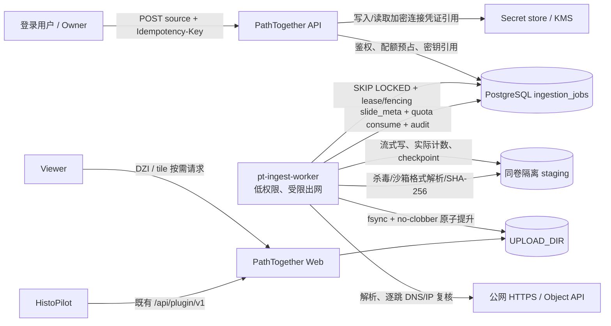

# PathTogether 远程文件摄取可行性调研与技术选型

> 状态：技术调研 / 架构建议，未实施、未迁移、未部署
> 调研日期：2026-09-10（Asia/Shanghai）
> 当前代码锚点：PathTogether `7060d443653c`、HistoPilot `7c618ebdaf6c`、HistoPilot-DSH `798954954cdf`
> 目标文件：数 GB 至数十 GB 的 SVS / NDPI / MRXS / OME-TIFF 等 WSI 进入 PathTogether 后沿用现有 Viewer / DZI 瓦片链路
>
> **2026-09-11 产品决定：本方案暂缓实施。** 先不建 `ingestion_jobs`、worker、API 或 UI；浏览器 V1/V2 上传保持现状。后续若重启，以本文 Go/No-Go、SSRF 双层防护与「邮件大附件 NO-GO」为不可降级门槛，不得把网络拉取放进 Web 请求或 HistoPilot。

## 1. 结论先行

### 1.1 明确选型

**建议做，但只在 PathTogether 内新增“持久化远程摄取作业”，不要把网络拉取放进 Web 请求、HistoPilot 或 HistoPilot-DSH。** 推荐的新运行单元是独立的 `pt-ingest-worker`：PathTogether API 负责鉴权、配额预占、作业创建与查询；PostgreSQL 保存状态与租约；worker 在受限出网环境中把源文件流式写到与 `UPLOAD_DIR` 同一文件系统的隔离暂存区，完成实际字节计数、SHA-256、恶意文件检查、`slide_io.open_slide` 校验和原子 no-clobber 提升，再写入现有 `slide_meta`。文件进入现有目录后，Viewer 继续按请求生成 DZI/瓦片，不另建一套切片存储。

首期建议只交付：

1. **HTTPS 公网直链 / 短期预签名 GET**：单文件、无任意自定义请求头；支持经严格验证的断点续传。
2. **S3-compatible 只读对象连接器**：优先 AWS S3，同时以同一抽象验证 OSS、COS、MinIO；使用对象版本/ETag/size 做源一致性保护，凭证只允许最小权限、服务器端引用。
3. **现有浏览器 V1/V2 上传完全保留**：远程摄取是加法能力，不替换也不复用其任务表。

第二阶段才考虑百度网盘 OAuth 文件选择与企业型 WebDAV/SFTP；“需要任意 Header/Cookie 的 URL”、任意百度分享链接抓取、远程 ZIP/MRXS 包和邮件附件摄取应暂缓。

### 1.2 邮件的明确结论

**“邮件附件直接发 WSI”不应成为正式产品通道。** 这不是只差实现：主流入站邮件服务的单封邮件上限约 35–40 MB，且上限包含 MIME/base64 后的消息；WSI 常为数 GB 至数十 GB。AWS SES 入站落 S3 的硬上限为 40 MB，SNS 更只有 150 KB；Postmark 入站附件累计上限为 35 MB。[16][17] 自建 SMTP 可以自行声明 `SIZE`，但 RFC 1870 并不保证中间邮件系统或发件服务接受超大消息，也不能解决重试副本、垃圾邮件、MIME 膨胀和存储 DoS。[18]

邮件只适合做**投递指令或链接入口**：登录用户先在 PathTogether 生成一次性、短时、不可枚举的投递地址/投递码，再发送包含 HTTPS 预签名下载链接或对象定位信息的邮件。邮件只创建一个待确认的 source claim，真正下载仍走统一 HTTPS/对象 worker；发件人地址、SPF/DKIM/DMARC 只能作为风险信号，不能替代 PathTogether 身份与授权。附件仅可作为可选的小型 checksum/manifest，默认不自动跟随正文链接，绝不把多 GB 附件当 WSI 运输层。

实现上应采用供应商的入站事件面，而不是轮询普通邮箱：例如 SES 可将原始 MIME 写入 S3/触发事件，Mailgun 可把解析后的消息以 HTTP webhook 转交应用。[15][19] 这只解决控制面接收，不改变附件容量和安全结论。

### 1.3 Go / No-Go

| 决策 | 结论 |
|---|---|
| 开展 HTTPS + S3-compatible MVP | **GO（有前置门槛）**：先完成独立 worker、SSRF 双层防护、持久租约/恢复、配额续租、真实大文件 PoC |
| 复用现有 `/api/uploads` 作为远程拉取队列 | **NO-GO**：它是浏览器按 offset 串行 PUT 的协议，不具备源解析、凭证、租约 worker、重定向/SSRF、远端版本约束 |
| 在 HistoPilot/DSH 实现下载 | **NO-GO**：跨越既有 WSI 所有权边界，扩大 AI 服务的网络与敏感数据权限 |
| 百度网盘 OAuth | **条件式 Phase 2**：官方能力存在，但应用审核、真实账号权限、dlink 生命周期、续传和限流均需线上验证 |
| 邮件大附件 | **NO-GO** |
| 邮件指令/链接入口 | **Phase 2 可做**，但只有绑定身份、签名 webhook、一次性投递码和统一 URL 安全策略后才上线 |
| 通用 WebDAV/SFTP | **按企业需求 Phase 2 / 延后**：技术可行，产品与运维复杂度高，不宜首期公开自助接入 |

## 2. 证据范围与结论层级

本报告严格区分五种证据：

| 层级 | 本次状态 | 能证明什么 | 不能证明什么 |
|---|---|---|---|
| 当前代码检查 | 已完成 | 三仓职责、V1/V2 上传、配额/任务/校验/提升、DZI/瓦片实际实现 | 未运行代码、未证明目标主机配置与仓库一致 |
| 官方文档调研 | 已完成 | 协议/供应商公开能力、限制和安全基线 | 未证明本项目账号已获权限、地域/套餐/限速表现 |
| PoC | **未执行** | — | Range 恢复、吞吐、真实 WSI 校验耗时、供应商错误码仍未知 |
| 集成实现与测试 | **未实施** | — | API/worker/UI/迁移均未验证 |
| 线上验证 | **未执行** | — | 当前生产进程、卷容量、出口策略、DNS、供应商账号与真实数据表现均为“待线上验证” |

因此本文是可执行的技术选型和验收合同，不是 implementation evidence，更不是 release verification。

## 3. 当前真实链路与仓库职责

### 3.1 所有权边界

代码与三仓 README 一致：

- **PathTogether** 拥有 WSI 文件、Viewer、region/DZI、标注、评论、分享、用户权限、审计和 Plugin Contract（`PathTogether/README.md:80-84`）。
- **HistoPilot** 拥有 Agent loop、tools、prompt、session/event、SSE、compaction、视觉上下文和模型接入；明确不得直接读取平台数据库或 WSI 路径（`HistoPilot/README.md:9-12`）。
- **HistoPilot-DSH** 只负责 DSH 工具注册及 HistoPilot HTTP/SSE 适配，不复制 PathTogether 或导航逻辑（`HistoPilot-DSH/README.md:3-11`）。

因此远程摄取必须由 **PathTogether** 负责。HistoPilot 最多在将来通过版本化 Plugin Contract 读取“切片已就绪”的既有资源，不创建、下载或持有源凭证。

### 3.2 浏览器上传当前实现

当前 PathTogether 将文件保存到 `UPLOAD_DIR`（README 默认值及容器 bind mount 见 `PathTogether/README.md:25-46,66`），路径如下：

1. 登录身份先通过 `can_upload()`；上传任务和最终 `slide_meta` 绑定 `owner_user_id`。
2. V1 `POST /api/upload`（`PathTogether/app.py:9009-9266`）处理小型单文件及 ZIP/MRXS：
   - 先做配额 reservation、磁盘水位和实际流式字节上限；
   - 保存到 `.uploading-*` 暂存文件；
   - ZIP 还检查路径穿越、成员数量/深度、单项与总展开大小、压缩比、符号链接/设备、加密、重复路径等；
   - `_validate_slide_file()` 调用 `slide_io.open_slide()`（`PathTogether/app.py:8416-8448`）；
   - 持久化 commit intent，计算 SHA-256，no-clobber 原子提升，写 `slide_meta`，再结算 reservation。
3. V2 `/api/uploads`（`PathTogether/app.py:9556-9977`）用于 `>= 16 MiB` 的单文件 WSI；ZIP/MRXS 仍回 V1（阈值见 `PathTogether/app.py:9281-9287`）：
   - `POST` 创建 `active` 任务并按 declared size 预占配额；
   - `PUT .../chunk` 要求严格等于服务器 `confirmed_offset`，校验分片 SHA-256，以 sidecar flock 串行化 pwrite；
   - `POST .../commit` 校验最终 size/SHA-256、真实格式，持久化 intent 后提升并落所有权；
   - `DELETE` 取消未完成任务。
4. `upload_tasks` 当前状态是 `active / committing / committed / failed / cancelled / expired`，默认任务 TTL 24 小时、chunk 16 MiB、单 chunk 上限 64 MiB、commit 超时 600 秒（`PathTogether/upload_task_store.py:47-72`）。恢复主要由请求路径惰性触发，不是常驻下载 worker。
5. 当前默认单请求/单文件上限 10 GiB、普通用户配额 20 GiB、磁盘保留水位 20 GiB、每用户在途 3 个、reservation TTL 1800 秒（`PathTogether/upload_guard.py:58-85`）。**数十 GB 摄取不能直接沿用这些默认值**，必须以同一套配额原语增加可续租的长任务语义，并在真实容量评估后单独配置。
6. 边缘 Nginx 对 V1/V2 关闭 request buffering 并设置长 timeout（`PathTogether/deploy/pt-edge-upload.inc.conf`），但远程摄取 worker 不应占用浏览器到 Gunicorn 的长请求连接。

### 3.3 当前“切片”并非后台预计算

摄取后的现有 Viewer 路径是：

- `/api/slide/<name>.dzi` 打开切片并即时返回 Deep Zoom XML（`PathTogether/app.py:10062-10085`）；
- `/api/slide/<name>_files/<level>/<x>_<y>.jpeg` 在授权后通过 `DeepZoomGenerator.get_tile()` 按请求解码并编码 JPEG（`PathTogether/app.py:10127-10256`）；
- `slide_cache.py` 管理 OpenSlide/OME 句柄与文件代际，`tile_cache.py` 提供进程内 LRU/single-flight。

所以新状态机里的 `tiling` 不能虚构成“生成完整金字塔”。本文把它定义为**激活与 Viewer readiness probe**：完成原子提升、所有权元数据、DZI 元数据和代表性低成本 tile/thumbnail 探测；完整瓦片仍按请求生成。若未来引入持久化 tile pyramid，必须另立存储、失效与版本合同。

### 3.4 可复用与不可直接复用

可复用：

- `upload_guard` 的用户配额、reservation、磁盘水位、流式实际字节计数；需增加长任务心跳续租和远程源限额。
- `_sanitize_name` / `_safe_name`、`_validate_slide_file`、`slide_io.open_slide`、`_promote_no_clobber`、SHA-256、`share_store.set_slide_meta`。
- V1/V2 的“commit intent 在提升之前持久化”和崩溃后 reconciliation 思路。
- 现有 ZIP 防护仅在以后确需支持远程 MRXS bundle 时复用。
- 现有权限模型、审计接口、管理端错误/积压监控模式。

不可直接复用：

- `upload_tasks`：它假设浏览器主动逐片 PUT，缺少 source、credential、DNS/redirect、远端版本、worker lease、retry schedule 和下载 checkpoint。
- Gunicorn 请求进程：数小时下载会被重启/超时打断，也没有跨进程抢占/租约语义。
- `scripts/import_slides.py`：它适用于管理员先用 rsync/SFTP 把单文件送到 staging 后的离线提升；脚本明确绕过 HTTP/CSRF/分片协议，且当前没有用户级任务、reservation/consume、完整审计与持续进度（`PathTogether/scripts/import_slides.py:1-18,76-126`）。它只可复用验证/提升模式，不能作为公开远程摄取后门。

## 4. 方案矩阵：技术可行不等于产品值得做

| 源类型 | 多 GB 技术可行性 | 续传/一致性 | 凭证与安全成本 | 产品价值 | 建议 |
|---|---|---|---|---|---|
| 公网 HTTPS 直链 | 高 | 取决于 `Range`、`206 Content-Range` 与强 validator；无 Range 时只能从零重试 | **SSRF 最高**；URL 可含 bearer query | 高：最通用、零账号绑定 | **MVP**，仅公网 HTTPS、无任意 Header、手工重定向校验 |
| S3 预签名 GET | 高；对象可远超数十 GB | S3 支持 Range、versionId、ETag 与可选 checksum；签名会过期[5][6] | URL 是 bearer secret，日志必须脱敏；下载开始后过期语义与重连要测 | 很高 | **MVP**，作为 HTTPS 的高质量来源；支持更新签名继续同一 job |
| AWS S3 只读连接器 | 高 | SDK 可固定 versionId/ETag/size 并自动刷新短期凭证 | IAM/KMS/Requester Pays/归档态；需 secret broker | 很高，科研/医疗数据常驻对象存储 | **MVP 或紧随 MVP** |
| 阿里云 OSS | 高；官方文档给出 48.8 TB 级对象/分片能力[7] | Range/ETag/条件读取可用；官方特别说明不合法 Range 可能返回完整对象，必须核验状态/Content-Range[8] | RAM role/STS、Endpoint/地域差异 | 中国客户价值高 | S3 抽象后首批适配，**待真实账号验证** |
| 腾讯云 COS | 高；官方文档支持约 48.82 TB 分块对象[9] | 单 Range、If-Match；部分源站回源场景会重定向，必须逐跳复核[10] | CAM 临时密钥、地域/域名差异 | 中国客户价值高 | S3 抽象后首批适配，**待真实账号验证** |
| MinIO | 高；S3-compatible，官方上限 50 TiB/10,000 parts[11] | 取决于部署版本与网关；需在客户实例实测 ETag/Range/TLS | 私网 MinIO 与公网 SSRF 策略冲突；不能开放任意内网地址 | 企业私有化价值高 | **Phase 2 企业连接器**；由管理员 allowlist endpoint/VPN，不走公网自助 URL |
| 百度网盘 OAuth 文件 | 中高，官方平台提供账号授权与文件传输；官方 Go SDK提供 OAuth、列举、`fs_id -> dlink -> stream`[12][13] | SDK scene 有接口级重试，但当前下载 helper 中途失败会删除 partial；dlink 续传、刷新、限速/会员差异需实测 | 应用审核、OAuth token、dlink、User-Agent、频控、用户撤权 | 中国个人/小团队价值可能高 | **Phase 2 条件式**；先完成 vendor qualification |
| 百度分享链接 + 提取码 | 非官方抓取虽可能实现，稳定性与合规性差 | 页面/风控/验证码/登录变化，不是可靠 API 合同 | Cookie 抓取、账号封禁、内容授权风险 | 表面价值高，长期维护价值低 | **延后/不做**；引导用户 OAuth 选择自己网盘内文件 |
| WebDAV | 中高，本质仍经 HTTP GET；WebDAV 标准给出集合和属性，但不保证服务器支持 Range/稳定 ETag[20] | 服务器差异大，需 capability probe；认证与重定向同 HTTPS | Basic/Bearer、私网 endpoint、证书与路径兼容性 | 企业长尾 | **Phase 2 按需求**，管理员建连接，不公开任意 endpoint |
| SFTP | 高；OpenSSH `reget` 可从本地文件长度继续，但明确警告远端内容变化会导致损坏[21] | 需固定 host key + size/mtime/可选 hash；resume 后仍必须全文件 SHA-256 | 私钥/密码、host-key rotation、跳板机、私网出口 | 企业长尾 | **Phase 2 按需求**；优先管理员 staging + `import_slides.py` 操作流程 |
| 入站邮件大附件 | **不适合**：主流平台 35–40 MB，远小于 WSI[16][17] | SMTP 可重投，MIME/供应商无可用的 GB 级断点合同 | 邮件炸弹、伪造、重放、恶意附件、数据副本扩散 | 低 | **不做** |
| 入站邮件指令/链接 | 高，邮件只是控制面 | webhook/event ID + 投递码幂等；下载仍统一走 HTTPS/对象 connector | 需签名 webhook、反垃圾、身份 claim、链接 SSRF | 中：降低交付门槛 | **Phase 2** |
| 用户自定义任意 Header/Cookie 的 URL | 技术可行 | redirect 时凭证泄漏风险；续传需重放秘密 | 极高：Header 注入、Host/Proxy-Authorization、跨域 redirect 泄密 | 少数企业需要 | **首期不做**；后续仅保存的受控 credential profile + Header allowlist |

### 4.1 为什么对象存储优先于 WebDAV/SFTP

S3/OSS/COS/MinIO 都能提供明确的 object key、size、版本/ETag、Range 和临时授权，适合把“这次下载的到底是不是同一对象”编码成状态机约束。WebDAV/SFTP 虽能传大文件，但服务器实现、私网可达性、证书/host key、认证方式和源文件修改语义高度分散，公开自助接入会把 PathTogether 变成通用网络客户端和秘密保管系统。其合理定位是企业管理员配置、按租户 allowlist，而不是首期面向所有用户的 URL 表单。

### 4.2 百度网盘的现实边界

官方开放平台公开“网盘账号授权”和文件传输能力；OAuth 授权码流程要求 redirect URI 匹配并建议用 `state` 抗 CSRF。[12][14] 官方 Go SDK的推荐链路是：用户 OAuth → 列目录/选择 `fs_id` → Meta 获取 size/MD5/dlink → 带规定 User-Agent 下载；常见错误包含 token/权限失效与频控。[13]

但截至本次只完成文档/SDK 源码检查，仍有以下**待线上验证**：

1. PathTogether 业务主体能否完成应用审核、获得所需 scope，生产 redirect URI 是否允许。
2. 真实数 GB/数十 GB WSI 在普通会员/会员账号下的速率、限频、并发与费用。
3. dlink 的实际有效期、过期续签、是否稳定支持 Range，以及中途断开后能否从 checkpoint 恢复。
4. 文件内容变化时 MD5/size/fs_id 的稳定语义；大文件 MD5 是否可作为全文件校验，最终仍以本地 SHA-256 为准。
5. 授权撤销/refresh token 轮换与删除请求；官方文档动态页的当前条款及商业限制。

未通过这些门槛前，不应把“百度网盘传输”写成已支持；也不应以用户 Cookie 或分享页逆向替代 OAuth。

## 5. 推荐架构与信任边界



### 5.1 运行单元

`pt-ingest-worker` 应是独立进程/容器，而不是 Flask/Gunicorn background thread：

- 只拿任务表、quota/audit/slide metadata 所需的最小 PostgreSQL 权限；无数据库 owner 权限。
- 挂载专用 staging 与 `UPLOAD_DIR`；两者必须在同一文件系统，才能沿用 hard-link/no-clobber 原子提升。暂存目录 `0700`、文件 `0600`、不可由 Web 直接服务。
- 使用单独网络命名空间/安全组；默认拒绝内网、loopback、link-local、云 metadata、管理网段，只允许 DNS、受控公网 443 与显式企业 connector endpoint。
- 不继承系统 `HTTP_PROXY/HTTPS_PROXY/NO_PROXY`；不运行 shell downloader；URL、bucket、key、文件名永不拼接进 shell。
- 任务通过 `SELECT ... FOR UPDATE SKIP LOCKED` 抢占，写 `lease_owner/lease_expires_at/lease_generation`，定时心跳。任何状态更新、checkpoint 和 commit 都带 fencing generation，旧 worker 恢复后不能覆盖新 worker。
- 下载/解析并发由独立 semaphore 限制，并同时设每用户、每源 host、全局带宽与磁盘在途字节上限。

### 5.2 为什么新建 `ingestion_jobs`，不扩成浏览器 `upload_tasks`

两者共享 quota/validation/commit 原语，但协议主体完全不同：浏览器任务的权威 checkpoint 是客户端提交的 `confirmed_offset`；远程任务的 checkpoint 还必须绑定 URL/object version、redirect 结果、凭证生命周期、Range 响应和 worker lease。强行复用会让状态字段大量可空、恢复分支互相污染，并增加旧 V2 回归风险。推荐添加新表和 service module，保持旧 API/表行为不变。

## 6. API 与数据模型草案

### 6.1 创建作业

`POST /api/ingestions`

请求头：

```http
Idempotency-Key: 0b18d528-...
Content-Type: application/json
X-CSRF-Token: ...
```

HTTPS 示例：

```json
{
  "source": {
    "type": "https",
    "url": "https://download.example.org/case-42.svs"
  },
  "filename": "case-42.svs",
  "expected_size": 12884901888,
  "expected_sha256": "optional-lowercase-hex"
}
```

对象示例：

```json
{
  "source": {
    "type": "s3_object",
    "connection_id": "srcconn_...",
    "bucket": "research-wsi",
    "key": "cohort-a/case-42.svs",
    "version_id": "optional-immutable-version"
  },
  "filename": "case-42.svs"
}
```

约束：

- 用户必须满足现有 `can_upload`；owner/user 隔离沿用现有身份模型。
- API 不在同步请求中访问源 URL，避免 timing oracle 和 Web worker 被慢源占用；只做纯解析、scheme/字段、粗略 hostname 规则和配额预占。真正解析 DNS/连接由受限 worker 完成。
- `url` 在数据库中拆成可展示的脱敏 locator 与加密 secret；query 默认视为秘密。响应和审计不回显完整 URL。
- 首期不接受 `headers` 字典，不接受 URL userinfo，不接受 `file: / ftp: / gopher: / data:` 等 scheme。
- `expected_size` 只用于预占和提早拒绝，绝不是可信上限；下载流实际计数始终硬截断。

建议响应 `202 Accepted`：

```json
{
  "ingestion_id": "ing_...",
  "state": "submitted",
  "status_url": "/api/ingestions/ing_...",
  "events_url": "/api/ingestions/ing_.../events"
}
```

### 6.2 查询、事件与取消

- `GET /api/ingestions/{id}`：仅 owner/owner-role 可见；返回脱敏 source、状态、阶段、计数与稳定错误码。
- `GET /api/ingestions/{id}/events?after_seq=N`：可选 SSE；事件持久化并复用现有 reconnect 思路，不能只发进程内事件。MVP 也可先 2–5 秒轮询。
- `POST /api/ingestions/{id}/cancel`：幂等；设置 `cancel_requested_at`，worker 在 chunk 边界检查并释放资源。已 `completed` 返回 409 并指向现有删除切片 API。
- `POST /api/ingestions/{id}/source-credential`：只用于用户更新已过期预签名 URL/授权，保持同一 job；必须重新做 source fingerprint 校验，不能改变到另一对象。
- `POST /api/source-connections/...`：Phase 2 管理 OAuth/对象凭证；读取型 scope、连接测试和撤销均审计。

### 6.3 状态响应

```json
{
  "ingestion_id": "ing_...",
  "state": "downloading",
  "phase": "http_get",
  "bytes_downloaded": 5368709120,
  "expected_bytes": 12884901888,
  "percent": 41.67,
  "attempt": 2,
  "retry_at": null,
  "viewer_ready": false,
  "error": null,
  "updated_at": "2026-09-10T12:00:00Z"
}
```

`percent` 仅在 `expected_bytes` 已由可信 object metadata 或稳定 HTTP 响应确认时返回；否则为 `null`。吞吐/ETA 是观察值，不作为正确性状态。

### 6.4 PostgreSQL 数据草案

建议至少：

```text
ingestion_jobs
  ingestion_id PK
  owner_user_id NOT NULL
  idempotency_key NOT NULL
  request_fingerprint NOT NULL
  source_type NOT NULL
  source_locator_redacted JSONB NOT NULL
  source_secret_ref NULL
  source_fingerprint JSONB NULL
  desired_filename / safe_name
  state / phase / attempt / next_retry_at
  expected_bytes / bytes_downloaded
  expected_sha256 / sha256_actual
  reservation_id / settle_bytes
  staging_relpath
  commit_token / commit_intent JSONB
  lease_owner / lease_generation / lease_expires_at / heartbeat_at
  cancel_requested_at
  error_code / error_detail_safe
  created_at / updated_at / completed_at
  UNIQUE(owner_user_id, idempotency_key)

ingestion_events
  ingestion_id + seq PK
  event_type / safe_payload / created_at

source_connections
  connection_id PK
  owner_user_id / tenant scope
  provider / endpoint_allowlist / secret_ref / scopes / expires_at
  status / created_at / revoked_at
```

秘密不进入 job JSON、event、应用日志或错误详情；`source_secret_ref` 指向 KMS/secret store 加密材料。若暂时只能落 PostgreSQL，至少 envelope encryption、密钥版本、严格列级访问、不可由普通管理 API 回读，并有轮换/删除路径。

## 7. 状态机、恢复与幂等

### 7.1 状态机

```text
submitted
  -> resolving        解析 connector、DNS、鉴权和远端 metadata
  -> downloading      流式下载与 checkpoint
  -> verifying        完整 size/hash、恶意文件与真实 slide parser 校验
  -> ready            校验完成，commit intent 已持久化，尚未对 Viewer 宣告成功
  -> tiling           原子提升 + slide_meta + DZI/代表性 tile readiness probe
  -> completed        配额已结算、审计已写、viewer_ready=true

任一非终态 -> waiting_retry -> resolving/downloading
任一非终态 -> cancelled
不可重试或超过策略 -> failed
```

`ready` 是关键恢复栅栏：在进入它之前 staging 不得被 Viewer 读取；进入后 commit intent 已足以让任意新 worker 判断“应继续提升、补 metadata/结算，还是回滚 staging”。`tiling` 不代表完整瓦片金字塔，只代表现有按需 Viewer 的激活探测。

### 7.2 幂等规则

1. `Idempotency-Key` 按 `owner_user_id` 唯一；相同 key + 相同规范化请求返回同一 job，相同 key + 不同请求返回 `409 idempotency_conflict`。
2. 请求 fingerprint 排除加密 secret 的密文随机性，但包含 source type、稳定 locator、目标文件名、expected size/hash。预签名 URL 的 query 不适合作稳定身份，用户应提供 Idempotency-Key。
3. 远端 source fingerprint：
   - HTTP：最终规范化 URL（脱敏）、strong ETag/Last-Modified/size；无可靠 validator 时断点后必须从零开始。
   - S3-compatible：provider/endpoint/bucket/key/versionId；无 versionId 时绑定 ETag + size，multipart ETag 只当 opaque version marker，不能冒充 MD5。
   - 百度网盘：connection/account、fs_id、size、provider MD5/dlink generation。
   - SFTP：connection/host-key、remote path、size/mtime，可选远端 checksum。
   - 邮件：provider event ID + RFC Message-ID + attachment index/投递码；不能只按发件人和主题。
4. 每次 checkpoint 写入 `lease_generation`；失去租约的 worker 即使继续运行也不能推进状态或提升文件。
5. 最终文件 SHA-256 是 PathTogether 自己流式计算的内容身份；远端 ETag/MD5/checksum 是额外校验，不能替代本地完整 hash。
6. 默认不做跨租户内容去重，避免通过 hash/时序泄露其他租户拥有的医疗数据；同一用户内去重也须显式产品语义。

### 7.3 断点续传的正确合同

HTTP Range 是可选能力；`Accept-Ranges` 只是提示，客户端仍需验证实际响应。[4] 从 `N` 恢复时必须：

1. 请求 `Range: bytes=N-`，并用固定 strong ETag/version 做 `If-Range` 或 connector 的版本参数。
2. 只在 `206` 且 `Content-Range` 起点严格等于 `N`、总长度与既有 metadata 一致时 append。
3. 若源返回 `200`、validator 改变、长度改变或内容编码非 identity，截断 partial 后从 0 重来；绝不能把整文件响应追加到 partial。
4. 发送 `Accept-Encoding: identity`；`Content-Length` 只作本次响应提示，累计实际字节超过 job/用户/系统硬上限立即停止。
5. 每次重试和每个 redirect 都重新做 DNS/IP 校验；预签名 URL 过期时进入可恢复的 `source_auth_expired`，由用户更新秘密而不是新建重复 job。
6. checkpoint 建议每 64–256 MiB 或固定时间持久化，文件先 `fdatasync` 再提交 offset；崩溃恢复先核对实际文件长度与 checkpoint，永远取较小安全点或从零重来。

## 8. 稳定错误模型

HTTP 状态只表达请求层；作业失败通过持久状态和机器码表达。建议最小集合：

| 类别 | error code | 是否自动重试 | 用户动作 |
|---|---|---:|---|
| 源解析 | `source_scheme_denied`, `source_url_invalid` | 否 | 更换受支持来源 |
| SSRF | `source_ssrf_blocked`, `redirect_denied`, `source_dns_changed` | 否 | 使用公网地址或管理员连接器 |
| 鉴权 | `source_auth_expired` | 否，等待更新 | 更新预签名 URL/OAuth |
| 鉴权 | `source_forbidden`, `source_not_found` | 否 | 检查权限/对象 |
| 一致性 | `source_changed`, `source_range_invalid` | 可从零有限重试 | 固定版本或重新提交 |
| 限流/网络 | `source_rate_limited`, `download_timeout`, `source_unavailable` | 是，指数退避+jitter+上限 | 等待或取消 |
| 容量 | `size_limit_exceeded`, `upload_quota_exceeded`, `disk_watermark_exceeded` | 否 | 调整配额/清理空间 |
| 完整性 | `checksum_mismatch`, `download_truncated` | 有限从零重试 | 检查源文件 |
| 格式 | `unsupported_format`, `invalid_slide`, `archive_policy_denied` | 否 | 提供受支持单文件/合规包 |
| 安全 | `malware_detected`, `parser_sandbox_violation` | 否 | 文件隔离，联系管理员 |
| 提升 | `name_conflict`, `ownership_conflict` | 否 | 改名或检查所有权 |
| 调度 | `worker_lease_lost` | worker 不落终态 | 新 worker 接管 |
| 取消 | `cancelled` | 否 | 可重新提交 |
| 内部 | `internal_retryable`, `internal_terminal` | 按策略 | 安全 request ID 联系管理员 |

安全详情、真实路径、完整 URL/query、Header、provider body 和 token 不返回给客户端；日志以 request/job ID、provider request ID、脱敏 host、阶段和稳定码关联。

## 9. 威胁模型与强制控制

### 9.1 资产与攻击面

受保护资产包括：医疗影像及其元数据、用户/租户归属、OAuth/对象存储/SFTP 凭证、PathTogether 内部数据库和网络、宿主磁盘/CPU/内存、Viewer 可用性和审计链。入口包括 URL、DNS、redirect、HTTP header、对象 key、OAuth callback、邮件 MIME/webhook、WebDAV XML、SFTP host/path、WSI/ZIP parser 和取消/重试 API。

### 9.2 主要威胁与控制

| 威胁 | 典型攻击 | 必须控制 | 上线阻断测试 |
|---|---|---|---|
| SSRF/内网探测 | URL 指向 `127.0.0.1`、RFC1918、IPv6 link-local、云 metadata、重定向到内网 | 应用层全量 IP 分类 + 连接层 egress deny；仅 `https`; 禁 userinfo；逐跳手工 redirect；DNS pinning；禁代理环境；限制端口 | IPv4/IPv6/映射地址、十进制/八进制、CNAME、DNS rebinding、302 链全部被拦截[1][2] |
| 凭证泄漏 | query/header 打进日志；跨域 redirect 携带 Authorization/Cookie | secret ref、envelope encryption、展示/日志脱敏；跨 origin 永不转发凭证；首期禁任意 Header；最小 scope/短期 token | 日志、错误、事件、admin UI、trace 中无秘密；重定向目标收不到凭证 |
| 内容替换/续传拼接 | ETag 改变，服务器忽略 Range 返回 200 | validator/version pin；严格 206/Content-Range；变化即截断重来；最终 SHA-256 | 途中改源、弱 ETag、无 ETag、错误 Range、gzip 都不产生 completed |
| 配额/磁盘 DoS | 假 Content-Length、无限 chunked body、并发数十 GB | 实际计数硬上限；reservation 心跳；用户/host/global 并发与带宽；磁盘水位；无长度源也有绝对 cap | 小 CL 大 body、无 CL、慢流、并发、磁盘临界均稳定拒绝/暂停 |
| ZIP/解压炸弹 | 极高压缩比、路径穿越、symlink/device、海量成员 | MVP 禁远程 archive；以后复用现有 V1 多维限制并在隔离目录展开，按展开后字节计费 | zip-slip、重复路径、加密、symlink、nested/bomb 全失败[3] |
| 恶意/畸形 WSI | 触发 OpenSlide/libtiff/tifffile 漏洞或耗尽内存 | extension + magic + parser 三层；AV；格式解析放低权限子进程/容器，设 CPU/内存/fd/时间/输出限制；及时更新依赖 | fuzz corpus、截断 TIFF、超大 metadata、解析超时/崩溃不能带倒 worker |
| MRXS 伴侣缺失 | 只下载 `.mrxs` 索引，Viewer 后续失败 | 单文件 MVP 明确拒绝 MRXS；Phase 2 用受限 bundle manifest/ZIP。OpenSlide 明确 MIRAX 需要同名目录及 `Slidedat.ini`[23] | 缺目录/少成员/多根/大小超限不提升 |
| 邮件炸弹/伪造/重放 | 猜地址群发、重复 webhook、伪造 From、大量附件/链接 | 随机短期 alias/投递码；provider webhook 验签/IP策略；event id 去重；envelope recipient；频率/大小/parts；隔离；登录后 claim | replay、伪造 From、无投递码、超限、恶意 MIME 均不创建下载 |
| 跨租户越权 | 猜 job ID、复用连接、同名覆盖、hash oracle | owner-scoped job/connection；不可枚举 ID；no-clobber；权限在每个状态/事件/取消点检查；不跨租户去重 | 两用户所有 GET/SSE/cancel/credential/update 都互相 403/404 且无存在性泄漏 |
| worker 重复/脑裂 | 两 worker 同时下载/提升，旧 worker 写新状态 | DB lease + heartbeat + fencing generation；idempotent commit intent；唯一约束；reconciler | kill -9、暂停、网络分区、租约过期后只有一份文件/一次配额结算 |
| 供应链/解析器漏洞 | 恶意文件利用原生库 | 固定依赖与镜像 digest、SBOM/CVE 策略、非 root、read-only rootfs、seccomp/权限收敛、真实回归样本 | 依赖扫描+隔离逃逸测试；版本升级有兼容回归 |

OWASP 明确建议 URL/域名/IP 与网络层联合防 SSRF；仅 denylist 不足。[1] 文件上传也需 allowlist、真实内容/签名校验、随机安全文件名、大小限制、授权、webroot 外存储、杀毒/沙箱和纵深防御，并单列 ZIP bomb 与 parser exploit 风险。[3]

### 9.3 SSRF 的实现级规则

1. 只接受规范化 `https://host[:port]/path?...`；MVP 端口只允许 443。拒绝 userinfo、fragment、空 host、非规范/混合编码 IP、超长 URL。
2. 用可信 resolver 解析全部 A/AAAA；只要任一候选属于 loopback、private、link-local、multicast、unspecified、reserved/documentation/benchmark、carrier-grade NAT、IPv4-mapped 禁止段、平台内部网段或 metadata 地址，整次解析拒绝。
3. 将经过校验的目标 IP 固定到本次连接，同时保留原 hostname 做 TLS SNI/证书校验和 Host；连接不得重新隐式解析另一个 IP。
4. 自动 redirect 必须关闭。每一跳重新规范化、解析、分类、pin，限制 hop 数；跨 origin 丢弃 Authorization/Cookie/自定义凭证，预签名对象的 provider redirect 也要经过 connector 专用 allowlist。
5. worker 安全组/防火墙硬拒绝内网与 metadata（例如 AWS `169.254.169.254`/IPv6 metadata 地址）；应用校验失误也不能接通。[2]
6. 企业 MinIO/WebDAV/SFTP 私网例外只能由管理员创建 connector，绑定明确 CIDR/hostname/租户和审计；不能由普通 URL 输入绕过公网策略。

### 9.4 病理数据、版权和地域

WSI 可能含 label/barcode/病历关联信息。中国《个人信息保护法》将医疗健康列为敏感个人信息，要求特定目的、充分必要性、严格保护措施，并对单独同意/告知提出要求。[24] 跨境规则还取决于主体、数据性质、人数阈值和是否属于重要数据；2024 年《促进和规范数据跨境流动规定》调整了适用门槛，但不是“所有医学影像均可自由跨境”。[25]

产品与合同最低要求：

- 用户在提交时确认有权复制/处理该文件，并选择预期处理地域；记录来源、提交者、目的、时间、连接器与同意/合同依据。
- 默认让下载 worker、staging、最终卷、备份、日志与 secret 位于同一批准地域；跨地域源到目标的传输在启用前做法律/安全评估。
- label/thumbnail 不写公开日志，不把原始文件或 hash 发送到公共恶意样本服务；若使用第三方 AV/SaaS，先完成数据处理协议与地域评审。
- 配置保留、删除、legal hold、撤权和审计导出；取消失败作业的 partial 按短 TTL 清理，完成文件沿用现有用户删除/保留政策。
- 版权投诉/非法内容处理流程必须覆盖远程摄取；“用户给了 URL”不等于拥有再分发权。

这部分是工程风险提示，不替代法律意见；生产适用地域、合同和数据分类均**待合规负责人线上确认**。

## 10. 格式、校验、命名与原子提交

### 10.1 MVP 格式范围

MVP 只接受现有 `slide_io` 已能验证的**单文件**格式：优先 SVS、NDPI、单文件 TIFF/OME-TIFF 等；最终接受与否以 `slide_io.open_slide()` 成功、关键 metadata 合理且 readiness probe 通过为准，不以扩展名/MIME 为准。OpenSlide 官方也声明各厂商格式支持可能不完整。[22]

MRXS 是多文件 MIRAX 格式：`.mrxs` 旁必须有同名目录，且包含 `Slidedat.ini` 和数据/index 文件。[23] 因此：

- HTTPS 单 URL MVP 拒绝 `.mrxs`，给出 `archive_policy_denied` 和操作说明；
- Phase 2 可接受受限 ZIP 或对象 prefix manifest，但必须把整套 bundle 的文件清单、相对路径、每项/总大小、hash 纳入 source/commit intent；
- 不能把单个 `.mrxs` 成功下载等同于可用切片。

### 10.2 下载、校验与提升顺序

1. 解析可信远端 metadata，预占/补足 quota，检查磁盘水位。
2. 在同卷 staging 创建随机名 partial，`O_CREAT|O_EXCL`、0600；客户端 filename 只作显示/建议名。
3. 流式下载，实际计数、增量 SHA-256、限速、checkpoint；不执行内容。
4. 下载完成后校验实际 size、expected/provider checksum；可用时执行本地 AV。
5. 在受限 parser sandbox 运行 `slide_io.open_slide`，检查 level/dimensions/metadata 上界；至少读取代表性 thumbnail/tile，捕捉延迟解码错误。
6. 选择现有规则产生 `safe_name`，持久化 `commit_intent` 和 SHA-256，进入 `ready`。
7. `fdatasync/fsync` 文件和 staging 目录；调用 no-clobber hard-link/原子提升；目标存在则不覆盖。
8. 写 `slide_meta(owner_user_id)`、完成 DZI/readiness probe、同事务或可补偿地结算 quota 和 job `completed`，写审计。
9. 删除 partial/lock；reconciler 定期处理 `ready/tiling`、过期 lease、孤儿 partial 和“已提升但 metadata/结算未完成”的状态。

当前 V1/V2 已有 commit intent、SHA-256、验证、no-clobber、所有权与 reservation 结算的可复用模式，但新实现要把 parser 放到更强的资源隔离中，并为长任务加入真正后台 reconciliation。

## 11. 迁移、灰度与回滚

### 11.1 加法迁移

1. 新增独立 migration：`ingestion_jobs`、`ingestion_events`、`source_connections` 及唯一/状态/lease 索引；不修改现有 `upload_tasks` 语义。
2. 新 API/worker/service 均在 `REMOTE_INGESTION_ENABLED=false` 下默认关闭；先只启 owner/internal cohort。
3. 旧 `/api/upload`、`/api/uploads`、前端本地文件选择、ZIP/MRXS 路由保持原样，回归测试必须证明未改变。
4. worker 先 dark deploy，只处理人工生成的测试 job；再启 HTTPS；对象连接器独立 feature flag；百度/邮件/WebDAV/SFTP 各自独立 flag。
5. 上线前调整 remote 专用 `max_source_bytes`、用户 quota、reservation TTL/heartbeat、staging 预算和清理策略；不要为了 remote 粗暴抬高浏览器 V1 body 上限。

### 11.2 回滚

- 第一层：关闭新建作业 feature flag，查询/取消仍可用；不影响浏览器 V1/V2。
- 第二层：暂停 worker 抢新任务，允许正在 `ready/tiling` 的 commit reconciler 收口；下载中任务保留 checkpoint 或按明确 TTL 取消，不删除已 completed 文件。
- 第三层：回滚 Web/API 镜像。旧版本忽略新增表；表和已摄取文件保留，避免不可逆数据丢失。不要在线 drop 表作为快速回滚。
- 凭证单独撤销/轮换；停 worker 不等于令第三方 OAuth/STS 凭证失效。
- 若发现归属/配额错误：先禁新建并保全 job/event/audit/文件，再用版本化修复工具对账；不得用全局清空 staging/UPLOAD_DIR 的方式回滚。

### 11.3 数据保全不变量

- 旧上传产生的文件、`upload_tasks`、reservation、queue、用户草稿/标注完全不动。
- 新作业只在 `completed` 后对普通 Viewer 可见；失败/取消不产生半可见 slide。
- 同名目标永不覆盖；已存在目标与新 staging 都保留到人工/策略判定。
- job、文件、所有权、quota consume 四者必须可对账；任何一个不一致都有 deterministic reconciler 和审计记录。

## 12. PoC 计划、可执行命令与测试矩阵

以下命令是建议的 PoC 合同，**本次均未执行**。真实 token/URL 不得写入 shell history、文档或 CI 日志；使用短期测试凭证和专用无敏感数据 bucket。

### 12.1 本地 HTTPS/Range 故障注入

建议新增测试夹具服务器，能分别模拟：正确 Range、忽略 Range 返回 200、错误 Content-Range、无 Content-Length、途中断流、ETag 改变、gzip、302 到公网/内网、DNS 变化、慢流。

```bash
cd /Users/solarise/ZCodeProject/histopilot-suite/PathTogether
python3 -m pytest -q tests/test_remote_ingestion_http.py \
  tests/test_remote_ingestion_ssrf.py \
  tests/test_remote_ingestion_recovery.py

# 对获准的非敏感 PoC URL 只检查响应合同；不要在命令行放永久密钥。
curl --proto '=https' --tlsv1.2 -sS -D /tmp/pt-range.headers \
  -H 'Accept-Encoding: identity' -H 'Range: bytes=0-1048575' \
  -o /dev/null 'https://example.invalid/test.svs'
```

验收：恢复请求只有在严格 206/Content-Range/validator 一致时 append；其余情况从零重来或稳定失败；所有内网/metadata/redirect 变体在建立连接前被应用层拒绝，同时 egress 层也不可达。

### 12.2 S3-compatible / MinIO

```bash
podman run --rm --name pt-ingest-minio \
  -p 127.0.0.1:19000:9000 -p 127.0.0.1:19001:9001 \
  -e MINIO_ROOT_USER=pt_poc_only \
  -e MINIO_ROOT_PASSWORD='replace-with-ephemeral-test-secret' \
  quay.io/minio/minio:REPLACE_WITH_REVIEWED_DIGEST \
  server /data --console-address ':9001'

cd /Users/solarise/ZCodeProject/histopilot-suite/PathTogether
python3 -m pytest -q tests/test_remote_ingestion_s3.py \
  tests/test_remote_ingestion_object_change.py
```

说明：生产镜像必须固定审阅过的 digest；本地 loopback MinIO 仅在 test profile 中 allowlist，绝不能放宽生产 SSRF 规则。另用 AWS/OSS/COS 各自的临时最小权限账号跑同一 provider contract suite，验证 `HEAD/GET Range/version/ETag/checksum/403/404/429/签名过期`。

### 12.3 SFTP / WebDAV

```bash
# OpenSSH 客户端能力检查；PoC 必须使用独立容器、临时 host key 和非敏感样本。
sftp -V
sftp -b tests/fixtures/sftp-reget.batch pt_poc@127.0.0.1

# WebDAV 先探测 metadata，再验证 GET Range；真实凭证通过临时配置文件注入。
curl --proto '=https' --tlsv1.2 -sS -X PROPFIND -H 'Depth: 0' \
  -o /tmp/pt-webdav-propfind.xml 'https://example.invalid/dav/test.svs'
curl --proto '=https' --tlsv1.2 -sS -D /tmp/pt-webdav-range.headers \
  -H 'Accept-Encoding: identity' -H 'Range: bytes=0-1048575' \
  -o /dev/null 'https://example.invalid/dav/test.svs'
```

验收：host key 固定而非静默 trust-on-first-use；远端改变后 resume 不得产出成功文件；WebDAV server 不支持可靠 Range/ETag 时标记 `restart_only`，UI 明示断线会从零开始。

### 12.4 百度网盘与邮件

```bash
# 百度官方 SDK 集成测试需要测试账号 token；只在隔离 CI secret 中提供。
BDPAN_ACCESS_TOKEN='ephemeral-test-token' \
  go test -tags integration -run TestIntegration -v \
  github.com/baidu-netdisk/baidu-drive-sdk-go/baidudriver/scene

# 邮件入口只测小型 MIME/链接指令，不上传真实 WSI 附件。
python3 -m pytest -q tests/test_remote_ingestion_email.py
```

百度验收必须含真实 5/20/50 GB 非敏感稀疏或公开 WSI 样本、断流、dlink 过期、OAuth 撤权、refresh、429/频控和 User-Agent；未完成前保持 feature flag off。邮件验收含 provider 签名、重复 webhook、伪造 From、随机 alias、超 parts/size、恶意附件、正文内网 URL、投递码过期与登录 claim。

### 12.5 格式与端到端矩阵

| 维度 | 必测样例 |
|---|---|
| 大小 | 0 B、15 MiB、数百 MiB、5/10/20/50 GB、超过硬上限 |
| 格式 | 合法 SVS、NDPI、OME-TIFF；截断/伪扩展/损坏 TIFF；单独 MRXS；合规/恶意 bundle |
| 网络 | 无 CL、正确/错误 Range、200 fallback、断流、慢流、TLS 错误、redirect、DNS rebinding、429/5xx |
| 一致性 | ETag/version/size 中途改变；预签名 URL 更新指向同一/不同对象；最终 hash mismatch |
| 并发 | 同 idempotency key 重放、不同 body 冲突、两 worker 抢占、同名目标、每用户/host/global 上限 |
| 崩溃 | 每个状态前后 kill -9；写 partial 后、checkpoint 前后、提升前后、metadata/consume 前后 |
| 权限 | user/owner、跨用户 GET/SSE/cancel/update credential、被删/禁用用户、连接撤销 |
| 容量 | quota top-up/续租/过期、disk watermark、清理器与正在下载竞争、保留策略 |
| Viewer | completed 前不可见；completed 后 DZI、thumbnail、代表性 tile、权限/分享；文件变更代际 |
| 回归 | 旧 V1 小文件、V2 16 MiB 阈值与续传、ZIP/MRXS、取消、旧 task 恢复全部不变 |

### 12.6 验收门槛

MVP 只有同时满足以下条件才算 `implementation_complete`：

1. 单一 agent/变更批次可从 migration rehearsal、实现、故障注入、真实 WSI、恢复和 review 跑完定义的 gates；关键套件无 skip 冒充通过。
2. 50 GB 级文件在至少两次强制断流/worker kill 后得到唯一正确 SHA-256 文件，配额只结算一次，无 orphan 可见 slide。
3. SSRF corpus 同时证明应用校验和网络 egress 两层阻断；任何 redirect/retry 不能绕过。
4. 两用户隔离、连接凭证不可回读、日志/事件/错误全程无 token/完整 signed URL。
5. SVS/NDPI/OME-TIFF 真实样本完成 DZI/thumbnail/多层 tile；MRXS MVP 被清晰拒绝。
6. 旧浏览器 V1/V2 全套和 Chromium 上传/Viewer E2E 通过。
7. migration 在生产规模 PG 副本上 rehearsal，回滚演练保留完成文件和旧 task。

`release_verified` 还必须另行满足：代码提交/推送与 CI、镜像 digest、目标主机迁移、worker/volume/egress/secret 配置、在线真实来源 smoke、监控告警、清理器和回滚演练；本报告没有完成任何一项线上门槛。

## 13. 分阶段路线图

### MVP

- 新 `ingestion_jobs/events`、quota 长租约、worker lease/fencing/reconciler。
- HTTPS 公网/预签名单文件 GET，无任意 Header，严格 SSRF/redirect/Range/validator。
- S3-compatible connector abstraction；至少 AWS S3 + 一个 MinIO contract environment，OSS/COS 在真实账号验证后按同批或紧随发布。
- 单文件 SVS/NDPI/OME-TIFF 等现有 parser 支持；MRXS/ZIP 明确拒绝。
- 进度、取消、稳定错误、owner 可见管理页；审计与基础 backlog/oldest/throughput/error metrics。
- parser sandbox、恶意文件策略、staging 清理、旧 V1/V2 回归。

### Phase 2

- 百度网盘 OAuth picker：应用审核、scope、token lifecycle、dlink/Range 大文件验证通过后再启。
- 邮件投递码 + 链接/source claim；不支持大附件。
- 企业 WebDAV/SFTP/私网 MinIO，由管理员建 allowlisted connector，host key/cert 固定。
- 受控 HTTP credential profile：只允许预定义 Authorization 类型/指定同源 endpoint，绝不开放任意 header map。
- MRXS/多文件 bundle：受限 ZIP 或对象 manifest，展开后 quota/安全/atomic bundle commit。

### 延后或拒绝

- 邮件多 GB 附件。
- 百度分享页/提取码自动抓取、用户 Cookie、非官方逆向。
- 公网用户任意 Header、任意端口/协议、允许访问内网 URL。
- 在 Web 请求或 HistoPilot/DSH 中运行长下载。
- 未有真实需求与运维 owner 前的通用 FTP/SMB/rclone“万能连接器”。
- 在没有持久 tile 存储与失效合同前，预生成完整 Deep Zoom 金字塔。

## 14. 粗略工程量与工作包

下表是**人周级容量估算**，不是交付承诺；不含供应商审核、法务等待、生产采购和未知格式修复。

| 工作包 | 内容 | 估算 | 主要依赖/风险 |
|---|---|---:|---|
| W0 契约与 migration | schema、状态机、API/error/idempotency、migration rehearsal | 1–1.5 人周 | 与现有 quota/ownership 对齐 |
| W1 worker 基座 | 独立进程、claim/lease/fencing/heartbeat/retry/cancel/reconciler | 2–3 人周 | 部署方式、PG 权限、优雅退出 |
| W2 HTTPS 安全下载 | SSRF、DNS pin、manual redirect、Range/checkpoint、限速/计数 | 2.5–4 人周 | HTTP 库是否支持 pinned connect + SNI；网络 egress |
| W3 校验与原子提交 | AV/parser sandbox、SHA、format、intent、promote、meta/quota/audit | 2–3 人周 | 原生库隔离、同卷存储、崩溃窗口 |
| W4 API/UI/进度 | 创建/查询/SSE或轮询/取消/更新签名、owner/admin UI | 1.5–2.5 人周 | UX 与长期任务恢复 |
| W5 S3-compatible | connection、STS/SDK、version/checksum、AWS+MinIO、OSS/COS contract | 2–3.5 人周 | 各厂商差异、KMS/归档态/费用 |
| W6 安全/运维 | secret store、RBAC、审计、metrics/alerts、cleanup、runbook | 2–3 人周 | 现有 secret/KMS 设施、值班 owner |
| W7 验证与发布门禁 | 故障注入、50 GB、格式 corpus、旧 V1/V2/Chromium、迁移/回滚 | 2.5–4 人周 | 真实非敏感样本、磁盘与网络预算 |

MVP 合计约 **16–24 人周**；两名熟悉代码的工程师与安全/运维评审并行，日历时间大致 **9–14 周**，但真实大文件/网络/供应商 PoC 可能成为关键路径。若首批只交付 HTTPS，不做凭证化 S3 connector，可少约 2–3.5 人周，但仍不能省略 worker、SSRF、恢复和 parser 隔离。

Phase 2 粗估：百度 OAuth **4–7 人周 + 不可控审核等待**；邮件指令入口 **2–4 人周**；每类企业 WebDAV/SFTP connector **3–5 人周**；MRXS bundle **3–5 人周**。这些能力应按实际用户来源数据决定，不建议一次性全做。

## 15. 上线前待确认 blocker

1. **生产存储能力**：`UPLOAD_DIR` 与 staging 实际卷、可用容量/IOPS、备份与 50 GB 并发预算，待线上验证。
2. **配额产品语义**：当前默认用户 20 GiB、小于目标数十 GB；`used_bytes` 与删除/保留如何结算需产品与数据层明确，不能只抬环境变量。
3. **worker 部署与出网**：Podman/systemd/Kubernetes 的实际承载、网络策略、DNS pinning 支持、metadata deny 与 secret store，待部署负责人确认。
4. **parser sandbox**：当前 `slide_io.open_slide` 在应用进程内；需要选定子进程/容器隔离、资源上限、AV 引擎与失败合同。
5. **真实数据集**：至少合法/损坏 SVS、NDPI、OME-TIFF、MRXS，各 5/20/50 GB 或真实代表样本，且无敏感/版权问题。
6. **供应商账号**：AWS/OSS/COS 的临时权限、费用/跨区流量；百度开放平台应用审核与真实下载能力；邮件域名/供应商/地域均未建立。
7. **法律与合同**：敏感医疗数据、患者 label、版权、跨境、第三方处理者、保留/删除依据待合规签字。
8. **SLO/运营**：最大文件、最大时长、自动重试窗口、带宽公平、失败 partial TTL、告警和值班 owner 尚未定。
9. **命名/冲突 UX**：自动重命名、拒绝或创建版本需要产品决定；默认建议 no-clobber + 用户确认。
10. **是否需要持久 tile cache**：当前 Viewer 是按需瓦片；不要把摄取项目隐含扩成 tile pyramid 建设。

只要 1–5 未闭合，就不应进入生产实现发布；百度、邮件和企业 connector 的 blocker 不应拖住纯 HTTPS/S3 MVP，但必须保持各自 feature flag 关闭。

## 16. 最终建议

远程摄取的核心并不是“让服务器执行一个 `curl`”，而是给 PathTogether 增加一个对敏感超大文件负责的、可恢复且可审计的传输事务。最稳妥的产品切面是：

1. 以 PathTogether 为唯一 owner，新建持久 `ingestion_jobs` 与受限 `pt-ingest-worker`。
2. 首期把来源收敛为公网 HTTPS/预签名 URL 与 S3-compatible 对象；禁止任意 Header、内网 URL、archive/MRXS 和非官方网盘抓取。
3. 严格复用现有 quota、真实格式校验、SHA、no-clobber、所有权和 Viewer 路径，但不复用浏览器 upload task 状态机。
4. 以 SSRF 双层隔离、源版本固定、严格 Range、实际字节硬限制、parser sandbox、lease/fencing 和 commit reconciliation 作为不可降级的上线门槛。
5. 百度网盘只走官方 OAuth + 用户文件选择，完成真实大文件和应用审核验证后进入 Phase 2。
6. 邮件只做“带投递码的指令/链接入口”；**明确拒绝把邮件附件当 WSI 大文件通道**。
7. 浏览器 V1/V2 始终保留；任何灰度/回滚不得删除旧文件、任务、配额记录、队列或用户数据。

这条路线技术上可行，也比“万能远程 URL/邮箱收附件”更容易形成清晰的安全边界、稳定错误和可维护的产品承诺。

## 17. 官方与一手资料

以下来源均于 **2026-09-10** 访问；供应商账号、套餐、地域和动态开放平台权限仍须按本文标注做线上验证。

[1] OWASP, *Server-Side Request Forgery Prevention Cheat Sheet*: <https://cheatsheetseries.owasp.org/cheatsheets/Server_Side_Request_Forgery_Prevention_Cheat_Sheet.html>

[2] AWS, *Retrieve instance metadata (EC2 metadata addresses and IMDS)*: <https://docs.aws.amazon.com/AWSEC2/latest/UserGuide/instancedata-data-retrieval.html>

[3] OWASP, *File Upload Cheat Sheet*: <https://cheatsheetseries.owasp.org/cheatsheets/File_Upload_Cheat_Sheet.html>

[4] IETF, RFC 9110, *HTTP Semantics*（Range / If-Range / 206 / Content-Range）: <https://datatracker.ietf.org/doc/rfc9110/>

[5] AWS S3 API, *GetObject*: <https://docs.aws.amazon.com/AmazonS3/latest/API/API_GetObject.html>

[6] AWS S3 User Guide, *Download and upload objects with presigned URLs*: <https://docs.aws.amazon.com/AmazonS3/latest/userguide/using-presigned-url.html>

[7] 阿里云 OSS，*Multipart Upload*: <https://help.aliyun.com/zh/oss/user-guide/multipart-upload/>

[8] 阿里云 OSS，*GetObject*: <https://help.aliyun.com/zh/oss/developer-reference/getobject>

[9] 腾讯云 COS，*规格与限制*: <https://cloud.tencent.com/document/product/436/14113>

[10] 腾讯云 COS，*GET Object*: <https://cloud.tencent.com/document/product/436/7753>

[11] MinIO, *S3 API limits*: <https://min.io/docs/minio/kubernetes/openshift/operations/concepts/thresholds.html>

[12] 百度网盘开放平台，*开放平台能力*: <https://yun.baidu.com/open/platform>

[13] 百度网盘官方 GitHub 组织，*baidu-drive-sdk-go*: <https://github.com/baidu-netdisk/baidu-drive-sdk-go>

[14] 百度开放授权，*OAuth 授权指南*: <https://openauth.baidu.com/doc/doc.html>

[15] AWS SES, *Email receiving concepts and use cases*: <https://docs.aws.amazon.com/ses/latest/dg/receiving-email-concepts.html>

[16] AWS SES, *Service quotas / Email receiving quotas*: <https://docs.aws.amazon.com/ses/latest/dg/quotas.html>

[17] Postmark, *Inbound attachment and email size limits*: <https://postmarkapp.com/support/article/1056-what-are-the-attachment-and-email-size-limits>

[18] IETF, RFC 1870, *SMTP Service Extension for Message Size Declaration*: <https://datatracker.ietf.org/doc/rfc1870/>

[19] Mailgun, *Receiving messages via HTTP*: <https://documentation.mailgun.com/docs/mailgun/user-manual/receive-forward-store/receive-http>

[20] IETF, RFC 4918, *HTTP Extensions for WebDAV*: <https://datatracker.ietf.org/doc/rfc4918/>

[21] OpenBSD manual, *sftp(1)*（`reget` 与远端变化损坏警告）: <https://man.openbsd.org/sftp>

[22] OpenSlide, *Virtual slide formats understood by OpenSlide*: <https://openslide.org/formats/>

[23] OpenSlide, *MIRAX format*: <https://openslide.org/formats/mirax/>

[24] 中国国家互联网信息办公室，*中华人民共和国个人信息保护法*: <https://www.cac.gov.cn/2021-08/20/c_1631050028355286.htm>

[25] 中国国家互联网信息办公室，*促进和规范数据跨境流动规定*: <https://www.cac.gov.cn/2024-03/22/c_1712776612187994.htm>
