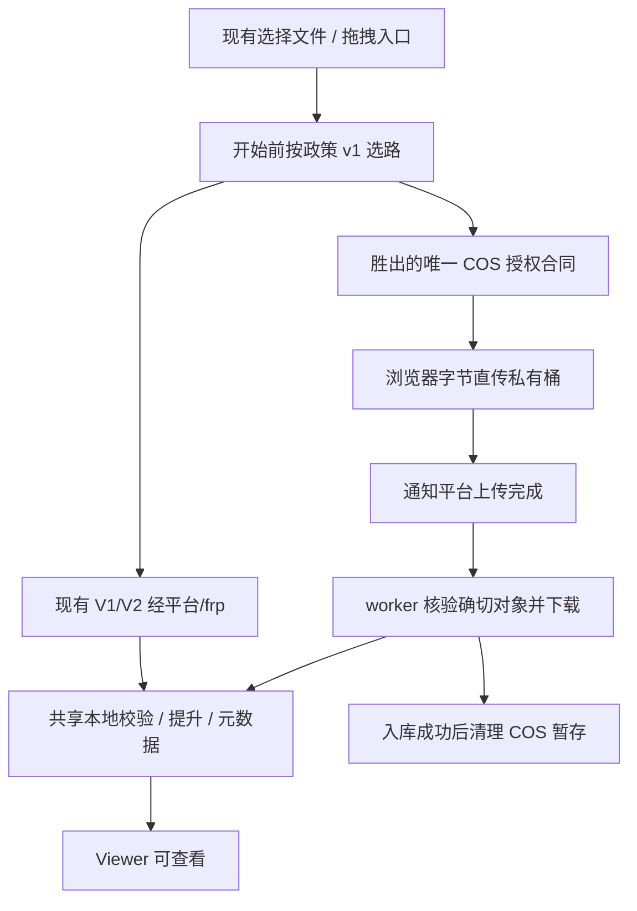

# 上传按大小分流：成熟开源方案调研与审计更新

> 2026-09-12。仅文档；未安装依赖、未改业务代码、未操作云资源、未做线上 PoC。
> 实施仍暂缓：未获明确开工授权前，不得改业务代码、安装 SDK、创建云资源或开启 COS capability。
> 关联：[COS 摄取审计合同](cos-direct-upload-audit-plan.md)（工程合同；授权/API/配额/验收以它为准）、[远程摄取架构](remote-file-ingestion-feasibility.md)（worker/SSRF/不可降级门槛仍有效）。

## 0. 冻结产品决定（开工后不再询问）

下列决定已定稿。获准实施后按此执行，不要重新选择运输框架、阈值单位、首期路由或授权混用方式。

| ID | 决定 | 执行含义 |
|---|---|---|
| D1 | 保留现有上传入口和 V1/V2；COS 是附加运输路径 | 不迁移、不删除 `upload_tasks`；COS 使用新 `ingestion_jobs` |
| D2 | 不引入 Uppy、tusd、Companion；不自研 multipart 协议 | PoC 只用官方 `cos-js-sdk-v5` 与官方预签名/STS |
| D3 | 大小单位为十进制字节 | `300 MB = 300000000`，`500 MB = 500000000`。全仓只允许一份整数 byte 配置，bootstrap 原样下发。禁止 `300 * 1024 * 1024` |
| D4 | 现有 V2 的 16 MiB 是分块阈值，不是分流阈值 | ZIP/MRXS 仍强制 V1；其它单文件 `>= 16 MiB` 走 V2，直到 COS 门禁通过 |
| D5 | 300/500 是政策目标，不是现在可启用的配置 | 门禁未过、三段吞吐未记录前，不得下发 COS capability，不得按大小自动导流 |
| D6 | 门禁通过且校准规则允许后，启用政策 v1 | `<300MB` 默认平台；`300–500MB`（含端点）默认平台、允许手动 COS；`>500MB` 在格式/权限/额度/COS 可用时默认 COS，否则明确退路，禁止静默换路 |
| D7 | 首期不做自动 busy/ETA 调度 | 不要实现 `normal/busy/unavailable` 发布、不要用活动任务数当繁忙、不要在 `<300MB` 上“预计等待过长则推荐 COS”。繁忙自动分流是后续增量 |
| D8 | 任务开始前选路，开始后冻结 `transport` | 禁止中途自动换路、双传、竞速。换路=取消旧任务 + 释放 reservation/分块/暂存 + 记录关联 + 全新任务 |
| D9 | 授权合同必须在写产品控制面前二选一 | 先 PoC 候选 B（SDK+STS），不通过再 PoC 候选 A（平台 multipart + 逐块预签名）。只实现胜出的那一套。通过标准见 COS 审计合同 §3 |
| D10 | 共同前置条件优先于大小 | 登录/权限、格式白名单、配额、磁盘水位、COS 开关。客户端不得设置 endpoint/bucket，不得绕过策略 |
| D11 | 首期 COS 格式 = 现有原生单文件白名单 | `svs/tif/tiff/ndpi/vms/vmu/scn/bif/svslide`。ZIP/MRXS 继续 V1；KFB/转换格式未单独验收前禁止 COS。UI 必须按格式说明，不能只看大小 |
| D12 | owner 与免登录也要 COS 费用硬停 | 不得沿用 `upload_guard.quota_applies()` 只限制 `role=user` |
| D13 | 回滚只关新任务和新授权 | 查询/取消/清理器保持运行，禁止关清理器，禁止把已在 COS 的对象自动改走 V2 |
| D14 | 开工后的唯一顺序 | 见 §8。不得先做路由 UI / bootstrap 阈值 |

校准规则（D5→D6，测量后自动判定，不再问产品）：

1. 记录三段吞吐：浏览器→平台/frp、浏览器→COS、COS→服务器（直连 COS endpoint，不绕 frp）。
2. 若 `frp 30M` 实测更接近 30 MB/s 而非 30 Mbps：首期**不启用**按大小自动导流；COS 仅手动、仅白名单格式。
3. 若 COS→服务器可用带宽不高于平台路径：不得宣称 COS 更快；`>500MB` 也改为默认平台 + 手动 COS。
4. 否则启用 D6 政策 v1。2–3 分钟只是运输参考，不是“可查看”承诺。

## 1. 结论

两条运输路径可行。按大小分流的判断代码很小；COS 运输层（授权、任务、worker、长租约、清理）不是小改动。不能先发布阈值或 COS UI，再补这些依赖。

frp 是网络转发层，不是应用上传协议。走 frp 不意味着改回一次性 POST。`static/app.js` 的 V2 阈值为 16 MiB；100 MB/400 MB 等单文件现在应继续 V2。`deploy/pt-edge-upload.inc.conf` 已有 V1/V2 代理配置，不证明线上 frp 健康或速度。

### 1.1 COS capability Go/No-Go

以下四项全部通过前，服务端不得把 COS 标成 available，前端不得按 300/500 MB 导流；任一项未过则现有 V1/V2 不变：

1. 真实账号 PoC 已选定**一种**生产授权合同（B 或 A），并写入 COS 审计合同的授权决议栏。
2. `ingestion_jobs`、下载 worker、同卷 staging、幂等提交、可恢复清理器可运行。
3. 远程长租约配额、COS 在途/费用硬停（含 owner/免登录）、worker 落盘前重查磁盘水位已明确。
4. 首期格式白名单逐项通过 COS 下载、解析、提升和 Viewer 验收。

## 2. 路由合同（政策 v1，仅门禁与校准通过后启用）

算术背景（不是服务承诺）：30 Mbps 满速 3.75 MB/s，300 MB 约 80 秒、500 MB 约 133 秒；有效 20–25 Mbps 时 500 MB 约 160–200 秒；两人均分时 500 MB 约 267 秒。不含排队、重试、SHA-256、解析、转换。

| 文件大小（十进制） | 政策 v1 | 首期（门禁后、自动 busy 前） |
|---|---|---|
| `< 300000000` | 默认平台/frp（V1/V2） | 只走平台。不要做 ETA 推荐 COS |
| `300000000–500000000` 含端点 | 默认平台；可信 busy 后可自动优先 COS | **默认平台，允许手动选 COS**（格式与开关允许时） |
| `> 500000000` | 默认 COS | 格式/权限/额度/COS 可用则默认 COS；否则提示并给出平台备用，禁止静默换路 |

创建任务时服务端重验并记录 `transport`、`policy_version`、`route_reason`。刷新后已创建任务的 transport 不变。

### 2.1 后续增量：busy 观测（首期禁止实现）

仅在政策 v1 稳定、三段吞吐有基线、且产品再次授权后实施。信号必须来自 frp 入口近期**有效载荷吞吐**、失败/超时率及明确故障；活动任务数或 V2 `request_time`（含摘要和落盘）不足以为 busy。过期或采集失败 = `unknown` = 保持默认平台。进入/退出 busy 用独立阈值或连续窗口。没有可靠样本时只保留手动 COS，不伪造秒级 ETA。

评估 COS 必须计入：COS 上传 + 排队 + 服务器下载 + 本地校验。服务器拉 COS 直连 endpoint。

首期 UI 禁止使用“当前直传线路繁忙，已选择云端上传”。手动 COS 用“已选择云端上传；可查看前还需服务器接收与校验”。

### 2.2 失败切路

同路径重试交给 V2 或既定 COS 适配。换运输方式必须终止旧任务并协调释放，旧字节不是另一协议的 checkpoint。首期只提供明确用户重试，不做后台双传。

## 3. 开源方案比较

基于官方仓库/文档的适配评估，不是依赖漏洞或生产稳定性审计。

| 方案 | 匹配度 | 结论 |
|---|---|---|
| 腾讯云 `cos-js-sdk-v5` | 官方高级上传、分块、进度、暂停/恢复、授权回调；可 script 引入 | **候选 B 的 PoC 载体**。不是已定生产授权 |
| Uppy `@uppy/aws-s3` | S3 multipart UI 生态 | 不做。不能假定 COS API 开箱兼容 |
| Uppy `@uppy/xhr-upload` | HTTP 上传包装 | 不做。不能替代 V2 offset/SHA-256/commit |
| `tus-js-client` + `tusd` | 标准续传 | 不做。会新增协议/服务，且不等于直传 COS |

Uppy 已把旧 multipart 回调改为 `signRequest`；旧教程不可混用。本项目页面上传在 `static/app.js`；若候选 B 胜出，SDK 锁版本、校验哈希、本地托管，不用 latest CDN。记录许可证。

## 4. 目标形态（授权选定之后）

控制面只处理小 JSON；API 不下载来源。临时凭证只留浏览器内存；禁止 `console.log(credentials)`。浏览器 PUT COS 不得走带 CSRF/Cookie 的 `apiFetch`。

候选 B 胜出时：浏览器初始化/合并，控制 API 为创建、查询、临时授权、完成通知、取消；无 `/parts/sign`。
候选 A 胜出时：worker 初始化/合并，浏览器只有 UploadPart 预签名；无浏览器 Complete 权限。
二者不可同时存在。

权限、费用、版本钉死、完成通知不可信，见 COS 审计合同 §3–§4。

## 5. 现有配额与格式缺口（实施时必须处理，不是可选项）

- `upload_guard.quota_applies()` 只约束认证 `role=user`。COS 账单走平台云账号，owner 与 `AUTH_ENABLED=False` 必须另设在途字节、授权速率、版本数、预算硬停。
- reservation 默认 1800 秒，V2 靠 chunk 续租。COS 在浏览器上传期间可能没有平台字节请求，之后还有下载与 SHA-256。远程任务由 worker/调度器心跳续租。STS 刷新、查询、完成、取消**不得**计为新的 hourly upload attempt（现默认 60）。成功恰好一次 `consume`，失败/取消恰好一次 `release`。创建时和 worker 落盘前都查磁盘水位。
- `UPLOAD_MAX_INFLIGHT=3` 要按阶段展示：浏览器上传、等待下载、服务器下载/校验。可共享总在途上限，UI 须说明占用，不能显示成“没有上传却占名额”。
- ZIP/MRXS 强制 V1；KFB 走转换 worker。首期 COS 不含这些格式。接 KFB 时另算 COS 源 + 本地暂存 + 转换产物峰值，并协调两个 worker。

## 6. 审计项（按阶段，不要把后续项当首期验收）

**阶段 0（PoC，无产品控制面）**

- 三段吞吐与费用：300 MB、500 MB，有条件再 2 GB；测试文件，禁止真实医疗数据。
- 候选 B：锁 SDK 版本；STS 最小权限；过期/断网/暂停/刷新；密钥不泄露；重复写入窗口与版本清理。
- 若 B 失败：候选 A 的 Content-Length 绑定、越界 part、过期 URL、无 Complete 权限。

**阶段 1（基础设施，capability 仍关闭）**

- worker、长租约、清理、owner 硬停、落盘前水位、SSRF/出网 allowlist、回滚不停清理器。
- 完成通知的 key/size/version 不可信；重复回调不重复摄取。

**阶段 2（前端 COS + 政策 v1）**

- 路由边界：阈值前后与等于阈值、零字节、格式不支持、超配额、COS 关。
- 服务端再验，不靠前端 if；刷新后 transport 不变；创建前后状态变化不改已创建任务；用户手动选路被记录。
- 跨运输重复创建有幂等/关联策略，禁止双预占双计费无人管。
- COS 不可用或格式不支持时有明确退路。
- 阶段文案：上传 100% ≠ 可查看。
- V1/V2/ZIP/MRXS/KFB/CSRF/配额/Viewer 回归。

**阶段 3（仅再次授权后）**

- `normal/busy/unavailable/unknown`、样本过期、共享链路、用户上行慢、防抖、busy 时中间档走 COS。

## 7. 官方来源

1. [腾讯云 COS JS SDK 开源仓库（MIT）](https://github.com/tencentyun/cos-js-sdk-v5)
2. [COS JavaScript SDK 快速入门：引入、临时权限及回调](https://cloud.tencent.com/document/product/436/11459)
3. [Uppy AWS S3 上传插件](https://uppy.io/docs/aws-s3/)
4. [Uppy XHR 上传插件](https://uppy.io/docs/xhr-upload/)
5. [tus 协议](https://tus.io/protocols/resumable-upload)
6. [tusd 官方参考实现](https://github.com/tus/tusd)
7. [Uppy 迁移说明](https://uppy.io/docs/guides/migration-guides/)

## 8. Agent 执行卡

未获“授权开工 COS/分流”的明确指令时：**只维护文档，停止。**

获准后严格按序，每步失败则停在该步，不要跳到路由 UI：

1. 按 COS 审计合同 §8 做三段吞吐测量，套用上文校准规则，写入测量记录（文件、时间、方向、Mbps、失败率）。
2. PoC 候选 B；按 COS 审计合同 §3.0 打分。通过 → 决议 = B。失败 → PoC 候选 A。A 通过 → 决议 = A。双失败 → COS NO-GO，保持 V1/V2。
3. 只实现决议合同的控制面 + 共享 worker/配额/清理。开关默认关。
4. 接前端 COS 适配（独立于 `xhrSend`/`apiFetch`），验收首期格式。
5. 门禁四项通过后，按校准规则启用政策 v1（或退化为全默认平台 + 手动 COS）。
6. 不要实现 busy 调度，除非另一次明确授权。

worker 是“最终文件落本地”的必要组件，开源上传库不能替代。
